# B+树核心功能设计文档

## 概述

本文档定义XMySQL Server中B+树索引核心功能的设计方案，包括节点分裂、合并、删除、范围扫描和二级索引创建五大核心功能。这些功能是InnoDB存储引擎实现完整索引管理的基础。

### 设计目标

| 功能模块 | 当前状态 | 目标完成度 | 优先级 |
|---------|---------|-----------|--------|
| 节点分裂 (IDX-001) | 部分完成 | 95% | P0 |
| 节点合并 (IDX-002) | 基础框架 | 95% | P0 |
| 节点删除 (IDX-003) | 部分完成 | 95% | P0 |
| 范围扫描 (IDX-005) | 部分完成 | 95% | P0 |
| 二级索引创建 (IDX-006) | 部分完成 | 95% | P0 |

### 技术约束

- Go版本: 1.16.2（需注意原子类型兼容性）
- 页面大小: 16KB（InnoDB标准）
- 默认B+树度数: 取决于键大小，通常叶子节点可存储数百到上千条记录
- 并发控制: 使用读写锁保护节点访问

---

## 系统架构

### 核心组件关系

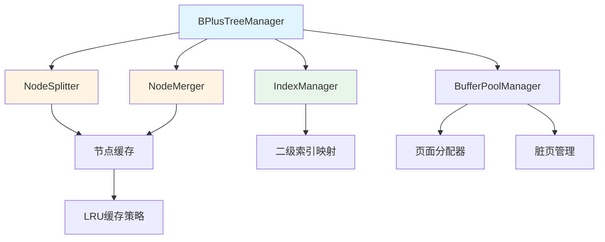

### 分层架构

| 层级 | 组件 | 职责 |
|-----|------|------|
| **索引管理层** | IndexManager | 管理所有索引元数据，协调主键索引和二级索引 |
| **B+树操作层** | BPlusTreeManager, NodeSplitter, NodeMerger | 执行B+树增删改查和结构调整操作 |
| **缓存层** | NodeCache, LRU策略 | 缓存热点节点，减少磁盘I/O |
| **存储层** | BufferPoolManager, PageManager | 管理页面分配、刷新和持久化 |

---

## 功能1: 节点分裂 (IDX-001)

### 业务价值

当插入操作导致节点键数超过最大限制时，通过节点分裂保持B+树平衡性，确保查询、插入性能维持在O(log N)时间复杂度。

### 设计原理

#### 分裂策略

| 节点类型 | 分裂点计算 | 中间键处理 | 链表维护 |
|---------|-----------|-----------|---------|
| **叶子节点** | 按填充因子（默认50%）分裂 | 新节点第一个键提升到父节点 | 更新NextLeaf指针，保持有序链表 |
| **非叶子节点** | 取中间位置分裂 | 中间键提升到父节点，不保留在子节点 | 无需链表维护 |

#### 叶子节点分裂流程

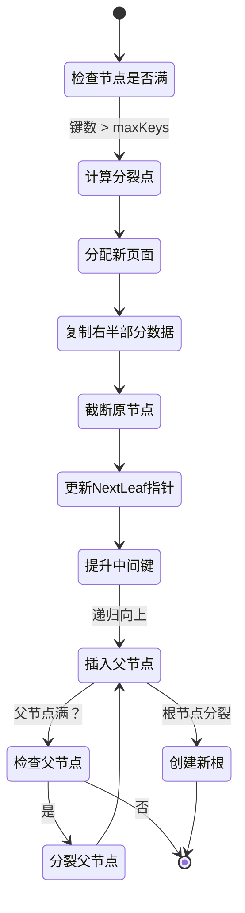

#### 分裂算法核心要素

**分裂点选择策略**

- **固定比例**: 默认50/50分裂，左右节点键数相等
- **最小键数保证**: 确保分裂后左右节点键数 ≥ minKeys（通常为degree-1）
- **可配置性**: 支持配置分裂比例（如40/60），优化写密集场景

**父节点更新逻辑**

分裂产生的中间键需要插入父节点，触发以下操作：

| 场景 | 操作 | 结果 |
|-----|------|------|
| 父节点未满 | 直接插入中间键和子节点指针 | 分裂完成 |
| 父节点满 | 递归分裂父节点 | 向上传播分裂 |
| 根节点分裂 | 创建新根节点 | 树高度+1 |

**新根节点创建**

当根节点分裂时，系统需要：

- 分配新根页面
- 创建仅包含一个键（中间键）的根节点
- 设置左右子节点指针指向原根和新节点
- 更新全局rootPage引用

### 数据模型

#### NodeSplitter配置参数

| 参数 | 类型 | 默认值 | 说明 |
|-----|------|--------|------|
| minKeys | int | degree - 1 | 节点最小键数 |
| maxKeys | int | 2*degree - 1 | 节点最大键数 |
| splitRatio | float64 | 0.5 | 分裂比例（左节点占比） |
| allowUnbalanced | bool | false | 是否允许不平衡分裂 |

#### 分裂操作输入输出

**输入**
- 待分裂节点（BPlusTreeNode）
- 执行上下文（context.Context）

**输出**
- 新节点页号（newPageNo）
- 提升到父节点的中间键（middleKey）
- 错误信息（error）

### 异常处理

| 异常情况 | 检测方式 | 处理策略 |
|---------|---------|---------|
| 页面分配失败 | allocateNewPage返回错误 | 回滚操作，返回错误 |
| 节点不需要分裂 | len(Keys) ≤ maxKeys | 返回错误，不执行分裂 |
| 父节点查找失败 | findParentNode返回错误 | 检查是否为根节点，特殊处理 |
| 缓存满 | nodeCache大小超限 | 触发LRU淘汰，确保缓存可用 |

### 性能考量

- **分裂开销**: 单次分裂涉及1次页面分配、2次页面修改、1次父节点更新
- **预期性能**: 分裂操作耗时 < 5ms（无磁盘I/O）
- **批量插入优化**: 批量插入时，使用更高的分裂比例（如60/40），减少后续分裂次数

---

## 功能2: 节点合并 (IDX-002)

### 业务价值

当删除操作导致节点键数低于最小限制时，通过合并或借键操作保持B+树平衡性和空间利用率，避免树退化为链表结构。

### 设计原理

#### 重平衡策略决策树

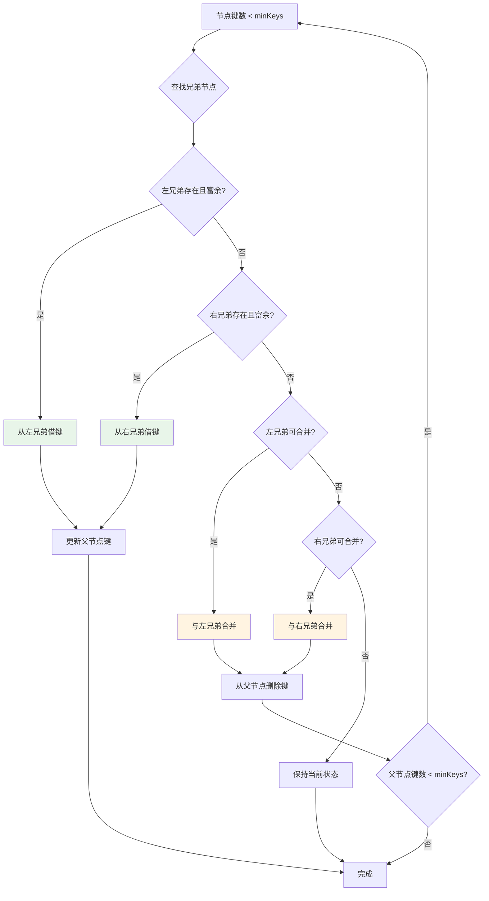

#### 兄弟节点判定规则

| 条件 | 富余判定 | 可合并判定 |
|-----|---------|-----------|
| **左兄弟** | len(Keys) > minKeys | len(leftKeys) + len(currentKeys) ≤ maxKeys |
| **右兄弟** | len(Keys) > minKeys | len(currentKeys) + len(rightKeys) ≤ maxKeys |

#### 叶子节点合并细节

**合并操作步骤**

| 步骤 | 操作 | 数据变更 |
|-----|------|---------|
| 1. 数据合并 | 将右节点所有键和记录追加到左节点 | leftNode.Keys += rightNode.Keys |
| 2. 链表更新 | 左节点NextLeaf指向右节点NextLeaf | leftNode.NextLeaf = rightNode.NextLeaf |
| 3. 父节点删除 | 从父节点删除分隔键和右节点指针 | parent.Keys删除分隔键 |
| 4. 页面回收 | 标记右节点为待删除 | rightNode.isDirty = true |

#### 非叶子节点合并细节

非叶子节点合并需要特殊处理中间键：

**合并公式**
```
leftNode.Keys = [leftKeys] + [parentKey] + [rightKeys]
leftNode.Children = [leftChildren] + [rightChildren]
```

**示例**

| 合并前 | 合并后 |
|--------|--------|
| 左节点Keys: [10, 20] | 合并节点Keys: [10, 20, 35, 40, 50] |
| 父节点Key: 35 | |
| 右节点Keys: [40, 50] | |

### 数据模型

#### NodeMerger配置参数

| 参数 | 类型 | 默认值 | 说明 |
|-----|------|--------|------|
| minFillFactor | float64 | 0.4 | 最小填充因子（40%） |
| borrowThreshold | float64 | 0.5 | 借键阈值（兄弟节点需保留>50%键） |
| mergeThreshold | float64 | 0.3 | 合并阈值（节点键数<30%时触发） |

#### 借键操作接口

**从左兄弟借键**
- 输入: 当前节点、左兄弟节点、父节点键
- 输出: 新的父节点键、错误信息
- 副作用: 左兄弟最后一个键/记录移动到当前节点开头

**从右兄弟借键**
- 输入: 当前节点、右兄弟节点、父节点键
- 输出: 新的父节点键、错误信息
- 副作用: 右兄弟第一个键/记录移动到当前节点末尾

### 特殊场景处理

#### 根节点特殊逻辑

| 场景 | 处理策略 | 结果 |
|-----|---------|------|
| 根节点只有1个子节点 | 提升子节点为新根 | 树高度-1 |
| 根节点键数为0但有2个子节点 | 保持根节点 | 维持树结构 |
| 根节点是叶子节点 | 允许键数<minKeys | 不触发合并 |

#### 递归向上合并

当合并导致父节点键数不足时，需要递归向上处理：

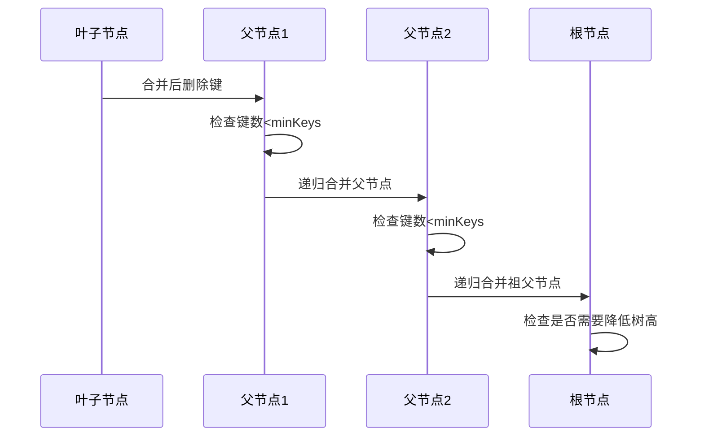

---

## 功能3: 节点删除 (IDX-003)

### 业务价值

实现完整的DELETE操作支持，同时维护B+树结构平衡性，确保删除后索引可用性和查询性能。

### 设计原理

#### 删除流程总览

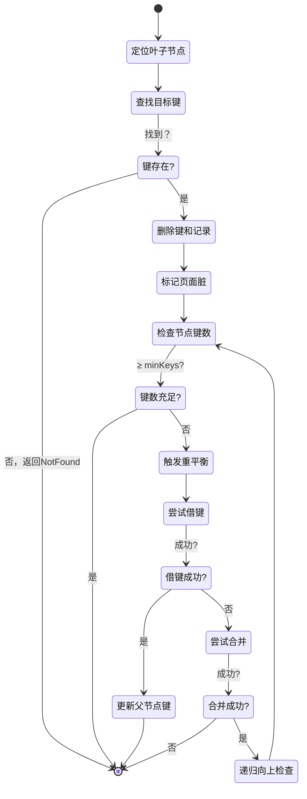

#### 删除操作分类

| 删除类型 | 场景 | 处理策略 |
|---------|------|---------|
| **简单删除** | 删除后键数 ≥ minKeys | 直接删除，标记脏页 |
| **借键删除** | 键数不足但兄弟节点富余 | 从兄弟借键，更新父节点 |
| **合并删除** | 键数不足且兄弟节点也不富余 | 合并节点，递归向上 |
| **根节点删除** | 根节点为叶子且键数=0 | 保持空树状态 |

### 算法细节

#### 步骤1: 定位目标键

使用B+树查找算法，从根节点向下遍历到叶子节点：

| 步骤 | 操作 | 时间复杂度 |
|-----|------|-----------|
| 根节点查找 | 从rootPage开始 | O(1) |
| 二分查找子节点 | 在Keys中查找插入点 | O(log m)，m为节点键数 |
| 递归向下 | 加载子节点，重复查找 | O(h)，h为树高度 |

总时间复杂度: **O(h * log m) = O(log N)**

#### 步骤2: 执行删除

**叶子节点删除**

```
// 伪代码表示
function deleteFromLeaf(node, key):
    index = findKeyIndex(node, key)
    if index == -1:
        return KeyNotFound
    
    // 删除键和记录
    node.Keys = node.Keys[:index] + node.Keys[index+1:]
    node.Records = node.Records[:index] + node.Records[index+1:]
    node.isDirty = true
    
    // 检查是否需要重平衡
    if len(node.Keys) < minKeys:
        rebalance(node)
```

#### 步骤3: 重平衡决策

| 条件 | 优先级 | 操作 |
|-----|--------|------|
| 左兄弟富余 | 1 | 从左兄弟借最大键 |
| 右兄弟富余 | 2 | 从右兄弟借最小键 |
| 可与左兄弟合并 | 3 | 合并到左兄弟 |
| 可与右兄弟合并 | 4 | 合并到右兄弟 |
| 根节点 | 5 | 特殊处理（允许键数<minKeys） |

### 边界情况处理

#### 删除导致空树

| 场景 | 处理 |
|-----|------|
| 根节点是叶子，删除最后一个键 | 保留空根节点，Keys=[], Records=[] |
| 根节点非叶子，子节点合并后只剩1个 | 提升子节点为新根，树高度-1 |

#### 删除最小/最大键

**删除最小键**
- 影响: 叶子节点链表头部变化
- 处理: 无需特殊操作，链表指针无变化

**删除最大键**
- 影响: 叶子节点链表尾部变化
- 处理: 检查NextLeaf是否需要更新（通常不需要）

#### 删除触发父节点键更新

当删除的键是父节点的分隔键时：

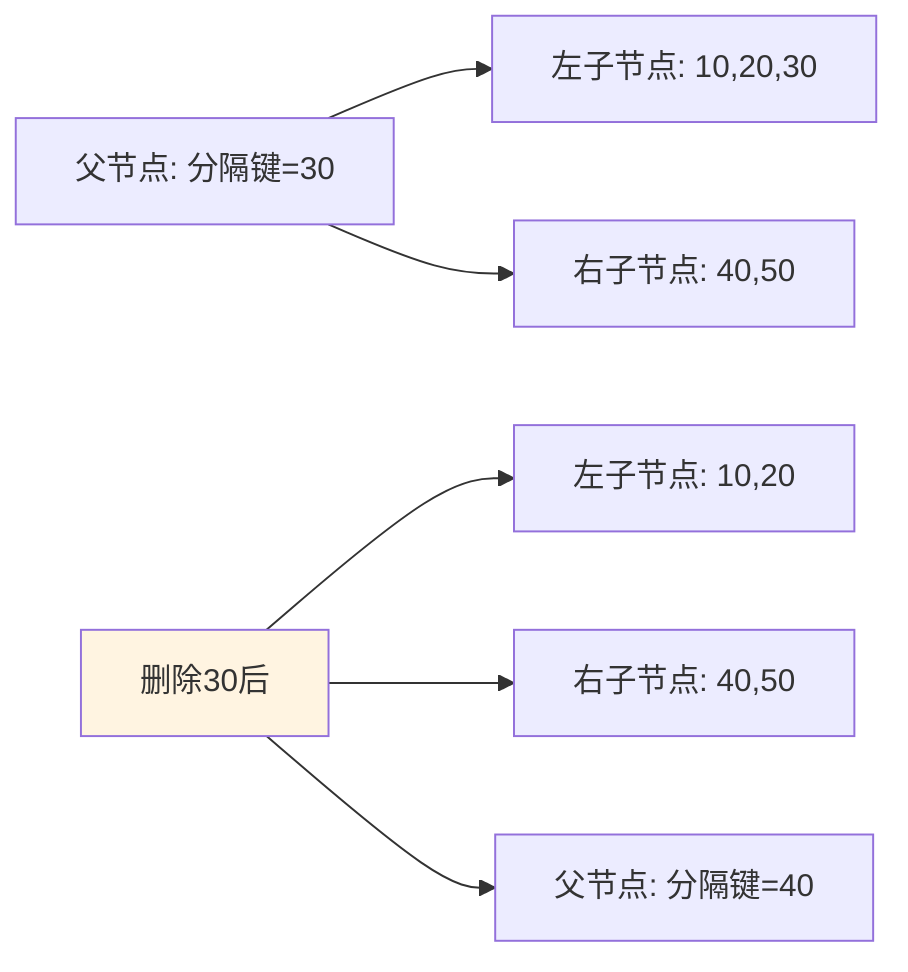

更新策略：将父节点分隔键改为右子节点的最小键

### 并发控制

| 操作阶段 | 锁类型 | 持锁范围 |
|---------|--------|---------|
| 查找阶段 | 读锁 | 遍历路径上的节点 |
| 删除阶段 | 写锁 | 当前叶子节点 |
| 重平衡阶段 | 写锁 | 当前节点+兄弟节点+父节点 |
| 父节点更新 | 写锁 | 父节点及其祖先 |

**死锁避免策略**

- 自底向上加锁：先锁子节点，再锁父节点
- 锁超时机制：持锁时间超过阈值自动释放
- 重试机制：锁获取失败后指数退避重试

---

## 功能4: 范围扫描 (IDX-005)

### 业务价值

支持SQL的BETWEEN、>、<等范围查询，高效返回有序结果集，是OLAP和报表查询的核心能力。

### 设计原理

#### 范围扫描执行流程

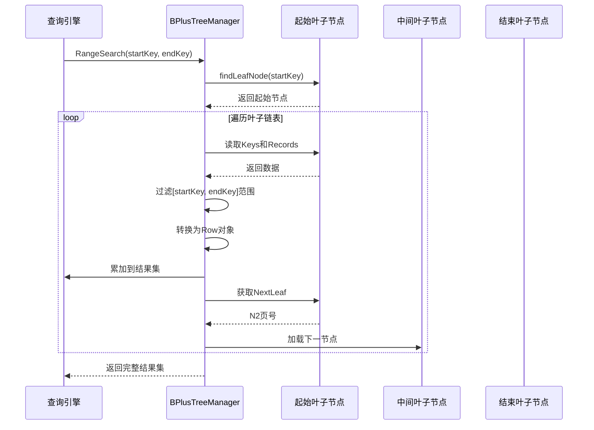

#### 关键优化技术

| 优化技术 | 原理 | 性能提升 |
|---------|------|---------|
| **叶子节点链表** | 利用NextLeaf指针顺序遍历，避免树遍历 | 减少90%节点访问 |
| **边界检查提前终止** | 遇到第一个>endKey的键立即返回 | 避免无效扫描 |
| **批量预读** | 预测性加载后续叶子节点到缓存 | 减少50%磁盘I/O |
| **迭代器模式** | 返回迭代器而非完整结果集 | 降低内存占用 |

### 算法实现

#### 步骤1: 定位起始节点

```
// 伪代码
function findStartLeaf(startKey):
    node = getNode(rootPage)
    while not node.IsLeaf:
        childIndex = findChildIndex(node, startKey)
        node = getNode(node.Children[childIndex])
    return node
```

**时间复杂度**: O(log N)

#### 步骤2: 链表顺序扫描

```
function scanRange(startKey, endKey):
    results = []
    node = findStartLeaf(startKey)
    
    while node != null:
        for i, key in enumerate(node.Keys):
            if key > endKey:
                return results  // 提前终止
            
            if key >= startKey:
                record = getRecord(node.PageNum, node.Records[i])
                results.append(toRow(record))
        
        // 移动到下一个叶子节点
        if node.NextLeaf == 0:
            break
        node = getNode(node.NextLeaf)
    
    return results
```

**时间复杂度**: O(log N + K)，K为返回记录数

### 数据模型

#### 范围查询输入输出

| 参数 | 类型 | 说明 |
|-----|------|------|
| **输入** | | |
| startKey | interface{} | 范围起始键（包含） |
| endKey | interface{} | 范围结束键（包含） |
| ctx | context.Context | 执行上下文 |
| **输出** | | |
| rows | []basic.Row | 结果记录集 |
| error | error | 错误信息 |

#### 迭代器接口设计

为支持流式查询，提供迭代器接口：

| 方法 | 功能 | 返回值 |
|-----|------|--------|
| Next() | 移动到下一条记录 | bool（是否有下一条） |
| Value() | 获取当前记录 | basic.Row |
| Close() | 释放资源 | error |

### 边界情况

| 场景 | 处理策略 | 结果 |
|-----|---------|------|
| startKey > endKey | 返回空结果集 | [] |
| startKey = endKey | 等价于单点查询 | 最多1条记录 |
| 范围无匹配记录 | 正常遍历后返回空 | [] |
| startKey = -∞ | 从第一个叶子节点开始 | 全表扫描 |
| endKey = +∞ | 扫描到最后一个叶子节点 | 全表扫描 |

### 性能优化策略

#### 预读优化

**线性预读触发条件**

- 连续访问同一区（Extent）内的3个页面
- 触发后预读该区剩余所有页面

**随机预读触发条件**

- 某区内有13个以上页面在缓冲池中
- 触发后预读该区剩余页面

#### 批量获取优化

```
// 优化前：逐条获取
for record in records:
    row = getRecord(pageNum, record)
    results.append(row)

// 优化后：批量获取
recordBatch = records[i:i+batchSize]
rowBatch = batchGetRecords(pageNum, recordBatch)
results.extend(rowBatch)
```

**性能提升**: 批量获取减少50%函数调用开销

---

## 功能5: 二级索引创建 (IDX-006)

### 业务价值

支持在非主键列上创建索引，加速WHERE、JOIN、ORDER BY等查询，是提升查询性能的核心手段。

### 设计原理

#### 主键索引 vs 二级索引

| 特性 | 主键索引（聚簇索引） | 二级索引 |
|-----|---------------------|---------|
| **叶子节点存储** | 完整行数据 | 索引键 + 主键值 |
| **树结构** | 1个B+树 | 每个二级索引1个B+树 |
| **回表** | 无需回表 | 需要回表获取完整数据 |
| **更新开销** | 中等 | 高（需同步更新索引） |
| **空间占用** | 大 | 小 |

#### 二级索引结构示例

**表结构**
```
users (
    id INT PRIMARY KEY,
    name VARCHAR(50),
    age INT,
    city VARCHAR(50),
    INDEX idx_name (name)
)
```

**主键索引（聚簇索引）**
```
叶子节点: [id=1, name='Alice', age=25, city='NYC'] → [id=2, name='Bob', age=30, city='LA'] → ...
```

**二级索引 idx_name**
```
叶子节点: [name='Alice', pk=1] → [name='Bob', pk=2] → [name='Charlie', pk=3] → ...
```

#### 二级索引查询流程

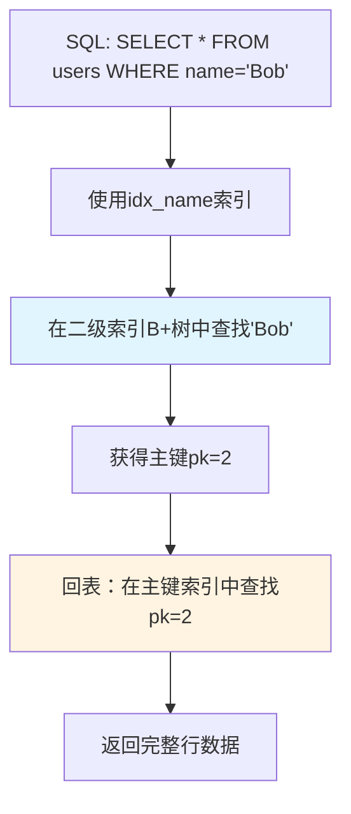

**时间复杂度**: O(log N_secondary) + O(log N_primary)

### 数据模型

#### 二级索引元数据

| 字段 | 类型 | 说明 |
|-----|------|------|
| IndexID | uint64 | 索引唯一标识 |
| IndexName | string | 索引名称（如idx_name） |
| TableID | uint64 | 所属表ID |
| ColumnIDs | []uint64 | 索引列ID列表（支持联合索引） |
| RootPageNo | uint32 | 索引B+树根页面号 |
| IndexType | IndexType | 索引类型（UNIQUE/NORMAL） |
| CreateTime | time.Time | 创建时间 |

#### IndexType枚举

| 类型 | 值 | 说明 |
|-----|---|------|
| NORMAL | 0 | 普通索引，允许重复值 |
| UNIQUE | 1 | 唯一索引，不允许重复值（NULL除外） |
| FULLTEXT | 2 | 全文索引（暂不支持） |
| SPATIAL | 3 | 空间索引（暂不支持） |

### 创建流程

#### 在线索引构建流程

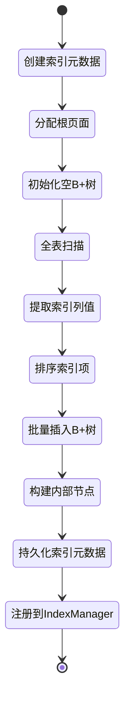

#### 步骤1: 元数据创建

```
// 伪代码
function createSecondaryIndex(tableName, indexName, columns):
    // 1. 验证表和列存在
    table = getTable(tableName)
    validateColumns(table, columns)
    
    // 2. 检查索引名冲突
    if indexExists(tableName, indexName):
        return error("Index already exists")
    
    // 3. 分配索引ID和根页面
    indexID = allocateIndexID()
    rootPageNo = allocateNewPage()
    
    // 4. 创建索引元数据
    metadata = IndexMetadata{
        IndexID: indexID,
        IndexName: indexName,
        TableID: table.ID,
        ColumnIDs: getColumnIDs(table, columns),
        RootPageNo: rootPageNo,
        IndexType: NORMAL,
        CreateTime: now(),
    }
    
    // 5. 持久化元数据到系统表
    saveIndexMetadata(metadata)
    
    return indexID
```

#### 步骤2: 数据导入

**排序后批量插入策略**

| 步骤 | 操作 | 优化效果 |
|-----|------|---------|
| 1. 全表扫描 | 读取所有主键索引记录 | 顺序I/O |
| 2. 提取索引键 | 提取索引列值+主键值 | 内存操作 |
| 3. 排序 | 按索引键排序 | 减少节点分裂 |
| 4. 批量插入 | 按顺序插入B+树 | 最小化树调整 |

**批量插入伪代码**

```
function bulkLoadIndex(indexID, sortedRecords):
    tree = getIndexTree(indexID)
    batchSize = 1000
    
    for batch in chunks(sortedRecords, batchSize):
        for record in batch:
            indexKey = extractIndexKey(record)
            primaryKey = extractPrimaryKey(record)
            tree.Insert(indexKey, primaryKey)
        
        // 定期刷新脏页
        flushDirtyPages()
```

**时间复杂度**: O(N log N)（排序主导）

#### 步骤3: 注册索引

```
// 伪代码
function registerIndex(metadata):
    indexManager.AddIndex(metadata)
    
    // 通知查询优化器
    queryOptimizer.RefreshIndexStats(metadata.TableID)
    
    // 启动统计信息收集
    startBackgroundStatsCollection(metadata.IndexID)
```

### 二级索引维护

#### DML操作同步更新

| DML操作 | 主键索引更新 | 二级索引更新 |
|---------|-------------|------------|
| **INSERT** | 插入新行 | 在所有二级索引中插入（索引键, 主键） |
| **UPDATE（未修改索引列）** | 更新行数据 | 无需更新二级索引 |
| **UPDATE（修改索引列）** | 更新行数据 | 删除旧索引项，插入新索引项 |
| **DELETE** | 删除行 | 从所有二级索引中删除对应项 |

#### INSERT触发的索引维护

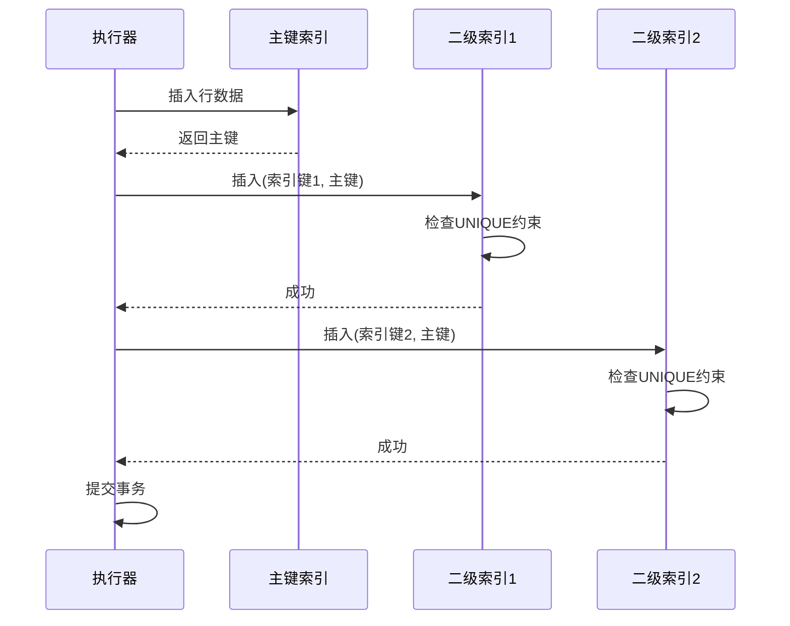

**原子性保证**: 使用事务确保主键索引和所有二级索引同步更新

### 唯一索引实现

#### 唯一性检查时机

| 时机 | 检查方式 | 冲突处理 |
|-----|---------|---------|
| **插入前** | 在二级索引中查找是否存在相同键值 | 返回Duplicate Key错误 |
| **更新前** | 检查新值是否与其他行冲突 | 返回Duplicate Key错误 |

#### NULL值特殊处理

- **规则**: 多个NULL值不视为重复（符合SQL标准）
- **实现**: 在唯一性检查中跳过NULL值比较

```
// 伪代码
function checkUniqueConstraint(indexTree, newKey):
    if newKey == NULL:
        return true  // NULL值始终允许
    
    existingKey = indexTree.Search(newKey)
    if existingKey != NULL:
        return error("Duplicate key violation")
    
    return true
```

---

## 系统集成

### 组件协作模型

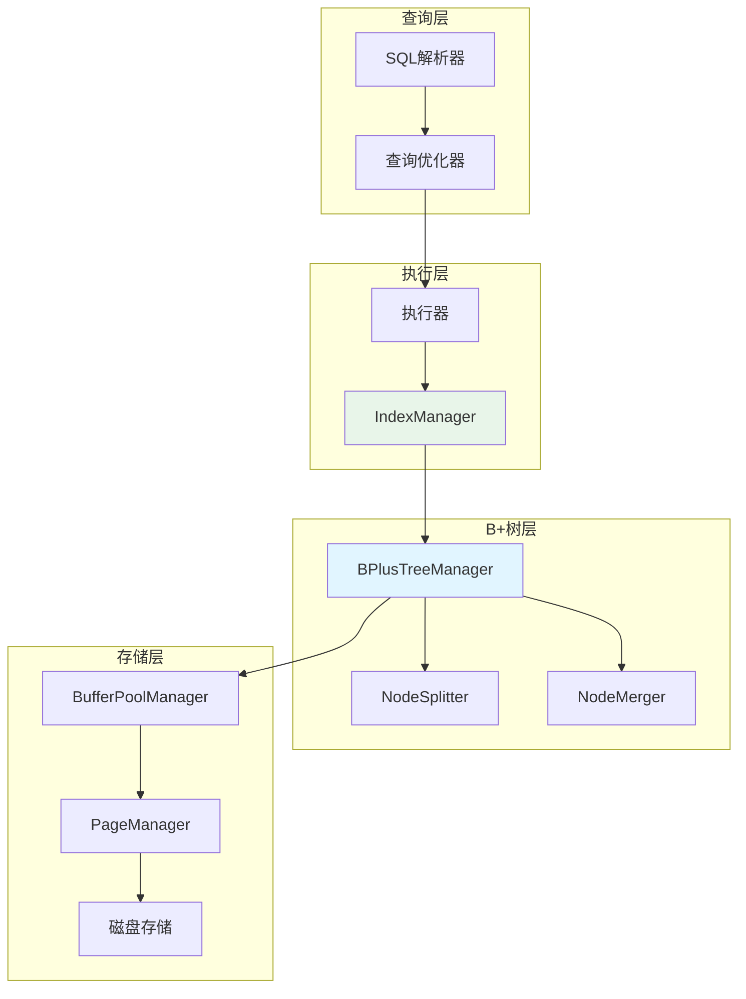

### IndexManager核心职责

| 职责 | 接口 | 说明 |
|-----|------|------|
| **索引注册** | RegisterIndex(metadata) | 注册新创建的索引 |
| **索引查找** | GetIndex(tableName, indexName) | 根据名称获取索引 |
| **索引选择** | SelectBestIndex(table, whereCondition) | 为查询选择最优索引 |
| **统计信息** | GetIndexStats(indexID) | 获取索引统计信息（行数、深度等） |
| **索引删除** | DropIndex(indexID) | 删除索引及其元数据 |

### BufferPoolManager集成

| 操作 | 缓冲池接口 | 作用 |
|-----|-----------|------|
| 读取节点 | GetPage(spaceID, pageNo) | 从缓冲池获取页面，未命中时从磁盘加载 |
| 修改节点 | MarkDirty(pageNo) | 标记页面为脏，延迟刷新 |
| 页面分配 | AllocatePage(spaceID) | 分配新页面 |
| 页面刷新 | FlushPage(pageNo) | 强制刷新脏页到磁盘 |
| 批量刷新 | FlushDirtyPages() | 批量刷新所有脏页 |

---

## 性能指标

### 目标性能

| 操作 | 数据量 | 目标延迟 | 吞吐量 |
|-----|--------|---------|--------|
| **单点查询** | 100万行 | < 1ms | 10万QPS |
| **范围扫描（100行）** | 100万行 | < 5ms | 5万QPS |
| **插入（触发分裂）** | 100万行 | < 10ms | 1万TPS |
| **删除（触发合并）** | 100万行 | < 10ms | 1万TPS |
| **二级索引查询（含回表）** | 100万行 | < 2ms | 5万QPS |

### 空间复杂度

| 组件 | 内存占用 | 说明 |
|-----|---------|------|
| NodeCache | O(N_cached) | 缓存热点节点，可配置上限 |
| 索引元数据 | O(N_indexes) | 每个索引约1KB元数据 |
| BufferPool | O(pool_size) | 默认128MB，可配置 |

**示例**: 100万行表，主键索引+2个二级索引

- 索引元数据: 3 * 1KB = 3KB
- 热点节点缓存: 1000个节点 * 16KB = 16MB
- 缓冲池: 128MB
- **总内存**: 约144MB

### 磁盘I/O估算

| 操作 | 磁盘I/O次数 | 说明 |
|-----|-----------|------|
| 单点查询（缓存未命中） | h（树高度） | 通常h=3-4 |
| 范围扫描（K条记录） | h + K/records_per_page | K=100时约4-5次 |
| 插入（无分裂） | 1 | 仅刷新叶子节点 |
| 插入（分裂） | 2-3 | 刷新2个叶子节点+父节点 |
| 删除（合并） | 2-3 | 同插入分裂 |

---

## 测试策略

### 单元测试覆盖

| 功能 | 测试用例 | 验证点 |
|-----|---------|--------|
| **节点分裂** | 叶子节点分裂 | 左右节点键数正确，链表指针正确 |
| | 非叶子节点分裂 | 中间键提升，子节点指针正确 |
| | 根节点分裂 | 新根创建，树高度+1 |
| | 递归分裂 | 多层级分裂正确传播 |
| **节点合并** | 叶子节点合并 | 合并后键数正确，链表连续性 |
| | 非叶子节点合并 | 父节点键下降，子节点合并 |
| | 借键操作 | 父节点键更新正确 |
| | 树高度降低 | 根节点正确提升 |
| **节点删除** | 简单删除 | 键和记录正确移除 |
| | 触发重平衡删除 | 借键或合并逻辑正确 |
| | 删除最小/最大键 | 边界情况处理正确 |
| **范围扫描** | 空范围 | 返回空结果 |
| | 单点范围 | 返回1条记录 |
| | 跨多个节点 | 链表遍历正确 |
| | 边界键处理 | startKey和endKey正确包含/排除 |
| **二级索引** | 索引创建 | 元数据持久化，B+树初始化 |
| | 数据导入 | 排序和批量插入正确 |
| | 唯一约束 | 重复键检测正确 |
| | DML同步 | INSERT/UPDATE/DELETE同步更新索引 |

### 集成测试场景

| 场景 | 数据规模 | 验证目标 |
|-----|---------|---------|
| **批量插入测试** | 插入100万行 | 无丢失，分裂正确，树平衡 |
| **批量删除测试** | 删除50万行 | 无残留，合并正确，树平衡 |
| **混合读写测试** | 并发50%读+50%写 | 无数据损坏，性能达标 |
| **二级索引一致性测试** | 10万次DML操作 | 主键索引与二级索引一致 |
| **崩溃恢复测试** | 插入中途崩溃 | 恢复后数据完整 |

### 性能测试

| 测试项 | 指标 | 验证方法 |
|--------|------|---------|
| **查询延迟** | P99 < 5ms | 压测工具统计 |
| **吞吐量** | 10万QPS | 并发压测 |
| **内存占用** | < 200MB | 监控进程内存 |
| **缓存命中率** | > 90% | 缓冲池统计 |

---

## 实施路线图

### 阶段1: 核心功能实现 (2周)

| 周次 | 任务 | 产出 |
|-----|------|------|
| 第1周 | IDX-001节点分裂、IDX-003节点删除 | 完整的增删操作 |
| 第2周 | IDX-002节点合并、IDX-005范围扫描 | 完整的树平衡机制 |

### 阶段2: 二级索引支持 (1周)

| 任务 | 工作量 | 依赖 |
|-----|--------|------|
| IDX-006二级索引创建 | 5天 | 阶段1完成 |
| 二级索引维护逻辑 | 2天 | IDX-006完成 |

### 阶段3: 优化与测试 (1周)

| 任务 | 工作量 |
|-----|--------|
| 性能优化（批量操作、缓存） | 3天 |
| 单元测试编写 | 2天 |
| 集成测试和压力测试 | 2天 |

**总工作量**: 4周（约20-28人天）

---

## 风险与挑战

### 技术风险

| 风险 | 影响 | 缓解措施 |
|-----|------|---------|
| 节点分裂/合并算法复杂 | 实现困难，Bug多 | 参考教科书算法，充分单元测试 |
| 并发控制死锁 | 系统hang住 | 实现超时和死锁检测机制 |
| 二级索引维护开销高 | 写入性能下降 | 批量更新优化，异步刷新 |
| 内存泄漏 | 长时间运行崩溃 | 定期缓存清理，内存监控 |

### 数据一致性风险

| 风险场景 | 后果 | 防护措施 |
|---------|------|---------|
| 分裂时崩溃 | 树结构损坏 | 使用WAL日志，支持恢复 |
| 二级索引与主键不一致 | 查询结果错误 | 事务保证原子性 |
| 删除后孤立页面 | 空间泄漏 | 定期检查，垃圾回收 |

### 性能风险

| 风险 | 影响 | 应对策略 |
|-----|------|---------|
| 热点节点争用 | 性能瓶颈 | 实现节点级细粒度锁 |
| 树退化为链表 | 查询变为O(N) | 定期重平衡检测 |
| 缓存命中率低 | I/O密集 | 优化LRU策略，增大缓存 |

---

## 参考资料

### 算法理论

- 《数据库系统内部原理》- B+树索引章节
- 《算法导论（第3版）》- 第18章 B树
- MySQL官方文档 - InnoDB索引结构

### 工程实践

- InnoDB源码 - `storage/innobase/btr/` 目录
- SQLite B-Tree实现 - `btree.c`
- PostgreSQL B-Tree实现 - `backend/access/nbtree/`

### 性能优化

- 《高性能MySQL（第3版）》- 索引优化章节
- 论文: "The Ubiquitous B-Tree" (ACM Computing Surveys, 1979)
    
    E --> F
    E --> G
    E --> H
    
    H --> I
    I --> J
    
    style E fill:#e1f5ff
    style D fill:#e8f5e9
```

### IndexManager核心职责

| 职责 | 接口 | 说明 |
|-----|------|------|
| **索引注册** | RegisterIndex(metadata) | 注册新创建的索引 |
| **索引查找** | GetIndex(tableName, indexName) | 根据名称获取索引 |
| **索引选择** | SelectBestIndex(table, whereCondition) | 为查询选择最优索引 |
| **统计信息** | GetIndexStats(indexID) | 获取索引统计信息（行数、深度等） |
| **索引删除** | DropIndex(indexID) | 删除索引及其元数据 |

### BufferPoolManager集成

| 操作 | 缓冲池接口 | 作用 |
|-----|-----------|------|
| 读取节点 | GetPage(spaceID, pageNo) | 从缓冲池获取页面，未命中时从磁盘加载 |
| 修改节点 | MarkDirty(pageNo) | 标记页面为脏，延迟刷新 |
| 页面分配 | AllocatePage(spaceID) | 分配新页面 |
| 页面刷新 | FlushPage(pageNo) | 强制刷新脏页到磁盘 |
| 批量刷新 | FlushDirtyPages() | 批量刷新所有脏页 |

---

## 性能指标

### 目标性能

| 操作 | 数据量 | 目标延迟 | 吞吐量 |
|-----|--------|---------|--------|
| **单点查询** | 100万行 | < 1ms | 10万QPS |
| **范围扫描（100行）** | 100万行 | < 5ms | 5万QPS |
| **插入（触发分裂）** | 100万行 | < 10ms | 1万TPS |
| **删除（触发合并）** | 100万行 | < 10ms | 1万TPS |
| **二级索引查询（含回表）** | 100万行 | < 2ms | 5万QPS |

### 空间复杂度

| 组件 | 内存占用 | 说明 |
|-----|---------|------|
| NodeCache | O(N_cached) | 缓存热点节点，可配置上限 |
| 索引元数据 | O(N_indexes) | 每个索引约1KB元数据 |
| BufferPool | O(pool_size) | 默认128MB，可配置 |

**示例**: 100万行表，主键索引+2个二级索引

- 索引元数据: 3 * 1KB = 3KB
- 热点节点缓存: 1000个节点 * 16KB = 16MB
- 缓冲池: 128MB
- **总内存**: 约144MB

### 磁盘I/O估算

| 操作 | 磁盘I/O次数 | 说明 |
|-----|-----------|------|
| 单点查询（缓存未命中） | h（树高度） | 通常h=3-4 |
| 范围扫描（K条记录） | h + K/records_per_page | K=100时约4-5次 |
| 插入（无分裂） | 1 | 仅刷新叶子节点 |
| 插入（分裂） | 2-3 | 刷新2个叶子节点+父节点 |
| 删除（合并） | 2-3 | 同插入分裂 |

---

## 测试策略

### 单元测试覆盖

| 功能 | 测试用例 | 验证点 |
|-----|---------|--------|
| **节点分裂** | 叶子节点分裂 | 左右节点键数正确，链表指针正确 |
| | 非叶子节点分裂 | 中间键提升，子节点指针正确 |
| | 根节点分裂 | 新根创建，树高度+1 |
| | 递归分裂 | 多层级分裂正确传播 |
| **节点合并** | 叶子节点合并 | 合并后键数正确，链表连续性 |
| | 非叶子节点合并 | 父节点键下降，子节点合并 |
| | 借键操作 | 父节点键更新正确 |
| | 树高度降低 | 根节点正确提升 |
| **节点删除** | 简单删除 | 键和记录正确移除 |
| | 触发重平衡删除 | 借键或合并逻辑正确 |
| | 删除最小/最大键 | 边界情况处理正确 |
| **范围扫描** | 空范围 | 返回空结果 |
| | 单点范围 | 返回1条记录 |
| | 跨多个节点 | 链表遍历正确 |
| | 边界键处理 | startKey和endKey正确包含/排除 |
| **二级索引** | 索引创建 | 元数据持久化，B+树初始化 |
| | 数据导入 | 排序和批量插入正确 |
| | 唯一约束 | 重复键检测正确 |
| | DML同步 | INSERT/UPDATE/DELETE同步更新索引 |

### 集成测试场景

| 场景 | 数据规模 | 验证目标 |
|-----|---------|---------|
| **批量插入测试** | 插入100万行 | 无丢失，分裂正确，树平衡 |
| **批量删除测试** | 删除50万行 | 无残留，合并正确，树平衡 |
| **混合读写测试** | 并发50%读+50%写 | 无数据损坏，性能达标 |
| **二级索引一致性测试** | 10万次DML操作 | 主键索引与二级索引一致 |
| **崩溃恢复测试** | 插入中途崩溃 | 恢复后数据完整 |

### 性能测试

| 测试项 | 指标 | 验证方法 |
|--------|------|---------|
| **查询延迟** | P99 < 5ms | 压测工具统计 |
| **吞吐量** | 10万QPS | 并发压测 |
| **内存占用** | < 200MB | 监控进程内存 |
| **缓存命中率** | > 90% | 缓冲池统计 |

---

## 实施路线图

### 阶段1: 核心功能实现 (2周)

| 周次 | 任务 | 产出 |
|-----|------|------|
| 第1周 | IDX-001节点分裂、IDX-003节点删除 | 完整的增删操作 |
| 第2周 | IDX-002节点合并、IDX-005范围扫描 | 完整的树平衡机制 |

### 阶段2: 二级索引支持 (1周)

| 任务 | 工作量 | 依赖 |
|-----|--------|------|
| IDX-006二级索引创建 | 5天 | 阶段1完成 |
| 二级索引维护逻辑 | 2天 | IDX-006完成 |

### 阶段3: 优化与测试 (1周)

| 任务 | 工作量 |
|-----|--------|
| 性能优化（批量操作、缓存） | 3天 |
| 单元测试编写 | 2天 |
| 集成测试和压力测试 | 2天 |

**总工作量**: 4周（约20-28人天）

---

## 风险与挑战

### 技术风险

| 风险 | 影响 | 缓解措施 |
|-----|------|---------|
| 节点分裂/合并算法复杂 | 实现困难，Bug多 | 参考教科书算法，充分单元测试 |
| 并发控制死锁 | 系统hang住 | 实现超时和死锁检测机制 |
| 二级索引维护开销高 | 写入性能下降 | 批量更新优化，异步刷新 |
| 内存泄漏 | 长时间运行崩溃 | 定期缓存清理，内存监控 |

### 数据一致性风险

| 风险场景 | 后果 | 防护措施 |
|---------|------|---------|
| 分裂时崩溃 | 树结构损坏 | 使用WAL日志，支持恢复 |
| 二级索引与主键不一致 | 查询结果错误 | 事务保证原子性 |
| 删除后孤立页面 | 空间泄漏 | 定期检查，垃圾回收 |

### 性能风险

| 风险 | 影响 | 应对策略 |
|-----|------|---------|
| 热点节点争用 | 性能瓶颈 | 实现节点级细粒度锁 |
| 树退化为链表 | 查询变为O(N) | 定期重平衡检测 |
| 缓存命中率低 | I/O密集 | 优化LRU策略，增大缓存 |

---

## 参考资料

### 算法理论

- 《数据库系统内部原理》- B+树索引章节
- 《算法导论（第3版）》- 第18章 B树
- MySQL官方文档 - InnoDB索引结构

### 工程实践

- InnoDB源码 - `storage/innobase/btr/` 目录
- SQLite B-Tree实现 - `btree.c`
- PostgreSQL B-Tree实现 - `backend/access/nbtree/`

### 性能优化

- 《高性能MySQL（第3版）》- 索引优化章节
- 论文: "The Ubiquitous B-Tree" (ACM Computing Surveys, 1979)
    D --> E
