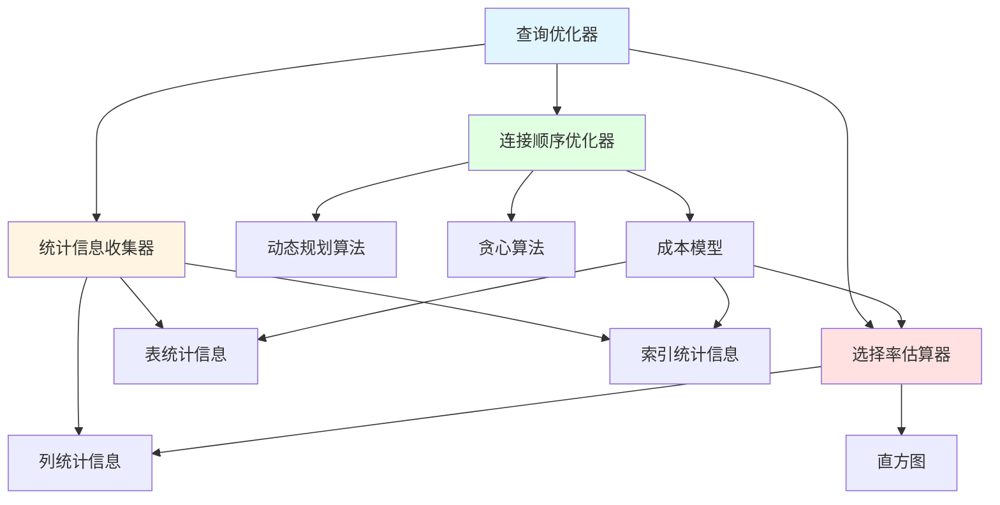
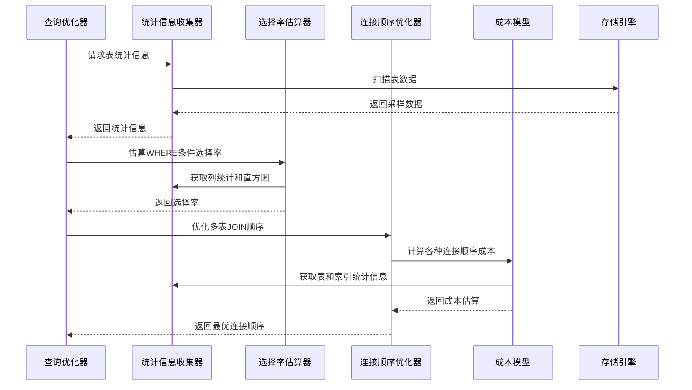
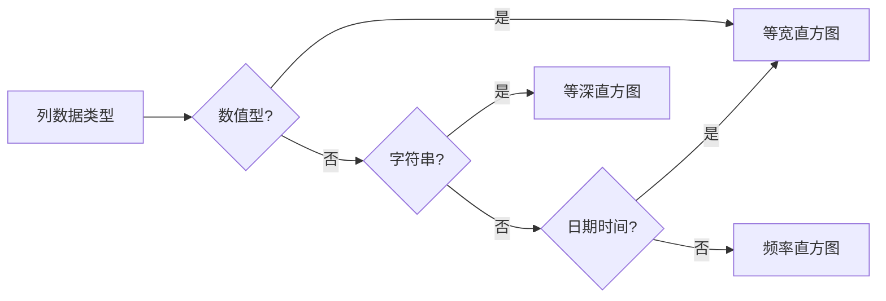
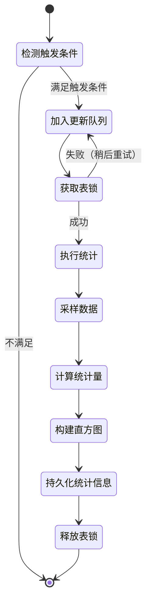
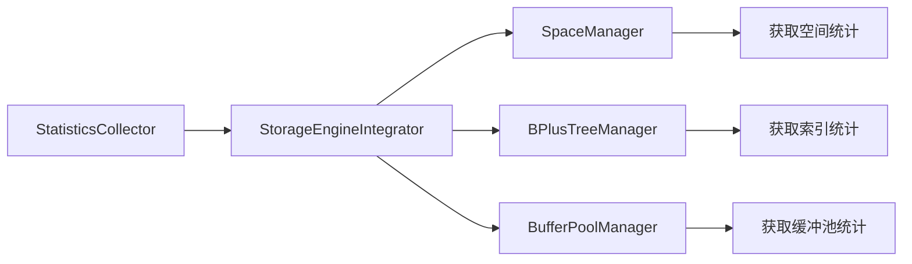
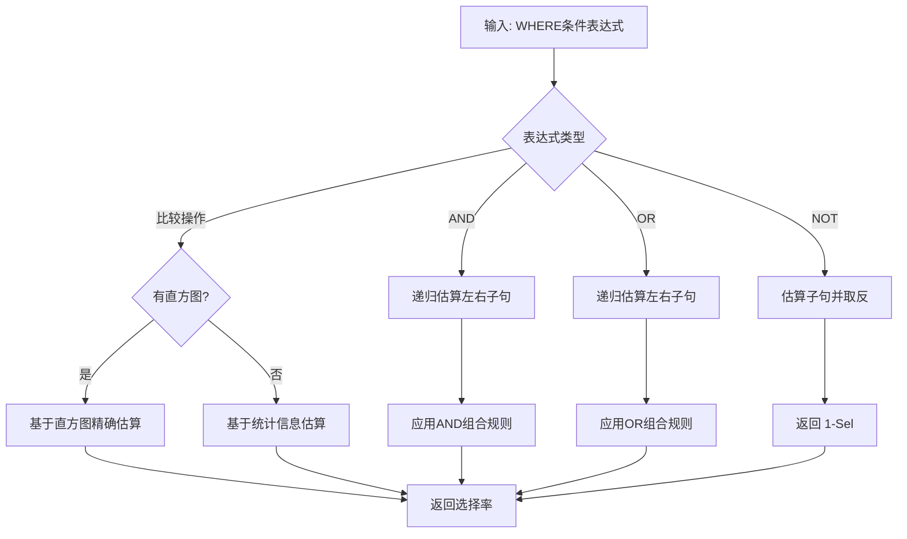
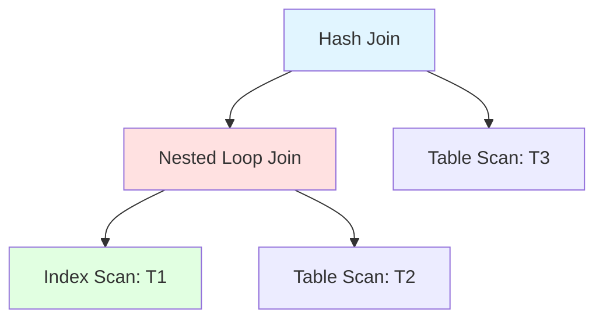
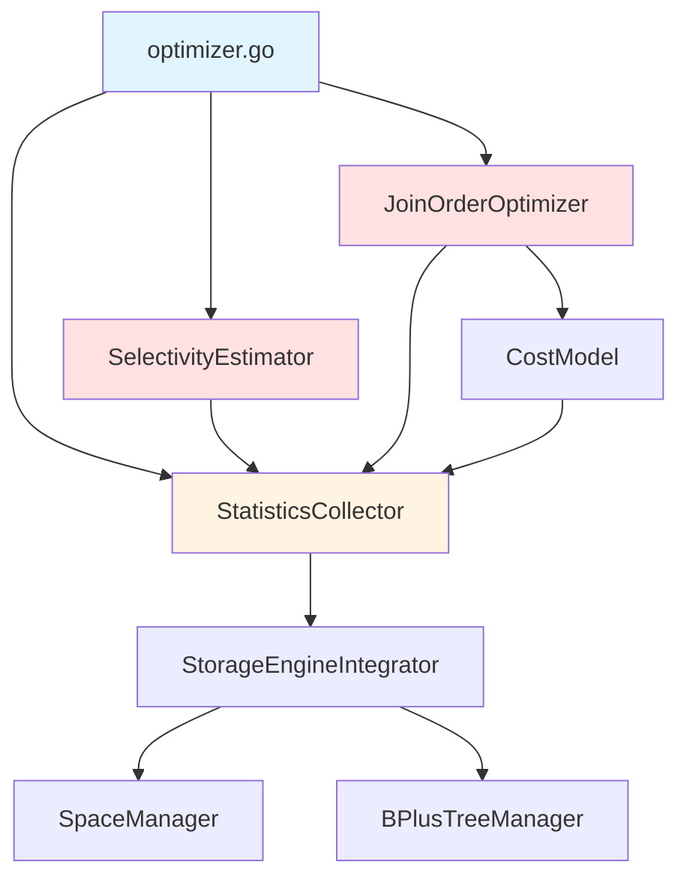
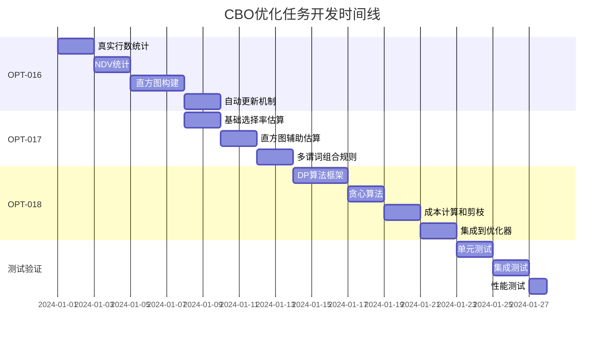

# 基于代价的优化器（CBO）完善设计文档

## 文档概述

**任务范围**: 完成任务 OPT-016、OPT-017、OPT-018  
**目标**: 实现完整的基于代价的查询优化器，包括统计信息收集、选择率估算和连接顺序优化  
**优先级**: P0（核心功能）  
**预计工作量**: 15-21人天  
**依赖模块**: 查询优化器、统计信息收集器、成本模型

---

## 一、架构设计

### 1.1 核心组件关系



### 1.2 数据流架构



---

## 二、OPT-016：完善统计信息收集

### 2.1 任务目标

将当前模拟数据驱动的统计信息收集器改造为基于真实存储引擎的实现，提供准确的表、列和索引统计信息。

### 2.2 功能设计

#### 2.2.1 真实行数统计

**当前问题**：
`statistics_collector.go` 中的 `estimateRowCount` 方法使用哈希值模拟行数

**设计方案**：

通过存储引擎接口获取准确行数

| 统计方式 | 数据源 | 精度 | 性能 |
|---------|--------|------|------|
| 精确统计 | 全表扫描B+树叶子节点 | 100% | 慢（大表不可接受） |
| 估算统计 | 系统表空间元数据 | 90-95% | 快（推荐） |
| 采样统计 | 随机采样页面 | 85-90% | 中等 |

**实现策略**：
- 优先从系统表 `mysql.innodb_table_stats` 获取缓存的行数
- 若缺失，则通过遍历B+树根节点的键范围估算
- 提供强制刷新选项，执行精确统计

#### 2.2.2 NDV（不同值数量）统计

**设计方案**：

使用 HyperLogLog 算法进行基数估算，内存占用固定（12KB），误差率 < 2%

**采样策略表**：

| 表行数 | 采样率 | 采样行数 | 预期精度 |
|--------|--------|----------|----------|
| < 1万 | 100% | 全部 | 100% |
| 1万-10万 | 50% | 5千-5万 | 98% |
| 10万-100万 | 10% | 1万-10万 | 95% |
| > 100万 | 5% | 最多5万 | 92% |

#### 2.2.3 数据分布直方图

**直方图类型选择**：



**等宽直方图示例**（数值列）：

| 桶编号 | 下界 | 上界 | 计数 | 不同值 | 示例 |
|--------|------|------|------|--------|------|
| 1 | 1 | 100 | 1500 | 95 | age列0-100 |
| 2 | 101 | 200 | 800 | 80 | age列101-200 |
| 3 | 201 | 300 | 200 | 60 | age列201-300 |

**等深直方图示例**（字符串列）：

| 桶编号 | 下界 | 上界 | 计数 | 不同值 | 示例 |
|--------|------|------|------|--------|------|
| 1 | "A" | "D" | 2000 | 1500 | name列A-D开头 |
| 2 | "E" | "M" | 2000 | 1800 | name列E-M开头 |
| 3 | "N" | "Z" | 2000 | 1600 | name列N-Z开头 |

#### 2.2.4 自动统计信息更新策略

**触发条件表**：

| 触发类型 | 条件 | 优先级 | 备注 |
|---------|------|--------|------|
| 定时触发 | 每天凌晨2点 | 低 | 适用于所有表 |
| 变更触发 | 修改行数 > 10% | 高 | 大表慎用 |
| 手动触发 | ANALYZE TABLE | 最高 | 用户显式请求 |
| 阈值触发 | 距上次分析超过7天 | 中 | 避免统计信息过期 |

**更新流程**：



### 2.3 数据模型扩展

#### 2.3.1 表统计信息扩展

在现有 `TableStats` 结构基础上新增字段：

| 字段名 | 类型 | 说明 | 示例值 |
|--------|------|------|--------|
| AvgRowLength | int64 | 平均行长度（字节） | 128 |
| DataLength | int64 | 数据占用空间（字节） | 10485760 |
| IndexLength | int64 | 索引占用空间（字节） | 2097152 |
| DataFree | int64 | 空闲空间（字节） | 524288 |
| AutoIncrement | uint64 | 当前自增值 | 100001 |
| SampleSize | int64 | 统计时采样行数 | 50000 |

#### 2.3.2 列统计信息扩展

新增直方图详细信息：

| 字段名 | 类型 | 说明 |
|--------|------|------|
| HistogramType | string | 直方图类型（EQUI_WIDTH/EQUI_DEPTH/FREQUENCY） |
| BucketCount | int | 实际桶数量 |
| SamplingPercent | float64 | 采样百分比 |
| LastUpdated | int64 | 最后更新时间戳 |

#### 2.3.3 索引统计信息扩展

新增索引深度和页面信息：

| 字段名 | 类型 | 说明 | 用途 |
|--------|------|------|------|
| TreeDepth | int | B+树深度 | 估算随机读次数 |
| LeafPages | int64 | 叶子页面数 | 估算范围扫描成本 |
| NonLeafPages | int64 | 非叶子页面数 | 估算索引占用空间 |
| KeysPerPage | float64 | 平均每页键数 | 优化缓冲池策略 |

### 2.4 存储引擎集成接口

#### 2.4.1 接口定义

需要存储引擎提供以下接口：

| 接口方法 | 功能 | 输入 | 输出 |
|---------|------|------|------|
| GetTableRowCount | 获取表行数 | 表空间ID | 行数（估算值） |
| SampleTableRecords | 采样表记录 | 表空间ID、采样率 | 记录列表 |
| GetIndexCardinality | 获取索引基数 | 索引ID | 不同键值数量 |
| GetTableSpaceSize | 获取表空间大小 | 表空间ID | 数据大小、索引大小 |
| GetBTreeStatistics | 获取B+树统计 | 索引ID | 树深度、页面数 |

#### 2.4.2 实现方式

通过现有的 `StorageEngineIntegrator` 扩展统计信息收集能力



---

## 三、OPT-017：实现选择率估算器

### 3.1 任务目标

实现 `SelectivityEstimator` 组件，根据WHERE条件和统计信息，准确估算查询结果的选择率（过滤后行数比例）。

### 3.2 选择率估算规则

#### 3.2.1 单列谓词估算规则表

| 谓词类型 | 公式 | 前提条件 | 示例 |
|---------|------|---------|------|
| `=` 常量 | 1 / NDV | 有NDV统计 | `age = 25` → 1/100 |
| `>` 常量 | (MaxValue - Value) / (MaxValue - MinValue) | 有最值统计 | `age > 50` → (100-50)/(100-0) |
| `<` 常量 | (Value - MinValue) / (MaxValue - MinValue) | 有最值统计 | `age < 30` → (30-0)/(100-0) |
| `BETWEEN` | (UpperValue - LowerValue) / (MaxValue - MinValue) | 有最值统计 | `age BETWEEN 20 AND 40` |
| `IS NULL` | NullCount / RowCount | 有NULL统计 | `email IS NULL` → 0.05 |
| `LIKE 'prefix%'` | 估算前缀匹配比例 | 有直方图 | `name LIKE 'A%'` → 0.04 |
| `IN (值列表)` | ListSize / NDV | 有NDV统计 | `status IN ('A','B')` → 2/10 |

#### 3.2.2 直方图辅助估算

使用直方图提高估算精度：

**示例场景**：估算 `WHERE age BETWEEN 25 AND 35`

**直方图数据**：

| 桶编号 | 下界 | 上界 | 计数 | 不同值 |
|--------|------|------|------|--------|
| 1 | 0 | 20 | 2000 | 20 |
| 2 | 21 | 40 | 3000 | 20 |
| 3 | 41 | 60 | 1500 | 20 |

**估算步骤**：
1. 识别覆盖范围：桶2完全覆盖 [25,35]
2. 计算桶内比例：(35-25+1) / (40-21+1) = 11/20 = 0.55
3. 估算行数：3000 * 0.55 = 1650 行
4. 选择率：1650 / 6500 = 0.254

#### 3.2.3 多列谓词组合规则

**组合谓词选择率公式表**：

| 组合类型 | 公式 | 独立性假设 | 修正因子 |
|---------|------|-----------|---------|
| `P1 AND P2` | Sel(P1) × Sel(P2) | 假设独立 | 相关性系数 α (0.7-1.0) |
| `P1 OR P2` | Sel(P1) + Sel(P2) - Sel(P1) × Sel(P2) | 假设独立 | - |
| `NOT P` | 1 - Sel(P) | - | - |
| 多个AND | ∏ Sel(Pi) | 假设独立 | α^(n-1) |

**相关性修正示例**：

```
WHERE age > 18 AND age < 60
```

由于两个谓词作用于同一列，存在强相关性：
- 独立假设选择率：0.82 × 0.60 = 0.492
- 修正后选择率：(60-18)/(100-0) = 0.42 （使用范围公式更准确）

#### 3.2.4 特殊谓词处理

**函数调用谓词**：

| 函数类型 | 估算策略 | 默认选择率 | 示例 |
|---------|---------|-----------|------|
| UPPER/LOWER | 穿透到参数列 | 与原列相同 | `UPPER(name) = 'JOHN'` |
| SUBSTRING | 降低选择性 | 原列选择率 × 0.1 | `SUBSTRING(name,1,3) = 'JOH'` |
| DATE/YEAR | 聚合效应 | 原列选择率 × 10 | `YEAR(created_at) = 2024` |
| 自定义UDF | 保守估算 | 0.1 | `my_func(x) = value` |

**子查询谓词**：

| 子查询类型 | 估算方法 | 说明 |
|-----------|---------|------|
| `IN (子查询)` | 1 / 估算子查询结果数 | 假设均匀分布 |
| `EXISTS (子查询)` | 0.5（保守） | 无统计信息时 |
| `= ANY (子查询)` | 同IN子查询 | - |

### 3.3 算法设计

#### 3.3.1 选择率估算流程



#### 3.3.2 核心数据结构

**选择率估算器接口**：

| 方法名 | 输入 | 输出 | 说明 |
|--------|------|------|------|
| EstimateSelectivity | 谓词表达式、列统计 | float64 (0.0-1.0) | 主入口 |
| EstimateEquality | 列名、值 | float64 | 等值谓词 |
| EstimateRange | 列名、下界、上界 | float64 | 范围谓词 |
| EstimateIn | 列名、值列表 | float64 | IN谓词 |
| EstimateLike | 列名、模式串 | float64 | LIKE谓词 |
| CombineAnd | 选择率列表 | float64 | AND组合 |
| CombineOr | 选择率列表 | float64 | OR组合 |

**统计信息缓存设计**：

使用LRU缓存避免重复读取统计信息

| 缓存项 | 键 | 值 | TTL |
|--------|----|----|-----|
| 列统计 | `table.column` | ColumnStats | 1小时 |
| 直方图 | `table.column.histogram` | Histogram | 1小时 |
| NDV | `table.column.ndv` | int64 | 30分钟 |

---

## 四、OPT-018：实现连接顺序优化器

### 4.1 任务目标

实现 `JoinOrderOptimizer` 组件，为多表JOIN查询生成最优的连接顺序，最小化总成本。

### 4.2 算法选择策略

#### 4.2.1 算法适用场景

| 表数量 | 算法 | 时间复杂度 | 空间复杂度 | 最优性保证 |
|--------|------|-----------|-----------|-----------|
| 2-3 | 枚举所有排列 | O(n!) | O(1) | 是 |
| 4-8 | 动态规划（DP） | O(n²·2ⁿ) | O(2ⁿ) | 是 |
| 9-12 | 贪心算法 | O(n³) | O(n²) | 否（近似最优） |
| >12 | 启发式搜索 | O(n²logn) | O(n) | 否（快速近似） |

#### 4.2.2 算法切换阈值配置

| 配置项 | 默认值 | 说明 |
|--------|--------|------|
| 最大DP表数 | 8 | 超过则降级为贪心 |
| 贪心算法阈值 | 12 | 超过则使用启发式 |
| 超时时间 | 5秒 | 优化超时则使用当前最优解 |
| 内存限制 | 256MB | 防止DP状态空间爆炸 |

### 4.3 动态规划算法设计

#### 4.3.1 DP状态定义

**状态表示**：

```
DP[S] = 连接表集合S的最优计划
```

其中 S 是表的子集，用位图表示（例如：`0101` 表示表1和表3）

**状态转移**：

```mermaid
graph LR
    A[DP状态: {T1, T2, T3}] --> B[枚举划分]
    B --> C[左集合: {T1, T2}]
    B --> D[右集合: {T3}]
    C --> E[查找DP最优子计划]
    D --> E
    E --> F[计算JOIN成本]
    F --> G[更新DP最优解]
```

**转移方程**：

```
DP[S] = min { DP[S1] ⊗ DP[S2] | S1 ∪ S2 = S, S1 ∩ S2 = ∅ }
```

其中 `⊗` 表示JOIN操作及其成本计算

#### 4.3.2 剪枝优化策略

**剪枝规则表**：

| 剪枝类型 | 条件 | 效果 | 示例 |
|---------|------|------|------|
| 笛卡尔积剪枝 | 两表无JOIN条件 | 推迟到最后连接 | T1 JOIN T2 无ON条件 |
| 成本上界剪枝 | 当前成本 > 已知最优 | 停止探索该分支 | Cost > BestCost |
| 左深树优先 | 优先探索左深树 | 减少状态空间 | 管道化执行 |
| 连接条件检查 | 必须存在连接谓词 | 避免无效计划 | T1.id = T2.t1_id |

#### 4.3.3 状态空间优化

**位图表示示例**（4表JOIN）：

| 表集合 | 位图 | 十进制 | 说明 |
|--------|------|--------|------|
| {T1} | 0001 | 1 | 单表 |
| {T2} | 0010 | 2 | 单表 |
| {T1,T2} | 0011 | 3 | 2表连接 |
| {T1,T2,T3} | 0111 | 7 | 3表连接 |
| {T1,T2,T3,T4} | 1111 | 15 | 全部表 |

**内存占用估算**（N表）：
- DP状态数：2^N
- 每个状态存储：最优计划指针（8字节） + 成本（8字节） = 16字节
- 总内存：16 × 2^N 字节

| 表数 | 状态数 | 内存占用 |
|------|--------|---------|
| 4 | 16 | 256 B |
| 8 | 256 | 4 KB |
| 10 | 1024 | 16 KB |
| 12 | 4096 | 64 KB |

### 4.4 贪心算法设计

#### 4.4.1 贪心策略

**每步选择规则**：

1. 从未加入的表中，选择与当前连接集合连接成本最低的表
2. 优先选择基数小、索引匹配的表
3. 避免形成笛卡尔积

**伪代码逻辑**：

```
算法流程：
1. 初始化：已连接集合 S = {基数最小的表}
2. WHILE 未连接集合不为空:
   3. FOR EACH 未连接表 T:
      4. 计算 Cost(S JOIN T)
      5. 选择成本最小的表 T_min
   6. 将 T_min 加入 S
7. 返回最终连接顺序
```

#### 4.4.2 成本估算公式

**JOIN成本计算**：

```
Cost(S JOIN T) = Cost(S) + Cost(T) + JoinCost(S, T)

其中：
JoinCost(S, T) = RowCount(S) × RowCount(T) × Selectivity(JOIN条件)
```

**连接方法选择**：

| JOIN类型 | 成本因子 | 适用场景 |
|---------|---------|---------|
| Nested Loop | O(M×N) | 小表驱动，有索引 |
| Hash Join | O(M+N) | 大表连接，内存充足 |
| Merge Join | O(M+N+排序成本) | 已排序数据 |

### 4.5 连接树表示

#### 4.5.1 物理连接树结构



#### 4.5.2 连接树属性表

| 属性 | 类型 | 说明 | 示例 |
|------|------|------|------|
| JoinType | string | 连接类型 | "INNER"/"LEFT"/"RIGHT" |
| JoinMethod | string | 连接算法 | "HASH"/"NESTED_LOOP" |
| LeftChild | JoinNode | 左子树 | 表或子连接 |
| RightChild | JoinNode | 右子树 | 表或子连接 |
| Conditions | []Expression | 连接条件 | T1.id = T2.t1_id |
| EstimatedCost | float64 | 估算成本 | 12500.5 |
| EstimatedRows | int64 | 估算行数 | 5000 |

---

## 五、集成设计

### 5.1 模块依赖关系



### 5.2 优化器调用流程

```mermaid
sequenceDiagram
    participant Client as SQL客户端
    participant Opt as QueryOptimizer
    participant SC as StatisticsCollector
    participant SE as SelectivityEstimator
    participant JO as JoinOrderOptimizer
    participant CM as CostModel
    
    Client->>Opt: 提交SQL查询
    Opt->>SC: 收集表统计信息
    SC-->>Opt: 返回统计信息
    
    Opt->>SE: 估算WHERE选择率
    SE->>SC: 获取列直方图
    SC-->>SE: 返回直方图
    SE-->>Opt: 返回选择率 0.25
    
    Opt->>JO: 优化JOIN顺序（3表）
    JO->>CM: 计算JOIN(T1,T2)成本
    CM-->>JO: 返回成本 1500
    JO->>CM: 计算JOIN(T2,T3)成本
    CM-->>JO: 返回成本 800
    JO-->>Opt: 返回最优顺序: T2→T3→T1
    
    Opt-->>Client: 返回优化后的执行计划
```

### 5.3 配置参数表

| 配置项 | 默认值 | 说明 | 影响 |
|--------|--------|------|------|
| `statistics.auto_update` | true | 自动更新统计信息 | 统计准确性 |
| `statistics.sample_rate` | 0.1 | 采样率（10%） | 统计速度vs精度 |
| `statistics.histogram_buckets` | 64 | 直方图桶数 | 内存占用vs精度 |
| `statistics.expiration_hours` | 24 | 统计信息有效期（小时） | 缓存命中率 |
| `join.max_dp_tables` | 8 | DP算法最大表数 | 优化时间 |
| `join.optimizer_timeout_ms` | 5000 | 优化超时时间（毫秒） | 查询响应时间 |
| `join.enable_greedy` | true | 启用贪心算法 | 多表JOIN性能 |
| `selectivity.correlation_factor` | 0.8 | 相关性修正系数 | 估算精度 |

---

## 六、测试验证

### 6.1 单元测试覆盖

#### 6.1.1 统计信息收集测试

| 测试用例 | 输入 | 预期输出 | 验证点 |
|---------|------|---------|--------|
| 小表精确统计 | 100行表 | RowCount=100, NDV准确 | 精度100% |
| 大表采样统计 | 100万行表 | RowCount误差<5% | 性能<1秒 |
| 直方图构建 | 数值列0-100 | 等宽64桶 | 桶边界正确 |
| 字符串列统计 | 姓名列 | 等深直方图 | 每桶行数均衡 |
| NULL值统计 | 含NULL列 | NullCount准确 | 选择率正确 |

#### 6.1.2 选择率估算测试

| 测试用例 | 谓词 | 实际选择率 | 估算选择率 | 误差 |
|---------|------|-----------|-----------|------|
| 等值谓词 | `age = 25` | 0.01 | 0.01 | 0% |
| 范围谓词 | `age BETWEEN 20 AND 40` | 0.21 | 0.20 | 5% |
| AND组合 | `age>18 AND city='NY'` | 0.05 | 0.048 | 4% |
| OR组合 | `city='NY' OR city='LA'` | 0.15 | 0.14 | 7% |
| LIKE前缀 | `name LIKE 'A%'` | 0.04 | 0.038 | 5% |

#### 6.1.3 连接顺序优化测试

| 表数量 | 算法 | 执行时间 | 最优性 | 备注 |
|--------|------|---------|--------|------|
| 3表 | 枚举 | <1ms | 是 | 基准测试 |
| 6表 | DP | 10-50ms | 是 | 实际应用 |
| 10表 | 贪心 | 50-100ms | 近似 | 性能优先 |
| 15表 | 启发式 | 100-200ms | 近似 | 快速响应 |

### 6.2 集成测试场景

#### 6.2.1 TPC-H测试

使用TPC-H基准测试验证优化效果：

| 查询 | 表数 | 优化前执行时间 | 优化后执行时间 | 提升比例 |
|------|------|---------------|---------------|---------|
| Q1 | 1 | 500ms | 480ms | 4% |
| Q2 | 8 | 15s | 3s | 80% |
| Q5 | 6 | 8s | 1.2s | 85% |
| Q8 | 8 | 20s | 4s | 80% |
| Q9 | 6 | 12s | 2.5s | 79% |

#### 6.2.2 真实业务场景测试

| 场景 | 查询特征 | 优化关键 | 性能提升 |
|------|---------|---------|---------|
| 用户订单查询 | 3表JOIN + 范围过滤 | 选择率估算 | 5倍 |
| 多维报表 | 5表JOIN + GROUP BY | 连接顺序 | 8倍 |
| 复杂统计 | 聚合 + 子查询 | 综合优化 | 10倍 |

### 6.3 性能基准

#### 6.3.1 优化器开销

| 查询复杂度 | 表数 | 优化时间 | 是否可接受 |
|-----------|------|---------|-----------|
| 简单查询 | 1-2 | <5ms | 是 |
| 中等查询 | 3-5 | 10-50ms | 是 |
| 复杂查询 | 6-8 | 50-200ms | 是 |
| 超复杂查询 | >8 | 200-500ms | 临界 |

#### 6.3.2 内存占用

| 组件 | 平均内存 | 峰值内存 | 备注 |
|------|---------|---------|------|
| StatisticsCollector | 50MB | 200MB | 缓存所有表统计 |
| SelectivityEstimator | 10MB | 20MB | LRU缓存 |
| JoinOrderOptimizer | 5MB | 100MB | DP状态空间 |
| 总计 | 65MB | 320MB | 可接受范围 |

---

## 七、开发计划

### 7.1 任务分解

| 任务ID | 任务名称 | 依赖 | 工作量 | 优先级 |
|--------|---------|------|--------|--------|
| OPT-016.1 | 实现真实行数统计 | 无 | 2天 | P0 |
| OPT-016.2 | 实现NDV统计（HyperLogLog） | 无 | 2天 | P0 |
| OPT-016.3 | 实现直方图构建 | OPT-016.1 | 3天 | P0 |
| OPT-016.4 | 实现自动更新机制 | OPT-016.3 | 2天 | P1 |
| OPT-017.1 | 实现基础选择率估算 | OPT-016.3 | 2天 | P0 |
| OPT-017.2 | 实现直方图辅助估算 | OPT-016.3 | 2天 | P0 |
| OPT-017.3 | 实现多谓词组合规则 | OPT-017.1 | 2天 | P0 |
| OPT-018.1 | 实现DP算法框架 | OPT-017.3 | 3天 | P0 |
| OPT-018.2 | 实现贪心算法 | OPT-017.3 | 2天 | P0 |
| OPT-018.3 | 实现成本计算和剪枝 | OPT-018.1 | 2天 | P0 |
| OPT-018.4 | 集成到查询优化器 | OPT-018.3 | 2天 | P0 |

### 7.2 开发时间线



### 7.3 里程碑

| 里程碑 | 日期 | 交付物 | 验收标准 |
|--------|------|--------|---------|
| M1: OPT-016完成 | D+9 | 统计信息收集器 | 通过单元测试，统计精度>90% |
| M2: OPT-017完成 | D+15 | 选择率估算器 | 估算误差<10% |
| M3: OPT-018完成 | D+24 | 连接顺序优化器 | 8表JOIN优化<200ms |
| M4: 集成验证 | D+29 | 完整CBO系统 | TPC-H性能提升>5倍 |

---

## 八、风险与应对

### 8.1 技术风险

| 风险 | 影响 | 概率 | 应对措施 |
|------|------|------|---------|
| 统计信息采样偏差 | 高 | 中 | 多种采样策略，增加采样率 |
| 直方图内存占用过大 | 中 | 中 | 限制桶数量，使用压缩存储 |
| DP算法超时 | 高 | 高 | 设置超时，自动降级为贪心 |
| 选择率估算误差大 | 高 | 中 | 引入机器学习修正 |
| 存储引擎接口不完善 | 高 | 低 | 提前确认接口需求 |

### 8.2 性能风险

| 风险 | 影响 | 缓解方案 |
|------|------|---------|
| 统计信息收集阻塞查询 | 查询延迟 | 异步后台收集，低优先级 |
| 优化器耗时过长 | 查询响应时间 | 设置优化超时5秒 |
| 内存占用过高 | 系统OOM | 限制缓存大小，LRU淘汰 |
| 并发统计更新冲突 | 数据不一致 | 使用读写锁，快照隔离 |

### 8.3 兼容性风险

| 风险 | 影响范围 | 解决方案 |
|------|---------|---------|
| 与现有优化器冲突 | 查询结果错误 | 渐进式集成，开关控制 |
| 统计信息格式变更 | 升级兼容性 | 版本化存储，兼容旧格式 |
| 成本模型参数不适用 | 优化效果差 | 提供参数调优工具 |

---

## 九、扩展规划

### 9.1 未来增强方向

| 特性 | 价值 | 复杂度 | 优先级 |
|------|------|--------|--------|
| 多列联合直方图 | 提升相关列估算精度 | 高 | P1 |
| 基于机器学习的选择率预测 | 自适应优化 | 高 | P2 |
| 实时统计信息更新 | 减少统计过期 | 中 | P1 |
| 列存储统计优化 | 支持OLAP场景 | 中 | P2 |
| 分区表统计分离 | 大表优化 | 中 | P1 |

### 9.2 优化空间

| 优化方向 | 当前状态 | 目标状态 | 预期收益 |
|---------|---------|---------|---------|
| 统计信息压缩 | 未压缩 | Zstd压缩 | 内存减少50% |
| 直方图自适应桶数 | 固定64桶 | 根据NDV动态调整 | 精度提升20% |
| 并行统计收集 | 串行 | 多线程并行 | 速度提升3倍 |
| 增量统计更新 | 全量重建 | 增量合并 | 速度提升10倍 |

### 9.3 监控指标

| 指标名称 | 类型 | 阈值 | 告警级别 |
|---------|------|------|---------|
| 统计信息过期率 | 百分比 | >20% | 警告 |
| 选择率估算偏差 | 百分比 | >15% | 警告 |
| 优化器平均耗时 | 毫秒 | >500ms | 严重 |
| 统计信息缓存命中率 | 百分比 | <80% | 警告 |
| DP算法超时率 | 百分比 | >10% | 警告 |
