# 模块5: 存储引擎核心 - 详细设计文档

## 概述

本文档详细阐述XMySQL Server存储引擎核心模块的设计，该模块负责管理InnoDB存储引擎的底层物理存储结构，包括页面管理、表空间管理、段和区管理以及行格式支持。当前模块完成度为75%，需要通过完善和优化来达到95%的目标完成度。

### 当前状态

| 组件 | 完成度 | 状态描述 |
|------|--------|----------|
| 页面管理 | 70% | 基础页面类型已实现，压缩/加密需完善 |
| 表空间管理 | 75% | 基础管理已完成，扩展/收缩/加密待实现 |
| 段和区管理 | 60% | 基本分配策略已实现，复用和优化待完善 |
| 行格式支持 | 50% | Compact格式部分实现，Dynamic/Compressed/BLOB待开发 |

### 目标完成度

**95%** - 通过完成以下四大子模块的优化和完善

### 预计总工作量

**35-45人天**

## 架构设计

### 存储层次结构

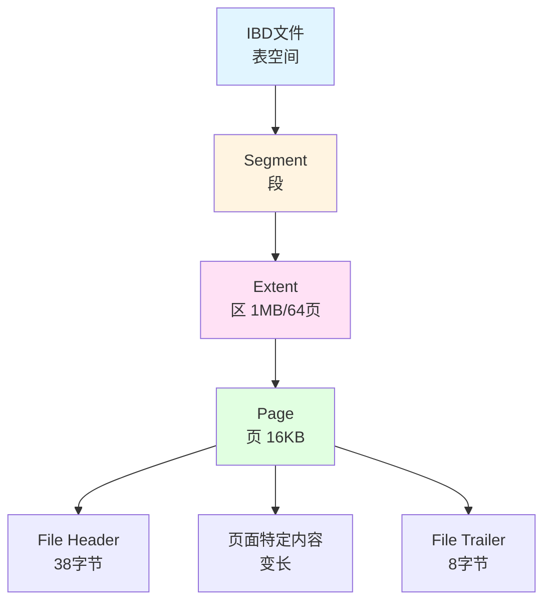
```mermaid
graph TB
    A[IBD文件<br/>表空间] --> B[Segment<br/>段]
    B --> C[Extent<br/>区 1MB/64页]
    C --> D[Page<br/>页 16KB]
    D --> E1[File Header<br/>38字节]
    D --> E2[页面特定内容<br/>变长]
    D --> E3[File Trailer<br/>8字节]
    
    style A fill:#e1f5ff
    style B fill:#fff4e1
    style C fill:#ffe1f5
    style D fill:#e1ffe1
```

### 核心组件关系

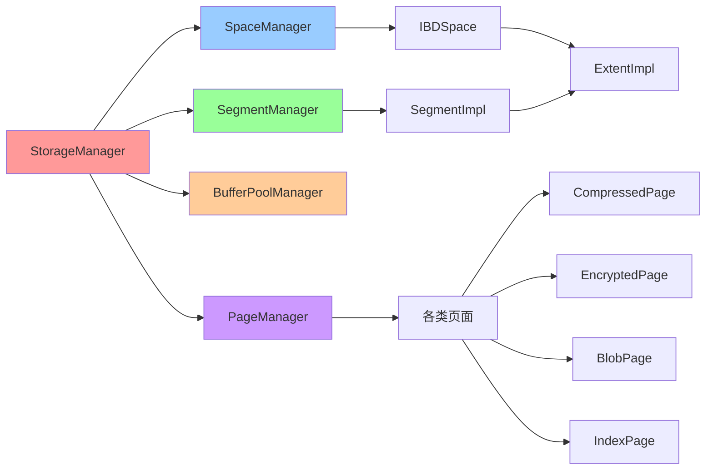
```mermaid
graph LR
    A[StorageManager] --> B[SpaceManager]
    A --> C[SegmentManager]
    A --> D[BufferPoolManager]
    A --> E[PageManager]
    
    B --> F[IBDSpace]
    F --> G[ExtentImpl]
    
    C --> H[SegmentImpl]
    H --> G
    
    E --> I[各类页面]
    I --> I1[CompressedPage]
    I --> I2[EncryptedPage]
    I --> I3[BlobPage]
    I --> I4[IndexPage]
    
    style A fill:#ff9999
    style B fill:#99ccff
    style C fill:#99ff99
    style D fill:#ffcc99
    style E fill:#cc99ff
```

## 5.1 页面管理优化

### 设计目标

优化页面的存储效率和访问性能，通过压缩、加密、智能分配和碎片整理等技术降低存储成本并提升数据安全性。

### 任务清单

| 任务ID | 任务名称 | 优先级 | 难度 | 工作量 | 状态 |
|--------|----------|--------|------|--------|------|
| STG-001 | 实现页面压缩 | 🟡 P1 | ⭐⭐⭐ | 5-6天 | 部分完成 |
| STG-002 | 实现页面加密 | 🟡 P1 | ⭐⭐⭐ | 5-6天 | 部分完成 |
| STG-003 | 优化页面分配 | 🔴 P0 | ⭐⭐ | 3-4天 | 部分完成 |
| STG-004 | 实现页面碎片整理 | 🟡 P1 | ⭐⭐⭐ | 4-5天 | 未开始 |
| STG-005 | 优化页面校验和 | 🟡 P1 | ⭐⭐ | 2-3天 | 部分完成 |

### STG-001: 页面压缩实现

#### 业务价值
- 减少磁盘空间占用50-70%
- 降低IO操作量
- 提升数据传输效率

#### 设计方案

**压缩算法支持**

| 算法 | 压缩比 | 速度 | 使用场景 |
|------|--------|------|----------|
| ZLIB | 高(60-70%) | 慢 | 归档数据，读多写少 |
| LZ4 | 中(40-50%) | 快 | 热数据，频繁访问 |
| ZSTD | 高(55-65%) | 中 | 通用场景，平衡性能 |

**页面压缩流程**

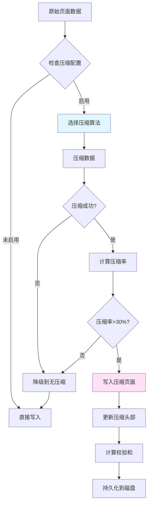
```mermaid
graph TD
    A[原始页面数据] --> B{检查压缩配置}
    B -->|启用| C[选择压缩算法]
    B -->|未启用| Z[直接写入]
    
    C --> D[压缩数据]
    D --> E{压缩成功?}
    E -->|是| F[计算压缩率]
    E -->|否| G[降级到无压缩]
    
    F --> H{压缩率>30%?}
    H -->|是| I[写入压缩页面]
    H -->|否| G
    
    I --> J[更新压缩头部]
    J --> K[计算校验和]
    K --> L[持久化到磁盘]
    
    G --> Z
    
    style C fill:#e1f5ff
    style I fill:#ffe1f5
```

**数据结构设计**

压缩页面结构（16KB总大小）：

| 部分 | 大小 | 说明 |
|------|------|------|
| File Header | 38字节 | 页面通用头部 |
| Compression Header | 16字节 | 压缩元数据 |
| Compressed Data | 变长(最大16322字节) | 压缩后数据 |
| Padding | 变长 | 填充到16KB |
| File Trailer | 8字节 | 页面尾部校验 |

**压缩头部结构**：

| 字段 | 大小 | 说明 |
|------|------|------|
| OriginalSize | 4字节 | 原始数据大小 |
| CompressedSize | 4字节 | 压缩后大小 |
| Algorithm | 2字节 | 压缩算法标识 |
| Checksum | 4字节 | 压缩数据校验和 |
| Reserved | 2字节 | 保留字段 |

#### 实现要点

1. **透明压缩/解压**
   - 在BufferPool读取时自动解压
   - 在刷盘时自动压缩
   - 对上层应用完全透明

2. **压缩性能优化**
   - 压缩操作异步化
   - 使用压缩缓存避免重复压缩
   - 针对小页面跳过压缩

3. **压缩失败处理**
   - 压缩失败时回退到非压缩模式
   - 记录压缩失败统计
   - 动态调整压缩策略

#### 涉及文件

- `server/innodb/storage/store/pages/compressed_page.go` (已存在，需完善)
- `server/innodb/storage/wrapper/page/compression_manager.go` (新建)
- `server/innodb/buffer_pool/compression_cache.go` (新建)

### STG-002: 页面加密实现

#### 业务价值
- 保护敏感数据安全
- 符合数据合规要求
- 防止物理文件泄露

#### 设计方案

**加密算法支持**

| 算法 | 密钥长度 | 性能 | 安全级别 |
|------|----------|------|----------|
| AES-128-CBC | 128位 | 快 | 中 |
| AES-256-CBC | 256位 | 中 | 高 |
| AES-128-CTR | 128位 | 快 | 中 |
| AES-256-CTR | 256位 | 中 | 高 |

**密钥管理架构**

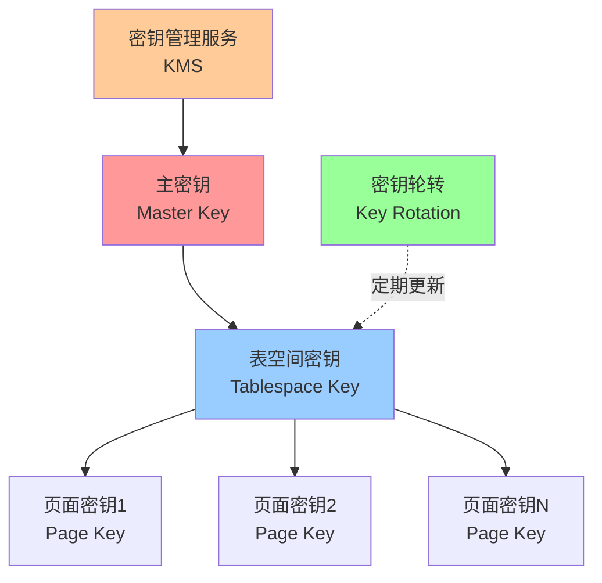
```mermaid
graph TB
    A[主密钥<br/>Master Key] --> B[表空间密钥<br/>Tablespace Key]
    B --> C1[页面密钥1<br/>Page Key]
    B --> C2[页面密钥2<br/>Page Key]
    B --> C3[页面密钥N<br/>Page Key]
    
    D[密钥管理服务<br/>KMS] --> A
    
    E[密钥轮转<br/>Key Rotation] -.定期更新.-> B
    
    style A fill:#ff9999
    style B fill:#99ccff
    style D fill:#ffcc99
    style E fill:#99ff99
```

**加密页面结构**（16KB总大小）：

| 部分 | 大小 | 说明 |
|------|------|------|
| File Header | 38字节 | 页面通用头部 |
| Encryption Header | 32字节 | 加密元数据 |
| Encrypted Data | 16306字节 | 加密后数据 |
| File Trailer | 8字节 | 页面尾部校验 |

**加密头部结构**：

| 字段 | 大小 | 说明 |
|------|------|------|
| Algorithm | 2字节 | 加密算法标识 |
| KeyVersion | 4字节 | 密钥版本号 |
| IV | 16字节 | 初始化向量 |
| Checksum | 4字节 | 加密数据校验和 |
| KeyID | 4字节 | 密钥标识符 |
| Reserved | 2字节 | 保留字段 |

#### 实现要点

1. **透明加密/解密**
   - 读取时自动解密
   - 写入时自动加密
   - 内存中始终是明文

2. **密钥管理**
   - 支持外部密钥管理系统(KMS)集成
   - 实现密钥版本控制
   - 支持密钥轮转

3. **性能优化**
   - 使用硬件加速（AES-NI）
   - 批量加密/解密
   - 加密操作并行化

#### 涉及文件

- `server/innodb/storage/store/pages/encrypted_page.go` (已存在，需完善)
- `server/innodb/storage/wrapper/page/encryption_manager.go` (新建)
- `server/innodb/basic/key_manager.go` (新建)

### STG-003: 页面分配优化

#### 业务价值
- 提升页面分配效率
- 减少碎片产生
- 优化空间利用率

#### 设计方案

**页面分配策略**

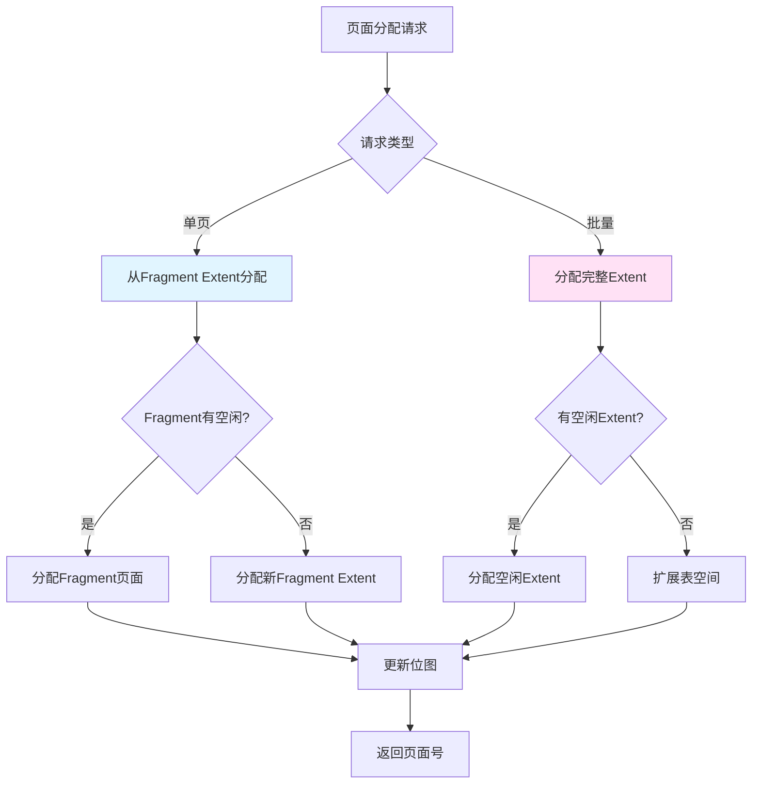
```mermaid
graph TD
    A[页面分配请求] --> B{请求类型}
    B -->|单页| C[从Fragment Extent分配]
    B -->|批量| D[分配完整Extent]
    
    C --> E{Fragment有空闲?}
    E -->|是| F[分配Fragment页面]
    E -->|否| G[分配新Fragment Extent]
    
    D --> H{有空闲Extent?}
    H -->|是| I[分配空闲Extent]
    H -->|否| J[扩展表空间]
    
    F --> K[更新位图]
    G --> K
    I --> K
    J --> K
    
    K --> L[返回页面号]
    
    style C fill:#e1f5ff
    style D fill:#ffe1f5
```

**分配优先级**

| 优先级 | 来源 | 适用场景 |
|--------|------|----------|
| 1 | 已分配Fragment页面 | 小表、零散分配 |
| 2 | 新Fragment Extent | Fragment满时 |
| 3 | 空闲Extent | 批量分配、大表 |
| 4 | 扩展表空间 | 空间不足时 |

#### 实现要点

1. **智能分配策略**
   - 根据表大小选择分配策略
   - 预测性分配，减少扩展次数
   - 空间回收和复用

2. **位图管理**
   - 高效的位图查找算法
   - 位图缓存机制
   - 并发位图更新

3. **碎片控制**
   - 连续页面优先分配
   - 定期碎片分析
   - 自动碎片整理触发

#### 涉及文件

- `server/innodb/storage/wrapper/space/ibd_space.go` (已存在，需优化)
- `server/innodb/manager/page_allocator.go` (新建)
- `server/innodb/storage/wrapper/space/bitmap_manager.go` (新建)

### STG-004: 页面碎片整理

#### 业务价值
- 提升查询性能
- 优化空间利用
- 减少IO操作

#### 设计方案

**碎片类型识别**

| 碎片类型 | 定义 | 影响 | 处理优先级 |
|----------|------|------|------------|
| 内部碎片 | 页面内有效数据<50% | 空间浪费 | 高 |
| 外部碎片 | 相邻页面分散在不同Extent | IO性能下降 | 中 |
| 逻辑碎片 | B+树页面填充率低 | 树高度增加 | 低 |

**碎片整理流程**

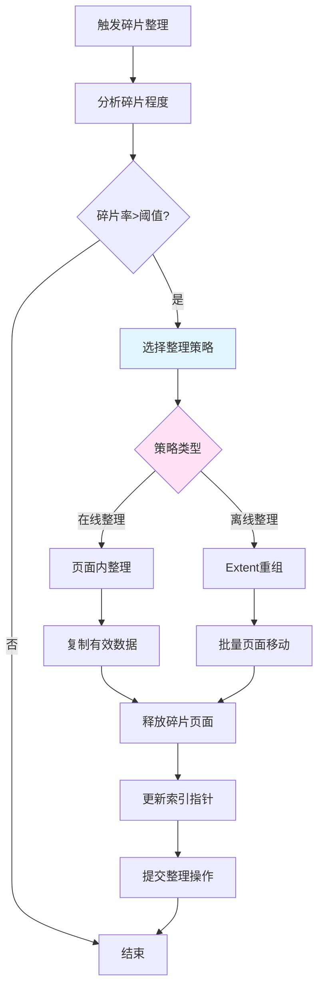
```mermaid
graph TD
    A[触发碎片整理] --> B[分析碎片程度]
    B --> C{碎片率>阈值?}
    C -->|否| Z[结束]
    C -->|是| D[选择整理策略]
    
    D --> E{策略类型}
    E -->|在线整理| F[页面内整理]
    E -->|离线整理| G[Extent重组]
    
    F --> H[复制有效数据]
    G --> I[批量页面移动]
    
    H --> J[释放碎片页面]
    I --> J
    
    J --> K[更新索引指针]
    K --> L[提交整理操作]
    L --> Z
    
    style D fill:#e1f5ff
    style E fill:#ffe1f5
```

**整理策略**

| 策略 | 适用场景 | 影响 | 执行时机 |
|------|----------|------|----------|
| 在线页面整理 | 内部碎片 | 影响小 | 后台自动 |
| Extent重组 | 外部碎片 | 影响中 | 低峰期 |
| 表重建 | 严重碎片 | 影响大 | 维护窗口 |

#### 实现要点

1. **碎片分析**
   - 实时碎片率监控
   - 碎片分布统计
   - 自动触发阈值配置

2. **在线整理**
   - 最小化锁冲突
   - 增量整理机制
   - 中断恢复能力

3. **离线整理**
   - 高效批量操作
   - 并行整理
   - 进度可见性

#### 涉及文件

- `server/innodb/manager/defragmentation_manager.go` (新建)
- `server/innodb/storage/wrapper/space/extent_reorganizer.go` (新建)
- `server/innodb/background/defrag_worker.go` (新建)

### STG-005: 页面校验和优化

#### 业务价值
- 检测数据损坏
- 保证数据完整性
- 快速故障定位

#### 设计方案

**校验和算法对比**

| 算法 | 计算速度 | 检测能力 | 推荐场景 |
|------|----------|----------|----------|
| CRC32 | 快 | 中 | 通用 |
| CRC32C | 很快(硬件加速) | 中 | 高性能场景 |
| xxHash | 很快 | 高 | 内存校验 |
| SHA256 | 慢 | 极高 | 安全敏感 |

**校验和计算范围**

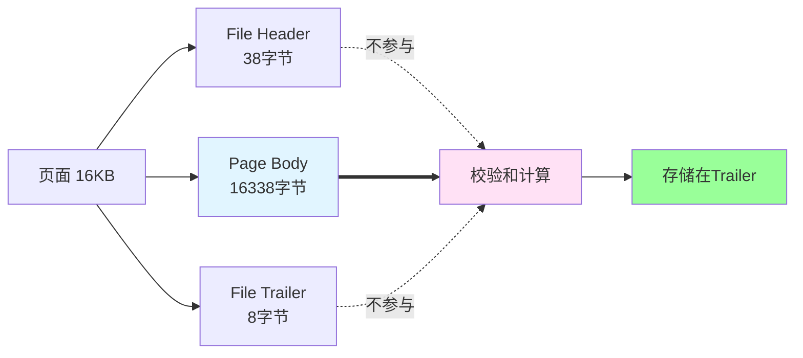
```mermaid
graph LR
    A[页面 16KB] --> B[File Header<br/>38字节]
    A --> C[Page Body<br/>16338字节]
    A --> D[File Trailer<br/>8字节]
    
    B -.不参与.-> E[校验和计算]
    C ==> E
    D -.不参与.-> E
    
    E --> F[存储在Trailer]
    
    style C fill:#e1f5ff
    style E fill:#ffe1f5
    style F fill:#99ff99
```

#### 实现要点

1. **多级校验**
   - 页面级校验（必选）
   - Extent级校验（可选）
   - 表空间级校验（定期）

2. **性能优化**
   - 使用硬件加速（CRC32C）
   - 并行计算校验和
   - 校验和缓存

3. **错误处理**
   - 校验和不匹配时的恢复策略
   - 错误日志记录
   - 损坏页面隔离

#### 涉及文件

- `server/innodb/storage/store/pages/page_integrity_checker.go` (已存在，需优化)
- `server/innodb/util/checksum.go` (新建)

## 5.2 表空间管理

### 设计目标

优化表空间的创建、扩展、收缩和IO性能，支持系统表空间的特殊管理和用户表空间的灵活配置。

### 任务清单

| 任务ID | 任务名称 | 优先级 | 难度 | 工作量 | 状态 |
|--------|----------|--------|------|--------|------|
| STG-006 | 完善系统表空间管理 | 🔴 P0 | ⭐⭐⭐ | 5-6天 | 部分完成 |
| STG-007 | 实现表空间扩展 | 🔴 P0 | ⭐⭐ | 3-4天 | 部分完成 |
| STG-008 | 实现表空间收缩 | 🟡 P1 | ⭐⭐⭐ | 4-5天 | 未开始 |
| STG-009 | 实现表空间加密 | 🟡 P1 | ⭐⭐⭐ | 5-6天 | 未开始 |
| STG-010 | 优化表空间IO | 🟡 P1 | ⭐⭐⭐ | 4-5天 | 未开始 |

### STG-006: 系统表空间管理

#### 业务价值
- 管理系统元数据
- 维护数据字典
- 支持系统表操作

#### 设计方案

**系统表空间页面布局**

| 页号 | 页面类型 | 说明 |
|------|----------|------|
| 0 | FSP_HDR | 表空间头部页面 |
| 1 | IBUF_BITMAP | Insert Buffer位图 |
| 2 | INODE | 段信息节点页面 |
| 3 | SYS | 系统页面 |
| 4 | INDEX | 索引页面 |
| 5 | DICT_ROOT | 数据字典根页面 |
| 6 | TRX_SYS | 事务系统页面 |
| 7 | FIRST_RSEG | 第一个回滚段 |
| 8+ | DATA | 数据页面 |

**系统表空间架构**

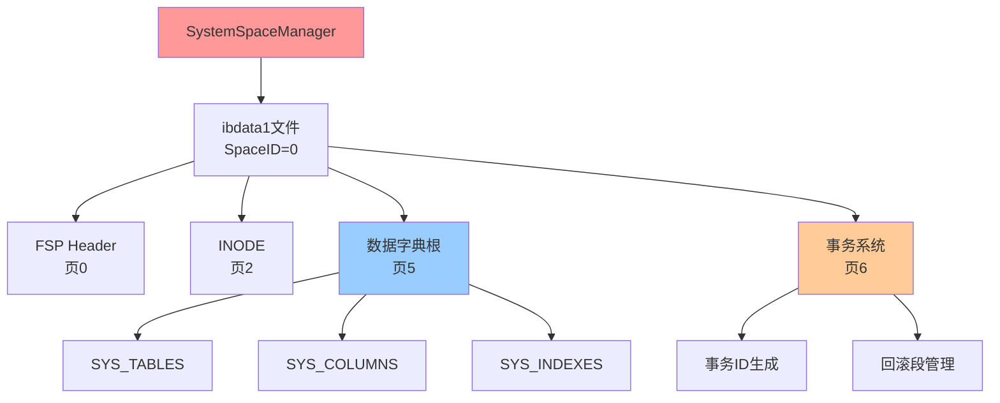
```mermaid
graph TB
    A[SystemSpaceManager] --> B[ibdata1文件<br/>SpaceID=0]
    
    B --> C1[FSP Header<br/>页0]
    B --> C2[INODE<br/>页2]
    B --> C3[数据字典根<br/>页5]
    B --> C4[事务系统<br/>页6]
    
    C3 --> D1[SYS_TABLES]
    C3 --> D2[SYS_COLUMNS]
    C3 --> D3[SYS_INDEXES]
    
    C4 --> E1[事务ID生成]
    C4 --> E2[回滚段管理]
    
    style A fill:#ff9999
    style C3 fill:#99ccff
    style C4 fill:#ffcc99
```

#### 实现要点

1. **系统页面管理**
   - 固定页面位置保证
   - 系统页面初始化
   - 系统页面恢复

2. **数据字典管理**
   - 系统表定义
   - 数据字典索引
   - 元数据一致性

3. **事务系统集成**
   - 事务ID分配
   - 回滚段管理
   - Undo日志关联

#### 涉及文件

- `server/innodb/manager/system_space_manager.go` (已存在，需完善)
- `server/innodb/manager/dictionary_manager.go` (已存在，需完善)
- `server/innodb/storage/store/pages/data_dictionary_hdr_page.go` (已存在)

### STG-007: 表空间扩展

#### 业务价值
- 自动空间增长
- 减少空间不足错误
- 提升用户体验

#### 设计方案

**扩展策略**

| 策略 | 扩展大小 | 适用场景 |
|------|----------|----------|
| 固定扩展 | 固定N个Extent | 小表、可预测增长 |
| 比例扩展 | 当前大小的X% | 大表、快速增长 |
| 自适应扩展 | 根据增长速率 | 通用场景 |

**扩展流程**

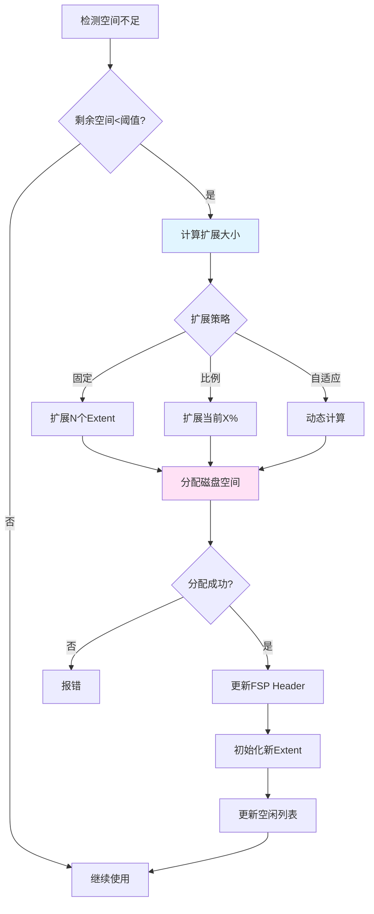
```mermaid
graph TD
    A[检测空间不足] --> B{剩余空间<阈值?}
    B -->|否| Z[继续使用]
    B -->|是| C[计算扩展大小]
    
    C --> D{扩展策略}
    D -->|固定| E[扩展N个Extent]
    D -->|比例| F[扩展当前X%]
    D -->|自适应| G[动态计算]
    
    E --> H[分配磁盘空间]
    F --> H
    G --> H
    
    H --> I{分配成功?}
    I -->|是| J[更新FSP Header]
    I -->|否| K[报错]
    
    J --> L[初始化新Extent]
    L --> M[更新空闲列表]
    M --> Z
    
    style C fill:#e1f5ff
    style H fill:#ffe1f5
```

#### 实现要点

1. **预测性扩展**
   - 基于历史增长率预测
   - 提前扩展避免阻塞
   - 扩展大小自适应

2. **扩展性能优化**
   - 批量Extent分配
   - 异步扩展
   - 扩展操作并行化

3. **空间限制**
   - 最大表空间大小限制
   - 磁盘配额检查
   - 扩展失败处理

#### 涉及文件

- `server/innodb/storage/wrapper/space/ibd_space.go` (已存在，需增强)
- `server/innodb/manager/space_expansion_manager.go` (新建)

### STG-008: 表空间收缩

#### 业务价值
- 回收未使用空间
- 降低存储成本
- 优化备份大小

#### 设计方案

**收缩条件判断**

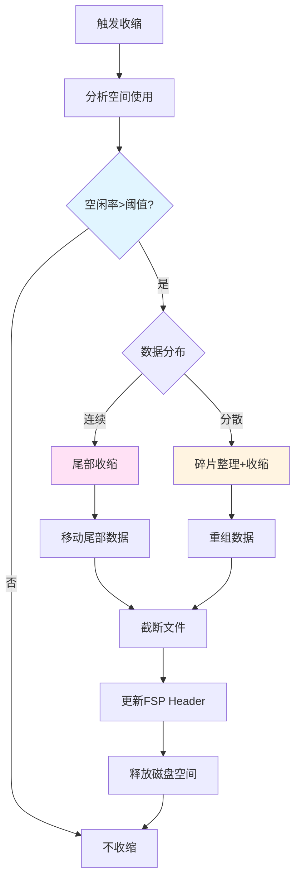
```mermaid
graph TD
    A[触发收缩] --> B[分析空间使用]
    B --> C{空闲率>阈值?}
    C -->|否| Z[不收缩]
    C -->|是| D{数据分布}
    
    D -->|连续| E[尾部收缩]
    D -->|分散| F[碎片整理+收缩]
    
    E --> G[移动尾部数据]
    F --> H[重组数据]
    
    G --> I[截断文件]
    H --> I
    
    I --> J[更新FSP Header]
    J --> K[释放磁盘空间]
    K --> Z
    
    style C fill:#e1f5ff
    style E fill:#ffe1f5
    style F fill:#fff4e1
```

#### 实现要点

1. **安全收缩**
   - 确保数据不丢失
   - 在线收缩支持
   - 收缩回滚机制

2. **收缩策略**
   - 仅收缩尾部空闲Extent
   - 与碎片整理结合
   - 渐进式收缩

3. **性能考虑**
   - 最小化数据移动
   - 低峰期执行
   - 可中断恢复

#### 涉及文件

- `server/innodb/storage/wrapper/space/space_shrink_manager.go` (新建)
- `server/innodb/background/shrink_worker.go` (新建)

### STG-009: 表空间加密

#### 业务价值
- 整体数据保护
- 合规性要求
- 密钥统一管理

#### 设计方案

**加密架构**

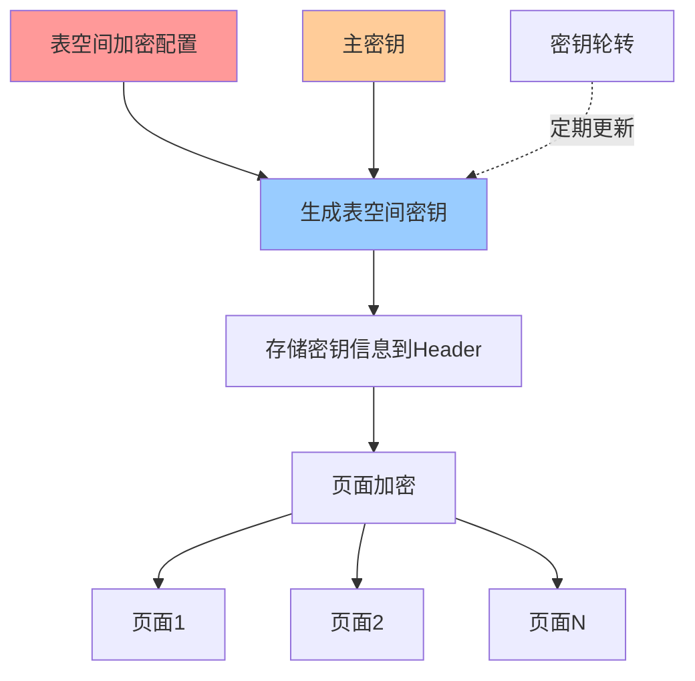
```mermaid
graph TB
    A[表空间加密配置] --> B[生成表空间密钥]
    B --> C[存储密钥信息到Header]
    
    C --> D[页面加密]
    D --> E[页面1]
    D --> F[页面2]
    D --> G[页面N]
    
    H[主密钥] --> B
    I[密钥轮转] -.定期更新.-> B
    
    style A fill:#ff9999
    style B fill:#99ccff
    style H fill:#ffcc99
```

#### 实现要点

1. **表空间级加密**
   - 创建时指定加密
   - 统一密钥管理
   - 加密元数据持久化

2. **已有表空间加密**
   - 在线加密转换
   - 渐进式加密
   - 加密进度跟踪

3. **解密支持**
   - 解密到明文
   - 临时解密
   - 密钥销毁

#### 涉及文件

- `server/innodb/storage/wrapper/space/tablespace_encryption.go` (新建)
- `server/innodb/basic/encryption_context.go` (新建)

### STG-010: 表空间IO优化

#### 业务价值
- 提升IO吞吐量
- 降低IO延迟
- 优化资源利用

#### 设计方案

**IO优化策略**

| 策略 | 技术 | 收益 |
|------|------|------|
| 顺序IO优化 | 预读、批量写 | 提升吞吐30-50% |
| 随机IO优化 | 异步IO、IO调度 | 降低延迟20-40% |
| 缓存优化 | 多级缓存、预热 | 减少IO 50-70% |

**IO路径优化**

```mermaid
graph LR
    A[应用请求] --> B{BufferPool}
    B -->|命中| C[内存返回]
    B -->|未命中| D[IO调度器]
    
    D --> E{IO类型}
    E -->|顺序| F[批量读取]
    E -->|随机| G[异步读取]
    
    F --> H[磁盘IO]
    G --> H
    
    H --> I[预读触发]
    I --> J[更新BufferPool]
    J --> C
    
    style B fill:#e1f5ff
    style D fill:#ffe1f5
    style H fill:#fff4e1
```

#### 实现要点

1. **顺序IO优化**
   - 批量读写
   - 预读机制
   - IO合并

2. **随机IO优化**
   - 异步IO
   - IO优先级调度
   - IO并发控制

3. **缓存策略**
   - 热点页面缓存
   - 预热重要数据
   - LRU算法优化

#### 涉及文件

- `server/innodb/storage/wrapper/space/io_scheduler.go` (新建)
- `server/innodb/buffer_pool/prefetch_manager.go` (新建)

## 5.3 段和区管理

### 设计目标

优化段的分配策略和区的复用机制，减少空间浪费，提升分配效率，支持段碎片整理。

### 任务清单

| 任务ID | 任务名称 | 优先级 | 难度 | 工作量 | 状态 |
|--------|----------|--------|------|--------|------|
| STG-011 | 完善段分配策略 | 🔴 P0 | ⭐⭐⭐ | 4-5天 | 部分完成 |
| STG-012 | 实现区复用机制 | 🟡 P1 | ⭐⭐ | 3-4天 | 未开始 |
| STG-013 | 优化段空间管理 | 🟡 P1 | ⭐⭐ | 3-4天 | 未开始 |
| STG-014 | 实现段碎片整理 | 🟡 P1 | ⭐⭐⭐ | 4-5天 | 未开始 |

### STG-011: 段分配策略

#### 业务价值
- 优化空间利用率
- 减少碎片产生
- 提升分配性能

#### 设计方案

**段类型与分配策略**

| 段类型 | 分配策略 | 初始大小 | 扩展策略 |
|--------|----------|----------|----------|
| 数据段 | 32页Fragment + Extent | 32页 | 按需扩展 |
| 索引段 | 优先Extent | 1个Extent | 成倍扩展 |
| Undo段 | 循环复用 | 1个Extent | 固定大小 |
| BLOB段 | 按需分配 | 动态 | 链式扩展 |

**段分配流程**

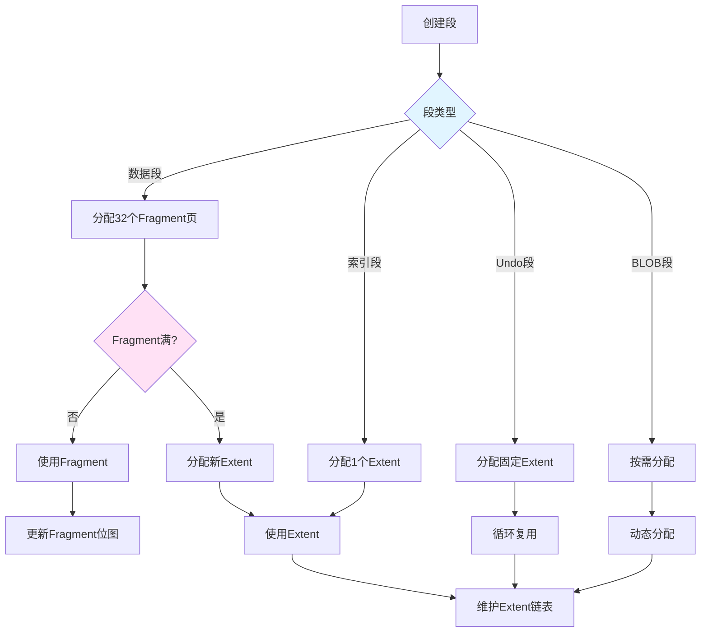
```mermaid
graph TD
    A[创建段] --> B{段类型}
    B -->|数据段| C[分配32个Fragment页]
    B -->|索引段| D[分配1个Extent]
    B -->|Undo段| E[分配固定Extent]
    B -->|BLOB段| F[按需分配]
    
    C --> G{Fragment满?}
    G -->|否| H[使用Fragment]
    G -->|是| I[分配新Extent]
    
    D --> J[使用Extent]
    E --> K[循环复用]
    F --> L[动态分配]
    
    I --> J
    J --> M[维护Extent链表]
    H --> N[更新Fragment位图]
    K --> M
    L --> M
    
    style B fill:#e1f5ff
    style G fill:#ffe1f5
```

#### 实现要点

1. **Fragment页面管理**
   - 前32个页面用于Fragment
   - Fragment满后分配完整Extent
   - Fragment位图快速查找

2. **Extent链表管理**
   - Free链表：完全空闲
   - NotFull链表：部分使用
   - Full链表：完全使用

3. **段扩展策略**
   - 小段使用Fragment
   - 大段使用Extent
   - 自适应切换

#### 涉及文件

- `server/innodb/manager/segment_manager.go` (已存在，需完善)
- `server/innodb/storage/wrapper/segment/allocation_strategy.go` (新建)
- `server/innodb/storage/store/segs/segment.go` (已存在)

### STG-012: 区复用机制

#### 业务价值
- 减少空间浪费
- 提升分配速度
- 降低碎片率

#### 设计方案

**区状态转换**

```mermaid
stateDiagram-v2
    [*] --> Free: 新分配
    Free --> Fragment: 部分使用
    Fragment --> Full: 填满
    Fragment --> Free: 释放所有页
    Full --> Fragment: 释放部分页
    Full --> Free: 释放所有页
    Free --> [*]: 回收
```

**复用策略**

| 策略 | 触发条件 | 复用对象 | 优先级 |
|------|----------|----------|--------|
| 同段复用 | 段内有Free Extent | 同一段的Free列表 | 高 |
| 表空间复用 | 段内无可用 | 表空间Free列表 | 中 |
| 跨表空间 | 系统表空间 | 系统空间Free列表 | 低 |

#### 实现要点

1. **Extent回收**
   - 页面全部释放时回收
   - 加入Free链表
   - 更新Extent状态

2. **智能复用**
   - 优先同段复用
   - 考虑空间局部性
   - 避免过度碎片化

3. **复用监控**
   - 复用率统计
   - 复用效率分析
   - 复用策略调优

#### 涉及文件

- `server/innodb/storage/wrapper/extent/extent_pool.go` (新建)
- `server/innodb/manager/extent_recycler.go` (新建)

### STG-013: 段空间管理优化

#### 业务价值
- 精确空间统计
- 快速空间查询
- 高效空间回收

#### 设计方案

**空间统计维护**

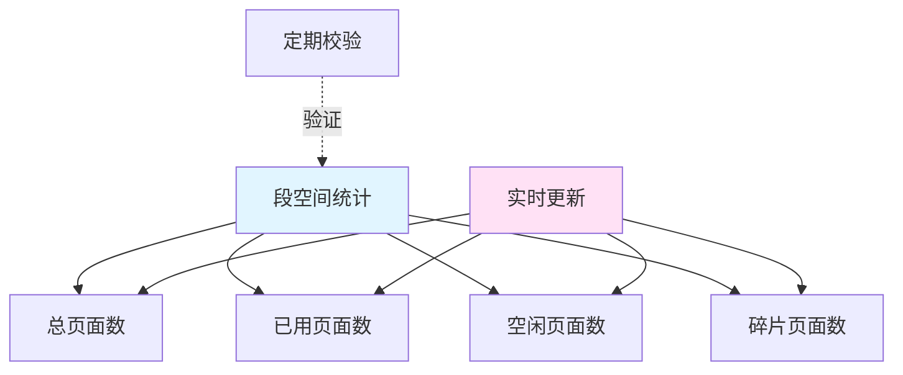
```mermaid
graph TB
    A[段空间统计] --> B[总页面数]
    A --> C[已用页面数]
    A --> D[空闲页面数]
    A --> E[碎片页面数]
    
    F[实时更新] --> B
    F --> C
    F --> D
    F --> E
    
    G[定期校验] -.验证.-> A
    
    style A fill:#e1f5ff
    style F fill:#ffe1f5
```

#### 实现要点

1. **空间统计**
   - 实时维护统计信息
   - 高效统计更新
   - 统计信息持久化

2. **空间查询**
   - 快速空间查询接口
   - 多维度统计
   - 历史趋势分析

3. **空间回收**
   - 自动空间回收
   - 回收阈值配置
   - 回收进度监控

#### 涉及文件

- `server/innodb/storage/wrapper/segment/space_tracker.go` (新建)
- `server/innodb/manager/segment_stats_manager.go` (新建)

### STG-014: 段碎片整理

#### 业务价值
- 提升空间利用率
- 优化查询性能
- 降低存储成本

#### 设计方案

**碎片整理策略**

| 策略 | 触发条件 | 整理范围 | 性能影响 |
|------|----------|----------|----------|
| 在线整理 | 碎片率>30% | 单个段 | 低 |
| 批量整理 | 碎片率>50% | 多个段 | 中 |
| 全局整理 | 碎片率>70% | 整个表空间 | 高 |

**整理流程**

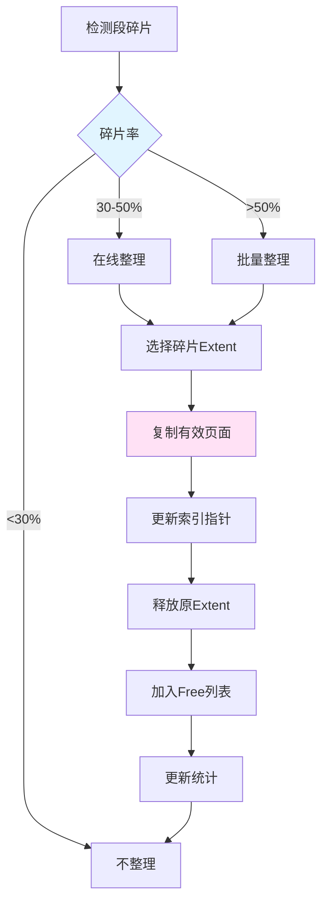
```mermaid
graph TD
    A[检测段碎片] --> B{碎片率}
    B -->|<30%| Z[不整理]
    B -->|30-50%| C[在线整理]
    B -->|>50%| D[批量整理]
    
    C --> E[选择碎片Extent]
    D --> E
    
    E --> F[复制有效页面]
    F --> G[更新索引指针]
    G --> H[释放原Extent]
    H --> I[加入Free列表]
    I --> J[更新统计]
    J --> Z
    
    style B fill:#e1f5ff
    style F fill:#ffe1f5
```

#### 实现要点

1. **碎片识别**
   - 实时碎片率计算
   - 碎片分布分析
   - 碎片热点识别

2. **在线整理**
   - 最小化锁冲突
   - 渐进式整理
   - 可中断恢复

3. **整理优化**
   - 整理优先级
   - 整理批量化
   - 整理并行化

#### 涉及文件

- `server/innodb/manager/segment_defrag_manager.go` (新建)
- `server/innodb/background/segment_defrag_worker.go` (新建)

## 5.4 行格式支持

### 设计目标

实现完整的InnoDB行格式支持，包括Compact、Dynamic、Compressed格式，以及BLOB大字段的外部存储管理。

### 任务清单

| 任务ID | 任务名称 | 优先级 | 难度 | 工作量 | 状态 |
|--------|----------|--------|------|--------|------|
| STG-015 | 完善Compact行格式 | 🔴 P0 | ⭐⭐⭐ | 5-6天 | 部分完成 |
| STG-016 | 实现Dynamic行格式 | 🟡 P1 | ⭐⭐⭐ | 5-6天 | 未开始 |
| STG-017 | 实现Compressed行格式 | 🟡 P1 | ⭐⭐⭐ | 5-6天 | 未开始 |
| STG-018 | 实现BLOB页面管理 | 🔴 P0 | ⭐⭐⭐ | 5-6天 | 部分完成 |
| STG-019 | 优化变长字段存储 | 🟡 P1 | ⭐⭐ | 3-4天 | 未开始 |

### STG-015: Compact行格式

#### 业务价值
- 标准InnoDB行格式
- 兼容MySQL 5.x
- 空间利用优化

#### 设计方案

**Compact行格式结构**

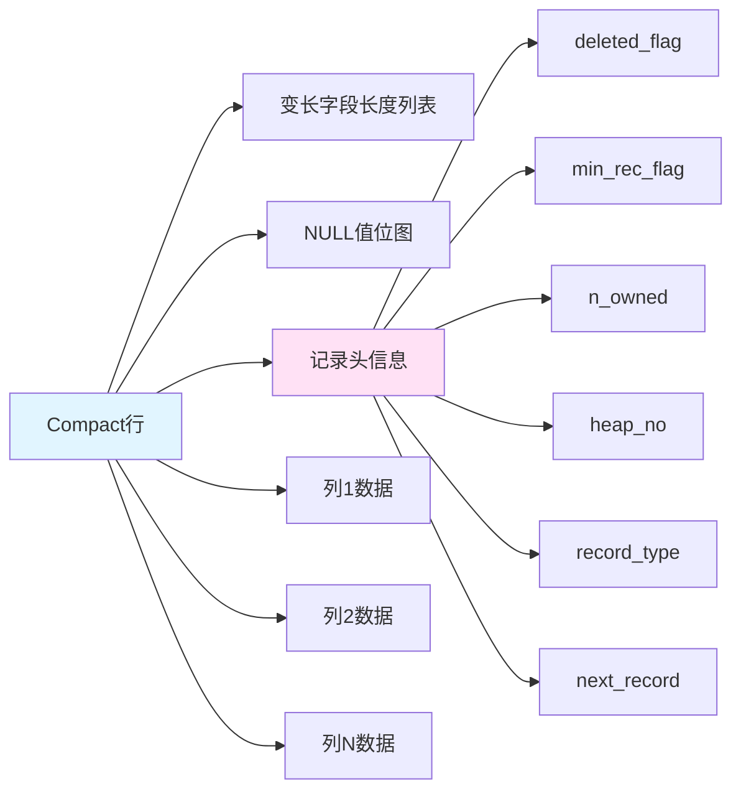
```mermaid
graph LR
    A[Compact行] --> B[变长字段长度列表]
    A --> C[NULL值位图]
    A --> D[记录头信息]
    A --> E[列1数据]
    A --> F[列2数据]
    A --> G[列N数据]
    
    D --> D1[deleted_flag]
    D --> D2[min_rec_flag]
    D --> D3[n_owned]
    D --> D4[heap_no]
    D --> D5[record_type]
    D --> D6[next_record]
    
    style A fill:#e1f5ff
    style D fill:#ffe1f5
```

**各部分详细设计**

| 部分 | 大小 | 说明 |
|------|------|------|
| 变长字段长度列表 | 1-2字节/字段 | 逆序存储VARCHAR/TEXT长度 |
| NULL值位图 | 1bit/可空字段 | 标识字段是否为NULL |
| 记录头信息 | 5字节 | 行元数据 |
| 隐藏列 | 13字节 | DB_TRX_ID(6) + DB_ROLL_PTR(7) |
| 数据列 | 变长 | 实际列数据 |

**记录头信息结构**（5字节）：

| 字段 | 位数 | 说明 |
|------|------|------|
| deleted_flag | 1位 | 删除标记 |
| min_rec_flag | 1位 | B+树非叶子节点最小记录标记 |
| n_owned | 4位 | 当前记录拥有的记录数 |
| heap_no | 13位 | 堆中位置 |
| record_type | 3位 | 记录类型(0普通/1节点指针/2Infimum/3Supremum) |
| next_record | 16位 | 下一条记录偏移 |

#### 实现要点

1. **变长字段处理**
   - 字段长度逆序存储
   - 支持1-2字节长度表示
   - 处理超长字段

2. **NULL值优化**
   - 位图压缩存储
   - NULL字段不占用数据空间
   - 快速NULL判断

3. **记录头管理**
   - 高效头信息编解码
   - 支持记录链表遍历
   - 记录类型识别

#### 涉及文件

- `server/innodb/record/unified_record.go` (已存在)
- `server/innodb/record/compact_format.go` (新建)
- `server/innodb/basic/row.go` (已存在)

### STG-016: Dynamic行格式

#### 业务价值
- MySQL 5.7+默认格式
- 优化大字段存储
- 改进行溢出处理

#### 设计方案

**Dynamic与Compact区别**

| 特性 | Compact | Dynamic |
|------|---------|---------|
| 基础结构 | 相同 | 相同 |
| 行溢出阈值 | 768字节 | 20字节 |
| 溢出数据存储 | 前缀+指针 | 仅指针 |
| 大字段性能 | 一般 | 优秀 |

**行溢出处理**

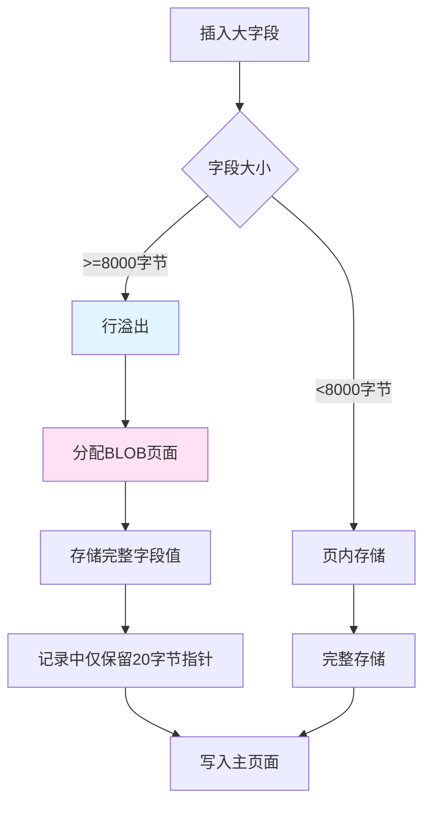
```mermaid
graph TD
    A[插入大字段] --> B{字段大小}
    B -->|<8000字节| C[页内存储]
    B -->|>=8000字节| D[行溢出]
    
    D --> E[分配BLOB页面]
    E --> F[存储完整字段值]
    F --> G[记录中仅保留20字节指针]
    
    C --> H[完整存储]
    G --> I[写入主页面]
    H --> I
    
    style D fill:#e1f5ff
    style E fill:#ffe1f5
```

#### 实现要点

1. **溢出判断**
   - 自动检测大字段
   - 计算行总大小
   - 决定是否溢出

2. **指针管理**
   - 20字节指针结构
   - 指向BLOB页面
   - 支持链式BLOB

3. **性能优化**
   - 减少页内空间占用
   - 提升大字段读取性能
   - 优化更新操作

#### 涉及文件

- `server/innodb/record/dynamic_format.go` (新建)
- `server/innodb/storage/wrapper/row/overflow_handler.go` (新建)

### STG-017: Compressed行格式

#### 业务价值
- 大幅减少存储空间
- 降低IO开销
- 支持大表存储

#### 设计方案

**压缩行格式架构**

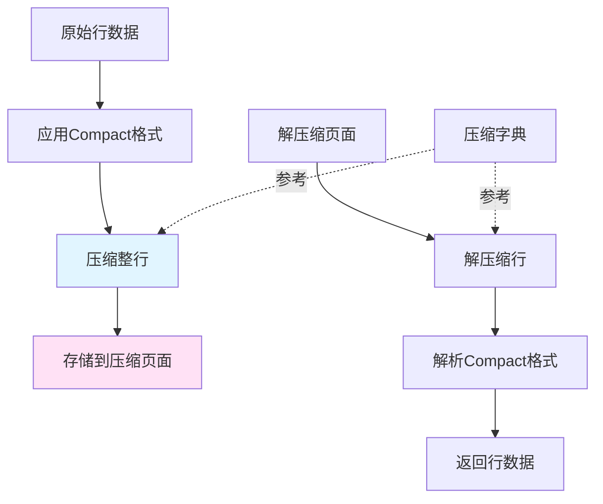
```mermaid
graph TB
    A[原始行数据] --> B[应用Compact格式]
    B --> C[压缩整行]
    C --> D[存储到压缩页面]
    
    E[解压缩页面] --> F[解压缩行]
    F --> G[解析Compact格式]
    G --> H[返回行数据]
    
    I[压缩字典] -.参考.-> C
    I -.参考.-> F
    
    style C fill:#e1f5ff
    style D fill:#ffe1f5
```

**压缩参数配置**

| 参数 | 可选值 | 说明 |
|------|--------|------|
| KEY_BLOCK_SIZE | 1, 2, 4, 8, 16 | 压缩页面大小(KB) |
| 压缩算法 | ZLIB, LZ4 | 压缩算法选择 |
| 压缩级别 | 1-9 | 压缩率vs性能权衡 |

#### 实现要点

1. **整行压缩**
   - 基于Compact格式
   - 压缩所有列数据
   - 压缩头信息优化

2. **压缩字典**
   - 维护压缩字典
   - 提升压缩率
   - 字典更新策略

3. **解压缩性能**
   - 缓存解压缩结果
   - 部分解压缩
   - 硬件加速

#### 涉及文件

- `server/innodb/record/compressed_format.go` (新建)
- `server/innodb/storage/wrapper/row/compression_handler.go` (新建)

### STG-018: BLOB页面管理

#### 业务价值
- 支持大字段存储
- 优化大对象性能
- 灵活存储管理

#### 设计方案

**BLOB存储架构**

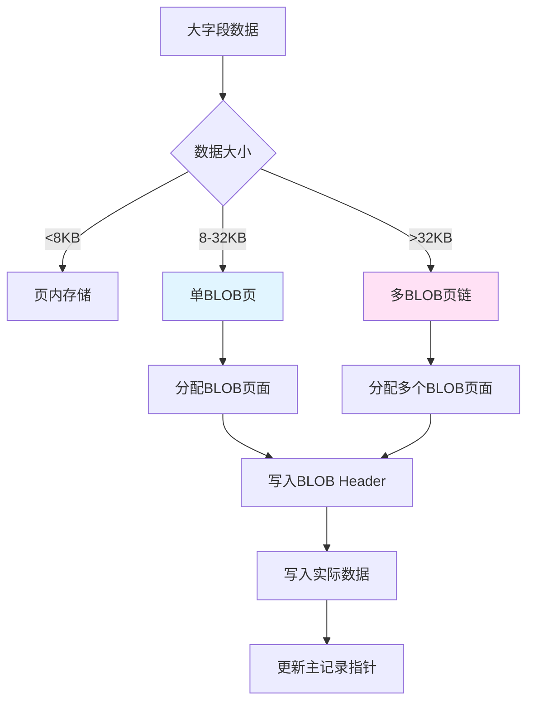
```mermaid
graph TB
    A[大字段数据] --> B{数据大小}
    B -->|<8KB| C[页内存储]
    B -->|8-32KB| D[单BLOB页]
    B -->|>32KB| E[多BLOB页链]
    
    D --> F[分配BLOB页面]
    E --> G[分配多个BLOB页面]
    
    F --> H[写入BLOB Header]
    G --> H
    
    H --> I[写入实际数据]
    I --> J[更新主记录指针]
    
    style D fill:#e1f5ff
    style E fill:#ffe1f5
```

**BLOB页面结构**（16KB）：

| 部分 | 大小 | 说明 |
|------|------|------|
| File Header | 38字节 | 页面通用头部 |
| BLOB Header | 20字节 | BLOB元数据 |
| BLOB Data | 16318字节 | 实际数据 |
| File Trailer | 8字节 | 页面尾部 |

**BLOB Header结构**：

| 字段 | 大小 | 说明 |
|------|------|------|
| Length | 4字节 | 总数据长度 |
| NextPage | 4字节 | 下一个BLOB页面号 |
| Offset | 4字节 | 当前页面数据偏移 |
| SegmentID | 8字节 | 所属段ID |

#### 实现要点

1. **BLOB页面分配**
   - 从BLOB段分配
   - 链式页面管理
   - 页面复用机制

2. **BLOB读写**
   - 支持部分读取
   - 流式写入
   - 并发访问控制

3. **BLOB删除**
   - 级联删除链式页面
   - 页面空间回收
   - 碎片整理

#### 涉及文件

- `server/innodb/storage/store/pages/blob_page.go` (已存在，需完善)
- `server/innodb/storage/wrapper/blob/blob_manager.go` (新建)
- `server/innodb/storage/wrapper/blob/blob_chain.go` (新建)

### STG-019: 变长字段存储优化

#### 业务价值
- 减少空间浪费
- 提升存储效率
- 优化查询性能

#### 设计方案

**变长字段长度表示**

| 长度范围 | 字节数 | 编码方式 |
|----------|--------|----------|
| 0-127字节 | 1字节 | 直接存储 |
| 128-16383字节 | 2字节 | 高位标记+长度 |
| >16KB | 2字节+溢出 | 溢出到BLOB页 |

**优化策略**

```mermaid
graph TD
    A[变长字段] --> B{字段长度}
    B -->|0-127| C[1字节长度]
    B -->|128-8000| D[2字节长度]
    B -->|>8000| E[溢出指针]
    
    C --> F[页内存储]
    D --> F
    E --> G[BLOB页存储]
    
    F --> H[构建长度列表]
    G --> H
    
    H --> I[逆序排列]
    I --> J[写入记录]
    
    style B fill:#e1f5ff
    style H fill:#ffe1f5
```

#### 实现要点

1. **长度编码优化**
   - 紧凑长度表示
   - 支持可变字节数
   - 快速长度解析

2. **空间预留**
   - 预留更新空间
   - 避免频繁溢出
   - 空间复用

3. **性能优化**
   - 字段对齐
   - 缓存长度信息
   - 批量处理

#### 涉及文件

- `server/innodb/record/varchar_handler.go` (新建)
- `server/innodb/storage/wrapper/row/varchar_optimizer.go` (新建)

## 实现优先级与依赖关系

### 优先级矩阵

```mermaid
graph TB
    P0[P0 核心任务] --> STG003[STG-003 页面分配优化]
    P0 --> STG006[STG-006 系统表空间管理]
    P0 --> STG007[STG-007 表空间扩展]
    P0 --> STG011[STG-011 段分配策略]
    P0 --> STG015[STG-015 Compact行格式]
    P0 --> STG018[STG-018 BLOB页面管理]
    
    P1[P1 重要任务] --> STG001[STG-001 页面压缩]
    P1 --> STG002[STG-002 页面加密]
    P1 --> STG004[STG-004 页面碎片整理]
    P1 --> STG005[STG-005 页面校验和]
    P1 --> STG008[STG-008 表空间收缩]
    P1 --> STG009[STG-009 表空间加密]
    P1 --> STG010[STG-010 表空间IO优化]
    P1 --> STG012[STG-012 区复用机制]
    P1 --> STG013[STG-013 段空间管理]
    P1 --> STG014[STG-014 段碎片整理]
    P1 --> STG016[STG-016 Dynamic行格式]
    P1 --> STG017[STG-017 Compressed行格式]
    P1 --> STG019[STG-019 变长字段优化]
    
    style P0 fill:#ff9999
    style P1 fill:#ffcc99
```

### 任务依赖关系

```mermaid
graph TD
    STG003 --> STG004
    STG003 --> STG011
    
    STG001 --> STG017
    
    STG006 --> STG007
    STG007 --> STG008
    STG007 --> STG009
    
    STG011 --> STG012
    STG011 --> STG013
    STG011 --> STG014
    
    STG015 --> STG016
    STG015 --> STG019
    STG016 --> STG017
    
    style STG003 fill:#e1f5ff
    style STG006 fill:#ffe1f5
    style STG011 fill:#fff4e1
    style STG015 fill:#e1ffe1
```

## 测试策略

### 单元测试

**测试覆盖目标**: 85%+

| 测试类别 | 测试内容 | 覆盖率目标 |
|----------|----------|------------|
| 页面管理 | 压缩/解压、加密/解密、分配/释放 | 90% |
| 表空间管理 | 扩展/收缩、IO操作 | 85% |
| 段和区管理 | 分配策略、复用机制 | 85% |
| 行格式 | 格式转换、BLOB处理 | 90% |

### 集成测试

**测试场景**:

| 场景 | 测试点 | 验证指标 |
|------|--------|----------|
| 大表创建 | 页面分配、表空间扩展 | 性能、稳定性 |
| 大字段存储 | BLOB管理、行溢出 | 正确性、性能 |
| 压缩存储 | 压缩行格式、压缩页面 | 压缩率、性能 |
| 加密存储 | 加密页面、密钥管理 | 安全性、性能 |
| 碎片整理 | 在线整理、空间回收 | 效率、影响 |

### 性能测试

**性能基准**:

| 操作 | 目标性能 | 测试方法 |
|------|----------|----------|
| 页面分配 | <1ms | 批量分配10000页 |
| 页面压缩 | 压缩比>50% | 压缩1GB数据 |
| 页面加密 | 性能损失<20% | 加密vs非加密对比 |
| BLOB读写 | 吞吐>100MB/s | 读写100MB BLOB |
| 碎片整理 | 空间回收>70% | 整理碎片化表 |

### 压力测试

**测试场景**:

| 场景 | 并发数 | 数据量 | 持续时间 |
|------|--------|--------|----------|
| 高并发分配 | 100线程 | 100万页 | 1小时 |
| 大量BLOB | 50线程 | 10GB | 2小时 |
| 混合负载 | 200线程 | 变化 | 4小时 |

## 工作量估算

### 各子模块工作量

| 子模块 | 任务数 | 总工作量 | P0任务 | P1任务 |
|--------|--------|----------|--------|--------|
| 页面管理优化 | 5 | 19-23天 | 1 | 4 |
| 表空间管理 | 5 | 21-26天 | 2 | 3 |
| 段和区管理 | 4 | 14-17天 | 1 | 3 |
| 行格式支持 | 5 | 23-28天 | 2 | 3 |
| **合计** | **19** | **77-94天** | **6** | **13** |

### 资源分配建议

**团队配置**: 2名核心开发工程师

**开发周期**: 6-8周

**分工方案**:

| 工程师 | 负责模块 | 工作量 |
|--------|----------|--------|
| 工程师A | 页面管理 + 行格式 | 42-51天 |
| 工程师B | 表空间管理 + 段区管理 | 35-43天 |

### 里程碑规划

| 里程碑 | 完成时间 | 交付内容 |
|--------|----------|----------|
| M1: P0任务完成 | 第3周 | 核心功能可用 |
| M2: P1任务50% | 第5周 | 主要功能完善 |
| M3: P1任务100% | 第7周 | 全部功能完成 |
| M4: 测试与优化 | 第8周 | 达到95%完成度 |

## 技术风险与对策

### 风险识别

| 风险 | 影响 | 概率 | 应对策略 |
|------|------|------|----------|
| 压缩算法性能不达标 | 高 | 中 | 引入LZ4等快速算法 |
| 加密性能损耗过大 | 中 | 中 | 使用硬件加速 |
| BLOB链式管理复杂 | 高 | 高 | 分阶段实现，先单页 |
| 碎片整理影响在线服务 | 高 | 中 | 实现可中断机制 |
| 行格式兼容性问题 | 高 | 低 | 严格遵循MySQL规范 |

### 质量保证

**代码审查**: 所有代码经过Code Review

**测试要求**:
- 单元测试覆盖率 > 85%
- 集成测试通过率 100%
- 性能测试达标

**文档要求**:
- API文档完整
- 实现说明清晰
- 示例代码充分

## 参考资料

### MySQL官方文档
- InnoDB存储引擎架构
- InnoDB页面结构
- InnoDB行格式说明

### 技术书籍
- 《MySQL技术内幕: InnoDB存储引擎》
- 《高性能MySQL》
- 《数据库系统内幕》

### 代码位置
- `server/innodb/storage/` - 存储层实现
- `server/innodb/manager/` - 管理器实现
- `server/innodb/basic/` - 基础接口定义
