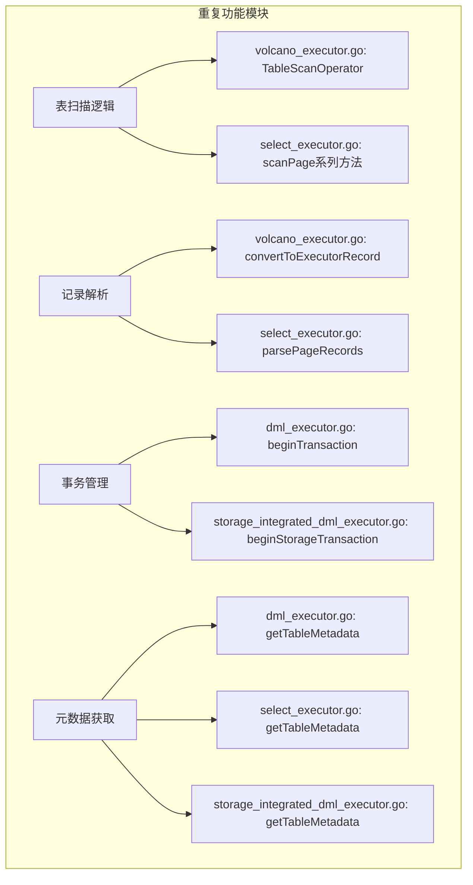
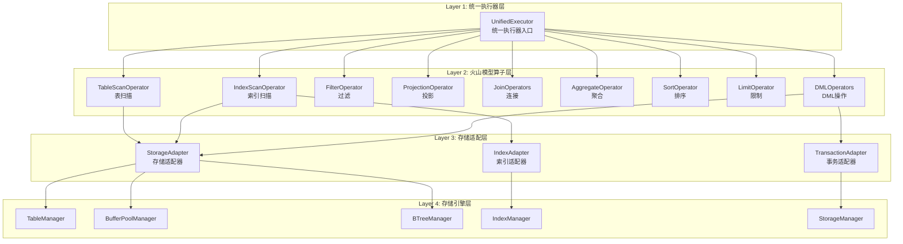
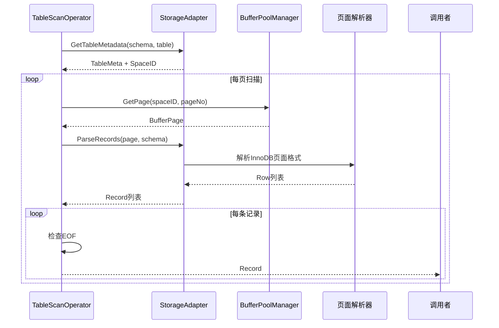
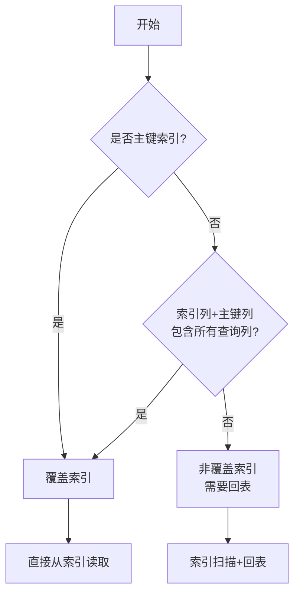
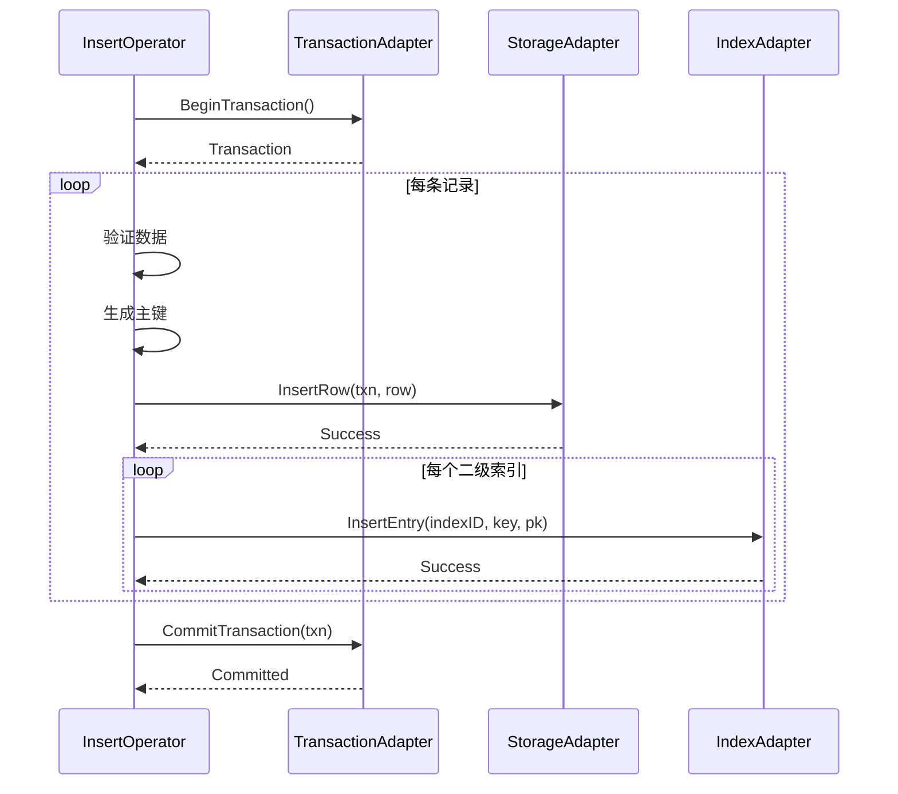
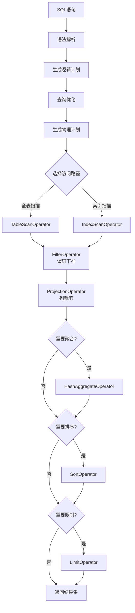
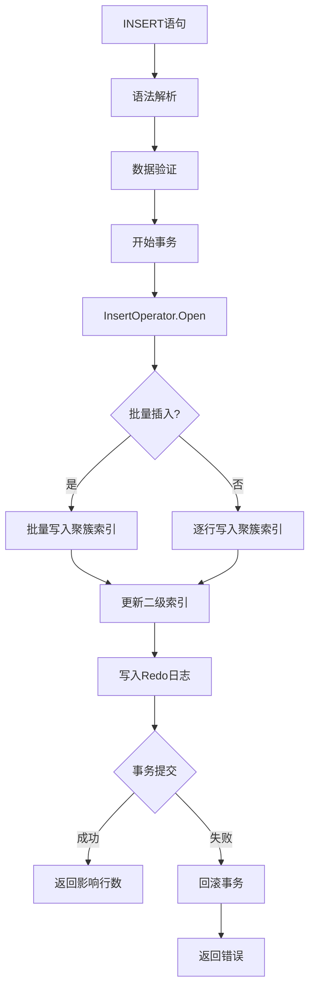
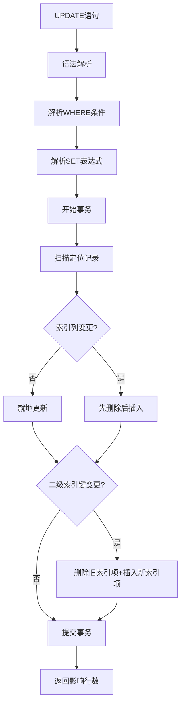
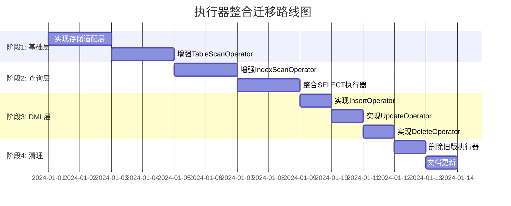
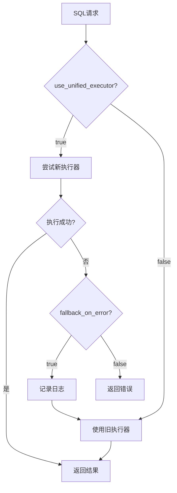

# 执行器代码整合重构设计

## 1. 概述

### 1.1 背景

当前项目存在两套不同的SQL执行器实现，导致代码重复、维护困难、容易引入Bug：

- **新版火山模型执行器**：`volcano_executor.go`（1601行）- 基于Operator接口的标准火山模型实现
- **旧版执行器**：`executor.go`（1429行）- 基于XMySQLExecutor的传统执行器实现
- **专用执行器**：`select_executor.go`（1252行）、`dml_executor.go`（705行）、`storage_integrated_dml_executor.go`（782行）

代码重复度约40%，主要体现在：
- 重复的表扫描逻辑
- 重复的记录处理逻辑
- 重复的事务管理代码
- 重复的元数据获取逻辑

### 1.2 目标

- 统一执行器架构为火山模型
- 消除代码重复
- 提升代码可维护性
- 保持功能完整性
- 不影响现有功能

### 1.3 范围

**包含**：
- 执行器接口统一
- SELECT执行器整合
- DML执行器整合
- 存储引擎集成执行器整合
- 删除过时代码

**不包含**：
- 查询优化器改造
- 存储引擎接口变更
- 事务管理器重构

## 2. 当前架构分析

### 2.1 新版火山模型架构（volcano_executor.go）

采用标准的Operator接口模式：

| 组件 | 职责 | 状态 |
|------|------|------|
| Operator接口 | 定义Open-Next-Close标准迭代器模式 | ✅ 完整实现 |
| BaseOperator | 提供算子公共功能 | ✅ 完整实现 |
| TableScanOperator | 全表扫描算子 | ⚠️ 部分实现（模拟数据） |
| IndexScanOperator | 索引扫描算子 | ⚠️ 部分实现（回表未完成） |
| FilterOperator | 过滤算子 | ✅ 完整实现 |
| ProjectionOperator | 投影算子 | ✅ 完整实现 |
| HashJoinOperator | 哈希连接算子 | ✅ 完整实现 |
| HashAggregateOperator | 哈希聚合算子 | ✅ 完整实现 |
| SortOperator | 排序算子 | ✅ 完整实现 |
| LimitOperator | 限制算子 | ✅ 完整实现 |
| VolcanoExecutor | 执行器核心 | ✅ 完整实现 |

**优势**：
- 标准化接口设计
- 良好的可扩展性
- 算子可组合性强
- 支持流式处理

**不足**：
- 部分算子实现不完整
- 缺少与存储引擎的实际集成
- 缺少DML操作支持

### 2.2 旧版执行器架构（executor.go）

基于XMySQLExecutor的传统架构：

| 组件 | 职责 | 集成度 |
|------|------|--------|
| XMySQLExecutor | SQL执行器核心 | ⚠️ 与多个管理器强耦合 |
| SelectExecutor | SELECT查询处理 | ✅ 与存储引擎集成 |
| DMLExecutor | INSERT/UPDATE/DELETE处理 | ✅ 与B+树集成 |
| StorageIntegratedDMLExecutor | 存储引擎集成DML | ✅ 完整存储集成 |

**优势**：
- 与存储引擎深度集成
- 实际数据处理能力强
- 支持完整的DML操作
- 持久化机制完善

**不足**：
- 代码结构复杂
- 可扩展性差
- 算子不可复用
- 维护成本高

### 2.3 代码重复分析

**重复代码统计**：

| 功能模块 | 重复位置 | 代码行数 | 重复率 |
|---------|---------|---------|--------|
| 表扫描逻辑 | TableScanOperator vs scanPage | ~150行 | 60% |
| 记录解析 | parsePageRecords系列 | ~200行 | 70% |
| 事务管理 | 各执行器中 | ~100行 | 80% |
| 元数据获取 | 各执行器中 | ~50行 | 90% |
| 条件解析 | parseWhereConditions | ~80行 | 85% |
| **总计** | - | **~580行** | **约40%** |

## 3. 整合设计方案

### 3.1 整体架构设计

采用分层架构，以火山模型为核心，渐进式整合现有功能：

### 3.2 统一执行器接口

**Record接口**（已存在，无需修改）：

| 方法 | 说明 |
|------|------|
| GetValues() | 获取记录所有列值 |
| SetValues(values) | 设置记录值 |
| GetSchema() | 获取记录Schema |

**Operator接口**（已存在，无需修改）：

| 方法 | 说明 |
|------|------|
| Open(ctx) | 初始化算子，分配资源 |
| Next(ctx) | 获取下一条记录（EOF返回nil） |
| Close() | 关闭算子，释放资源 |
| Schema() | 返回输出Schema |

**新增UnifiedExecutor接口**：

| 方法 | 说明 | 用途 |
|------|------|------|
| ExecuteSelect(ctx, stmt, schemaName) | 执行SELECT查询 | 替代SelectExecutor |
| ExecuteInsert(ctx, stmt, schemaName) | 执行INSERT语句 | 替代DMLExecutor.ExecuteInsert |
| ExecuteUpdate(ctx, stmt, schemaName) | 执行UPDATE语句 | 替代DMLExecutor.ExecuteUpdate |
| ExecuteDelete(ctx, stmt, schemaName) | 执行DELETE语句 | 替代DMLExecutor.ExecuteDelete |
| BuildOperatorTree(ctx, physicalPlan) | 构建算子树 | 统一构建入口 |

### 3.3 存储适配层设计

为了实现存储引擎与算子的解耦，引入适配器模式：

**StorageAdapter**：

| 方法 | 说明 |
|------|------|
| ScanTable(spaceID, pageNo) | 扫描表页面 |
| ReadPage(spaceID, pageNo) | 读取页面 |
| ParseRecords(page, schema) | 解析页面记录 |
| GetTableMetadata(schema, table) | 获取表元数据 |

**IndexAdapter**：

| 方法 | 说明 |
|------|------|
| RangeScan(indexID, startKey, endKey) | 索引范围扫描 |
| PointLookup(indexID, key) | 索引点查询 |
| InsertEntry(indexID, key, value) | 插入索引项 |
| DeleteEntry(indexID, key) | 删除索引项 |

**TransactionAdapter**：

| 方法 | 说明 |
|------|------|
| BeginTransaction(readOnly, isolationLevel) | 开始事务 |
| CommitTransaction(txn) | 提交事务 |
| RollbackTransaction(txn) | 回滚事务 |
| AcquireLock(txn, lockType, resource) | 获取锁 |

### 3.4 算子功能增强设计

#### 3.4.1 TableScanOperator增强

**当前状态**：返回模拟数据

**改进方案**：集成实际存储引擎

| 步骤 | 操作 | 依赖组件 |
|------|------|---------|
| 1 | 获取表空间ID | TableStorageManager |
| 2 | 确定扫描起始页 | StorageAdapter |
| 3 | 循环读取页面 | BufferPoolManager |
| 4 | 解析页面记录 | StorageAdapter.ParseRecords |
| 5 | 应用过滤条件 | FilterOperator（下推） |
| 6 | 返回记录 | Record接口 |

**数据流**：

#### 3.4.2 IndexScanOperator增强

**当前状态**：回表逻辑未实现

**改进方案**：实现覆盖索引与回表逻辑

| 场景 | 处理流程 |
|------|---------|
| 覆盖索引 | 索引扫描 → 直接返回记录 |
| 非覆盖索引 | 索引扫描 → 提取主键 → 回表查询 → 返回记录 |

**覆盖索引判定**：

**回表优化**：

| 优化技术 | 说明 | 预期效果 |
|---------|------|----------|
| 批量回表 | 一次索引扫描获取多个主键，批量回表 | 减少页面读取次数50% |
| 主键排序 | 对主键排序后顺序回表 | 利用缓存局部性，提升20%性能 |
| 预取页面 | 预测下一页主键所在页面并预取 | 减少IO等待30% |

#### 3.4.3 DML算子设计

**新增算子**：

| 算子 | 功能 | 实现方式 |
|------|------|---------|
| InsertOperator | 插入记录 | 调用StorageAdapter写入聚簇索引+更新二级索引 |
| UpdateOperator | 更新记录 | 先扫描定位记录，就地更新或删除后插入，更新索引 |
| DeleteOperator | 删除记录 | 标记删除+更新索引 |

**InsertOperator流程**：

### 3.5 执行流程整合

#### 3.5.1 SELECT查询流程

#### 3.5.2 INSERT流程

#### 3.5.3 UPDATE流程

## 4. 迁移策略

### 4.1 迁移路径

采用渐进式迁移策略，分阶段完成整合：

### 4.2 兼容性保障

**双轨运行机制**：

在迁移期间，新旧执行器并存，通过配置开关控制：

| 配置项 | 默认值 | 说明 |
|-------|--------|------|
| use_unified_executor | false | 是否使用统一执行器 |
| fallback_on_error | true | 新执行器失败时回退到旧执行器 |
| log_executor_switch | true | 记录执行器切换日志 |

**切换逻辑**：

### 4.3 测试策略

**测试覆盖**：

| 测试类型 | 测试内容 | 通过标准 |
|---------|---------|---------|
| 单元测试 | 各算子独立功能 | 覆盖率 > 85% |
| 集成测试 | 执行器与存储引擎集成 | 所有场景通过 |
| 性能测试 | 对比新旧执行器性能 | 性能不低于旧版 |
| 回归测试 | 现有功能不受影响 | 100%通过 |

**测试数据集**：

| 数据集 | 规模 | 用途 |
|-------|------|------|
| 小数据集 | < 1000行 | 功能验证 |
| 中数据集 | 1万-10万行 | 性能基准测试 |
| 大数据集 | > 100万行 | 压力测试 |

## 5. 代码清理计划

### 5.1 删除清单

**完全删除的文件**：

| 文件 | 原因 | 替代方案 |
|------|------|---------|
| simple_executor.go | 不存在，无需处理 | - |

**废弃的类型/方法**（在executor.go中）：

| 类型/方法 | 位置 | 替代方案 |
|----------|------|---------|
| XMySQLExecutor结构体 | executor.go | UnifiedExecutor |
| executeSelectStatement | executor.go | UnifiedExecutor.ExecuteSelect |
| buildExecutorTree | executor.go | VolcanoExecutor.BuildFromPhysicalPlan |
| convertToSelectResult | executor.go | 结果转换器适配器 |

**保留但重构的文件**：

| 文件 | 重构内容 | 保留原因 |
|------|---------|---------|
| select_executor.go | 提取存储集成逻辑到StorageAdapter | 独立的MySQL系统表处理逻辑 |
| dml_executor.go | DML算子化改造 | 事务管理和数据验证逻辑 |
| storage_integrated_dml_executor.go | 拆分到StorageAdapter+TransactionAdapter | 持久化管理器和检查点机制 |

### 5.2 重构优先级

| 优先级 | 任务 | 影响范围 | 预计工作量 |
|-------|------|---------|-----------|
| P0 | 实现StorageAdapter | 所有算子 | 1天 |
| P0 | 增强TableScanOperator | SELECT查询 | 1天 |
| P1 | 增强IndexScanOperator | 索引查询 | 1.5天 |
| P1 | 实现DML算子 | INSERT/UPDATE/DELETE | 1.5天 |
| P2 | 整合事务管理 | DML操作 | 0.5天 |
| P2 | 删除旧代码 | 整体架构 | 0.5天 |

### 5.3 代码迁移检查清单

**迁移前检查**：

- [ ] 确认所有单元测试通过
- [ ] 确认集成测试通过
- [ ] 确认性能测试达标
- [ ] 代码审查完成
- [ ] 文档更新完成

**迁移中监控**：

- [ ] 双轨运行日志正常
- [ ] 错误率未上升
- [ ] 性能指标稳定
- [ ] 回退机制可用

**迁移后验证**：

- [ ] 删除旧代码后编译通过
- [ ] 所有测试重新通过
- [ ] 生产环境观察期（建议7天）无异常
- [ ] 文档更新发布

## 6. 风险评估与缓解

### 6.1 技术风险

| 风险 | 概率 | 影响 | 缓解措施 |
|------|------|------|---------|
| 新算子性能低于旧版 | 中 | 高 | 性能测试对比，优化热点代码 |
| 存储集成兼容性问题 | 中 | 高 | 充分的集成测试，渐进式迁移 |
| 事务语义不一致 | 低 | 高 | 详细的事务测试用例 |
| 内存泄漏 | 低 | 中 | 压力测试+内存分析工具 |

### 6.2 业务风险

| 风险 | 概率 | 影响 | 缓解措施 |
|------|------|------|---------|
| 迁移期间功能回退 | 低 | 高 | 双轨运行+自动回退机制 |
| 数据一致性问题 | 低 | 高 | 严格的数据验证测试 |
| 线上问题快速定位困难 | 中 | 中 | 增强日志+监控告警 |

### 6.3 回滚方案

**触发条件**：

- 错误率上升超过阈值（如错误率 > 1%）
- 性能下降超过20%
- 出现数据不一致问题
- 关键功能不可用

**回滚步骤**：

| 步骤 | 操作 | 预计时间 |
|------|------|---------|
| 1 | 将use_unified_executor配置改为false | < 1分钟 |
| 2 | 重启受影响的服务实例 | 5分钟 |
| 3 | 验证旧执行器功能正常 | 10分钟 |
| 4 | 分析新执行器失败原因 | - |

## 7. 性能优化建议

### 7.1 执行器层优化

| 优化项 | 说明 | 预期收益 |
|-------|------|---------|
| 算子融合 | 将多个简单算子合并为复合算子 | 减少虚函数调用开销15% |
| 向量化执行 | 批量处理多条记录 | 提升CPU缓存命中率20% |
| 延迟物化 | 尽可能晚地构造完整记录 | 减少内存拷贝30% |

### 7.2 存储层优化

| 优化项 | 说明 | 预期收益 |
|-------|------|---------|
| 预取优化 | 智能预测并预取下一页 | 减少IO等待30% |
| 批量读取 | 一次读取多个页面 | 提升吞吐量25% |
| 缓存利用 | 复用BufferPool中的热页面 | 减少磁盘读取40% |

### 7.3 索引优化

| 优化项 | 说明 | 预期收益 |
|-------|------|---------|
| 索引覆盖 | 优先使用覆盖索引避免回表 | 减少随机IO 50% |
| 批量回表 | 对主键排序后批量回表 | 提升回表性能20% |
| 索引提示 | 支持FORCE INDEX等提示 | 优化器选择准确性 |

## 8. 实施计划

### 8.1 时间安排（总计3-5天）

| 阶段 | 任务 | 负责人 | 工作量 |
|------|------|--------|--------|
| 第1天 | 实现StorageAdapter、IndexAdapter、TransactionAdapter | 开发 | 1天 |
| 第2天 | 增强TableScanOperator、IndexScanOperator | 开发 | 1天 |
| 第3天 | 实现InsertOperator、UpdateOperator、DeleteOperator | 开发 | 1天 |
| 第4天 | 整合UnifiedExecutor、编写测试用例 | 开发+测试 | 1天 |
| 第5天 | 删除旧代码、文档更新、代码审查 | 开发 | 1天 |

### 8.2 验收标准

**功能验收**：

- [ ] SELECT查询功能完整，支持复杂查询
- [ ] INSERT/UPDATE/DELETE功能正常
- [ ] 事务隔离级别正确
- [ ] 索引维护正确
- [ ] 系统表查询正常

**性能验收**：

- [ ] SELECT性能不低于旧版
- [ ] INSERT性能不低于旧版
- [ ] UPDATE/DELETE性能不低于旧版
- [ ] 内存占用合理（不超过旧版的120%）

**质量验收**：

- [ ] 单元测试覆盖率 > 85%
- [ ] 集成测试全部通过
- [ ] 代码审查通过
- [ ] 文档完整更新

## 9. 后续优化方向

### 9.1 短期优化（1-2周）

- 实现向量化执行引擎
- 实现算子代价模型
- 优化内存管理（对象池）
- 增强监控和诊断工具

### 9.2 中期优化（1-2个月）

- 实现并行执行引擎
- 支持分区表扫描
- 实现物化视图支持
- 优化查询编译

### 9.3 长期规划（3-6个月）

- 实现分布式执行引擎
- 支持GPU加速
- 实现自适应执行
- 机器学习辅助优化
