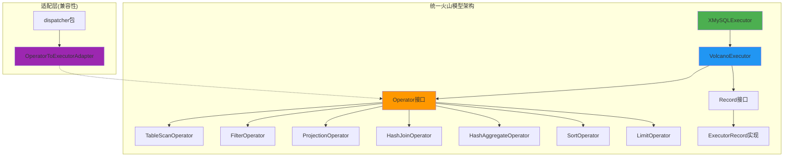
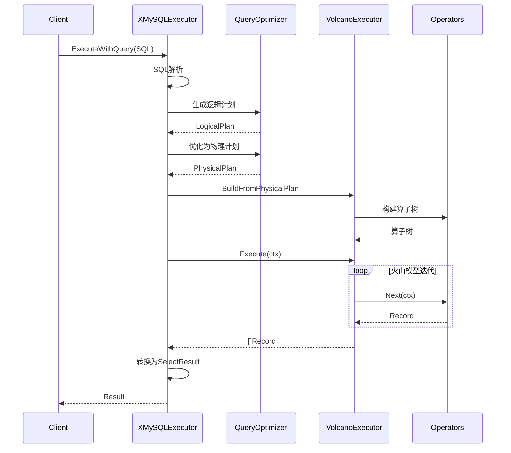
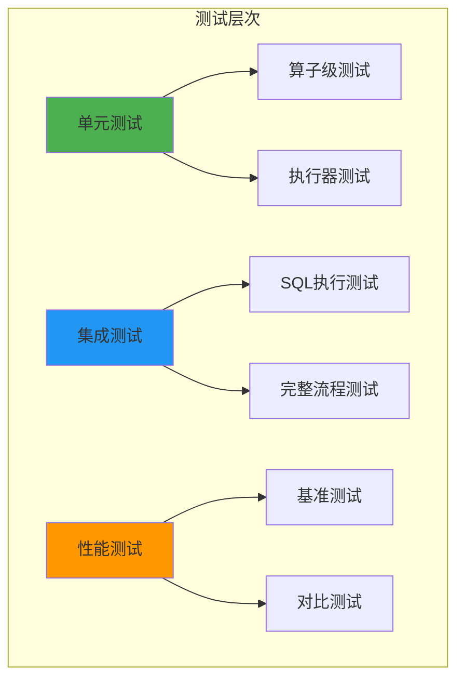
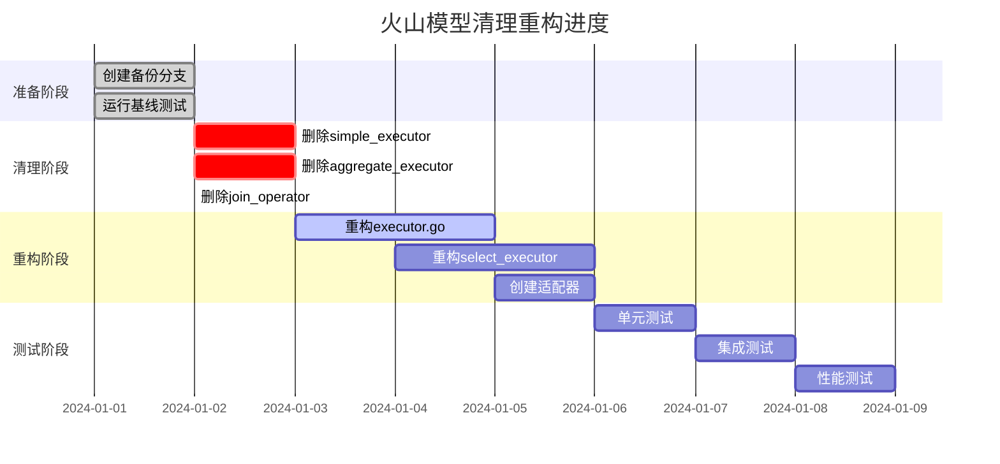
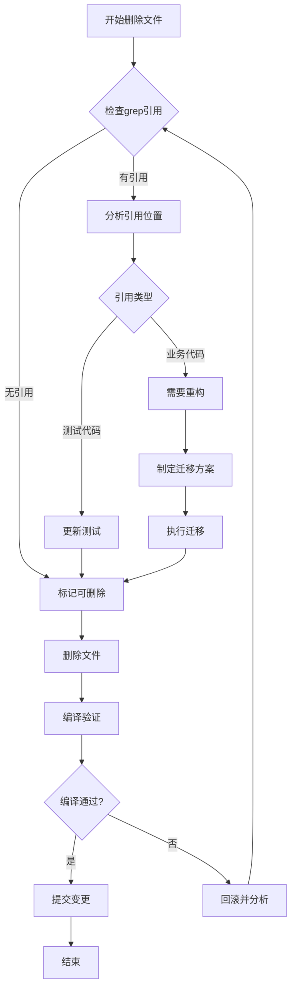
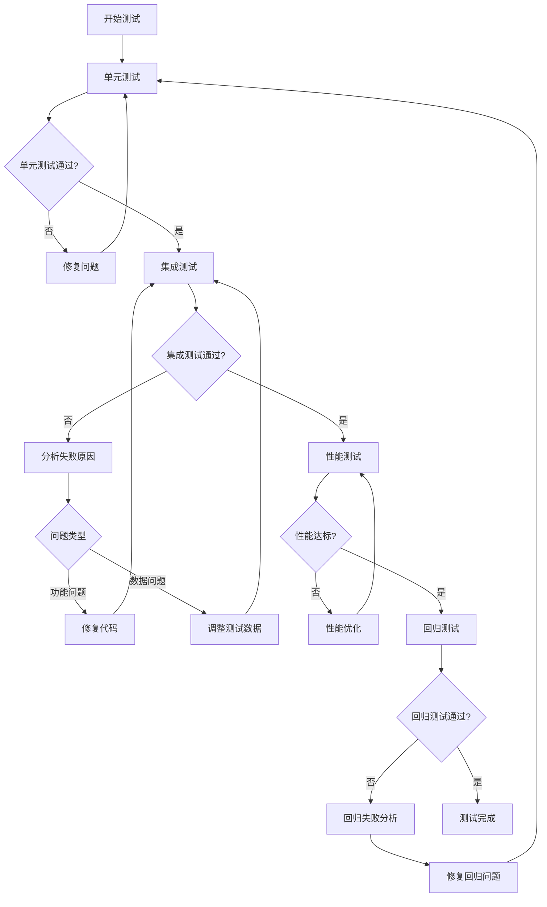

# 火山模型代码清理与重构执行设计

## 1. 概览

本设计文档基于`VOLCANO_MODEL_CLEANUP_PLAN.md`，针对XMySQL Server火山模型执行器的代码重复问题，制定具体的清理重构方案和测试策略。

### 1.1 目标

- 统一火山模型实现，消除代码重复
- 完成从旧接口(Iterator/Executor)到新接口(Operator)的迁移
- 确保功能完整性和性能稳定性
- 建立完整的测试覆盖

### 1.2 当前状态分析

**重复代码情况**：
- `simple_executor.go`: 包含已被替代的SimpleTableScanExecutor、SimpleProjectionExecutor等
- `aggregate_executor.go`: 包含已被HashAggregateOperator替代的SimpleAggregateExecutor
- `join_operator.go`: 空文件
- `executor.go`: 包含旧接口定义Iterator/Executor，同时包含必要的XMySQLExecutor
- `select_executor.go`: 使用旧BaseExecutor接口的SELECT执行器

**接口冲突**：
- 旧接口：`Init() error` + `Next() error` + `GetRow() []interface{}`
- 新接口：`Open(ctx context.Context) error` + `Next(ctx context.Context) (Record, error)`

## 2. 架构设计

### 2.1 目标架构

### 2.2 接口统一方案

#### 2.2.1 新版Operator接口

**接口定义**：
- `Open(ctx context.Context) error`: 初始化算子，分配资源
- `Next(ctx context.Context) (Record, error)`: 获取下一条记录，返回nil表示EOF
- `Close() error`: 关闭算子并释放资源
- `Schema() *metadata.Schema`: 返回输出schema信息

**优势**：
- 支持context传播，便于取消和超时控制
- 类型安全的Record返回值
- 符合标准火山模型设计

#### 2.2.2 旧接口废弃策略

**删除的接口**：
- `Iterator`接口(executor.go Line 24-30)
- `Executor`接口(executor.go Line 32-39)
- `BaseExecutor`结构体(executor.go Line 41-48)

**保留的组件**：
- `XMySQLExecutor`: 核心执行器，需重构使用VolcanoExecutor
- `executor_record.go`: Record接口实现
- `volcano_executor.go`: 新版火山模型完整实现

### 2.3 执行流程设计

## 3. 重构策略

### 3.1 文件清理方案

#### 3.1.1 待删除文件

| 文件名 | 删除原因 | 依赖检查 |
|--------|---------|---------|
| simple_executor.go | 已被volcano_executor.go完全替代 | 需检查grep引用 |
| aggregate_executor.go | 已被HashAggregateOperator替代 | 需检查grep引用 |
| join_operator.go | 空文件 | 无依赖 |

#### 3.1.2 需重构文件

| 文件名 | 重构内容 | 优先级 |
|--------|---------|--------|
| executor.go | 删除旧接口，实现buildExecutorTree，更新executeSelectStatement | P0 |
| select_executor.go | 迁移到新Operator接口，使用VolcanoExecutor | P0 |
| dispatcher/system_variable_engine.go | 使用适配器包装Operator | P1 |

### 3.2 executor.go重构设计

#### 3.2.1 buildExecutorTree实现

**职责**：从物理计划构建VolcanoExecutor

**输入参数**：
- `ctx context.Context`: 执行上下文
- `physicalPlan plan.PhysicalPlan`: 物理计划节点

**输出**：
- `*VolcanoExecutor`: 构建好的火山执行器
- `error`: 错误信息

**实现逻辑**：
1. 验证管理器实例有效性(tableManager, bufferPoolManager, storageManager, indexManager)
2. 创建VolcanoExecutor实例
3. 调用VolcanoExecutor.BuildFromPhysicalPlan构建算子树
4. 返回执行器实例

**错误处理**：
- 管理器为nil：返回清晰的错误信息
- 构建算子树失败：包装错误并返回

#### 3.2.2 executeSelectStatement重构

**当前问题**：
- 直接使用SelectExecutor，未利用查询优化器
- 未构建物理执行计划

**重构后流程**：
1. **生成逻辑计划**：调用`generateLogicalPlan(stmt, databaseName)`
2. **优化为物理计划**：调用`optimizeToPhysicalPlan(logicalPlan)`
3. **构建执行器树**：调用`buildExecutorTree(ctx, physicalPlan)`
4. **执行查询**：调用`volcanoExec.Execute(ctx)`获取记录集
5. **转换结果**：调用`convertToSelectResult(records, schema)`

**新增辅助方法**：

| 方法名 | 职责 | 返回值 |
|--------|------|--------|
| generateLogicalPlan | 从SQL生成逻辑计划 | LogicalPlan, error |
| optimizeToPhysicalPlan | 逻辑计划优化为物理计划 | PhysicalPlan, error |
| convertToSelectResult | Record数组转换为SelectResult | *SelectResult, error |

### 3.3 select_executor.go重构设计

#### 3.3.1 结构体重构

**删除**：
- `BaseExecutor`继承关系
- 旧接口相关字段

**新增**：
- `volcanoExecutor *VolcanoExecutor`: 火山执行器实例

**保留**：
- 管理器字段(optimizerManager, bufferPoolManager, btreeManager, tableManager)
- 查询解析相关字段

#### 3.3.2 ExecuteSelect方法重构

**重构前**：
- 使用BaseExecutor的Init-Next-GetRow模式

**重构后**：
1. 解析SELECT语句
2. 构建物理计划(使用optimizerManager)
3. 创建VolcanoExecutor实例
4. 调用BuildFromPhysicalPlan构建算子树
5. 执行查询获取记录集
6. 转换为SelectResult返回

### 3.4 适配器设计

#### 3.4.1 OperatorToExecutorAdapter

**用途**：为dispatcher包提供向后兼容

**接口映射**：

| 旧接口方法 | 适配器实现 |
|-----------|-----------|
| Init() error | operator.Open(ctx) |
| Next() error | record, err := operator.Next(ctx); 缓存record |
| GetRow() []interface{} | 从缓存record提取values并转换 |
| Close() error | operator.Close() |
| Schema() | operator.Schema() |

**实现要点**：
- 维护context实例
- 缓存当前record用于GetRow
- 将Record.GetValues()转换为[]interface{}

## 4. 测试策略

### 4.1 测试架构

### 4.2 单元测试设计

#### 4.2.1 算子级单元测试

**TableScanOperator测试**：
- 测试场景：打开算子、迭代记录、关闭算子
- 验证点：schema正确性、记录数量、字段值
- 测试数据：模拟100条记录

**FilterOperator测试**：
- 测试场景：简单条件过滤、复杂条件过滤、空结果
- 验证点：过滤逻辑正确性、条件表达式评估
- 测试数据：100条记录，过滤条件`age > 18`

**ProjectionOperator测试**：
- 测试场景：投影部分列、投影所有列、列顺序调整
- 验证点：输出schema、字段值正确性
- 测试数据：投影索引[0, 2]

**HashJoinOperator测试**：
- 测试场景：INNER JOIN、LEFT JOIN、空表JOIN
- 验证点：JOIN结果正确性、hash表构建
- 测试数据：users表10条 + orders表20条

**HashAggregateOperator测试**：
- 测试场景：COUNT、SUM、AVG、GROUP BY
- 验证点：聚合结果正确性、分组逻辑
- 测试数据：按department分组统计

**SortOperator测试**：
- 测试场景：单列升序、单列降序、多列排序
- 验证点：排序结果正确性、稳定性
- 测试数据：100条乱序记录

**LimitOperator测试**：
- 测试场景：只有LIMIT、LIMIT+OFFSET、边界情况
- 验证点：返回记录数、跳过记录数
- 测试数据：100条记录，LIMIT 10 OFFSET 5

#### 4.2.2 VolcanoExecutor测试

**BuildFromPhysicalPlan测试**：
- 测试场景：单表扫描、带过滤、带聚合、带JOIN
- 验证点：算子树结构正确性
- 测试数据：各种物理计划节点

**Execute测试**：
- 测试场景：端到端执行简单查询、复杂查询
- 验证点：结果集正确性、记录数
- 测试数据：完整SQL查询

#### 4.2.3 适配器测试

**OperatorToExecutorAdapter测试**：
- 测试场景：Init-Next-GetRow循环、类型转换
- 验证点：接口兼容性、数据一致性
- 测试数据：TableScanOperator包装

### 4.3 集成测试设计

#### 4.3.1 SQL执行测试用例

| 测试ID | SQL语句 | 预期结果 | 验证点 |
|--------|---------|---------|--------|
| IT-001 | SELECT * FROM users | 返回所有用户 | 全表扫描 |
| IT-002 | SELECT name FROM users WHERE age > 18 | 返回成年用户姓名 | 过滤+投影 |
| IT-003 | SELECT * FROM users ORDER BY age LIMIT 5 | 返回最年轻5个用户 | 排序+限制 |
| IT-004 | SELECT COUNT(*) FROM users | 返回用户总数 | 聚合 |
| IT-005 | SELECT department, SUM(salary) FROM employees GROUP BY department | 部门工资汇总 | 分组聚合 |
| IT-006 | SELECT u.name, o.amount FROM users u JOIN orders o ON u.id = o.user_id | 用户订单信息 | 内连接 |

#### 4.3.2 测试数据准备

**users表结构**：
- id INT PRIMARY KEY
- name VARCHAR(50)
- age INT
- department VARCHAR(50)

**orders表结构**：
- id INT PRIMARY KEY
- user_id INT
- amount DECIMAL(10,2)
- order_date DATE

**测试数据量**：
- users: 100条记录
- orders: 200条记录

### 4.4 性能测试设计

#### 4.4.1 基准测试指标

| 测试项 | 指标 | 基线值 | 目标 |
|--------|------|--------|------|
| 表扫描性能 | ops/sec | 待测量 | 无明显下降(<10%) |
| 过滤性能 | ops/sec | 待测量 | 无明显下降(<10%) |
| JOIN性能 | ops/sec | 待测量 | 无明显下降(<10%) |
| 聚合性能 | ops/sec | 待测量 | 无明显下降(<10%) |
| 内存使用 | MB | 待测量 | 无明显增长(<15%) |

#### 4.4.2 性能对比测试

**对比维度**：
- 旧实现 vs 新实现(同等SQL查询)
- 单算子性能
- 端到端查询性能

**测试环境**：
- Go version: 1.16.2
- 数据规模: 10000条记录
- 重复次数: 1000次

### 4.5 回归测试设计

#### 4.5.1 功能回归检查表

| 检查项 | 验证方法 | 通过标准 |
|--------|---------|---------|
| SELECT基本功能 | 执行IT-001到IT-006 | 全部通过 |
| INSERT功能 | 插入记录并查询验证 | 数据正确 |
| UPDATE功能 | 更新记录并查询验证 | 数据正确 |
| DELETE功能 | 删除记录并查询验证 | 记录删除 |
| 事务功能 | COMMIT/ROLLBACK测试 | 事务语义正确 |
| 并发查询 | 10个并发SELECT | 无死锁、结果正确 |

#### 4.5.2 边界条件测试

| 边界场景 | 测试方法 | 预期行为 |
|---------|---------|---------|
| 空表查询 | SELECT * FROM empty_table | 返回空结果集 |
| 大数据量查询 | 查询100万条记录 | 正常执行，不OOM |
| 复杂JOIN | 3表JOIN | 结果正确 |
| 嵌套子查询 | SELECT ... WHERE id IN (SELECT ...) | 支持或返回明确错误 |
| NULL值处理 | WHERE column IS NULL | 正确处理NULL |

## 5. 执行流程设计

### 5.1 阶段划分

### 5.2 依赖检查流程

### 5.3 测试执行流程

## 6. 风险控制

### 6.1 风险识别

| 风险ID | 风险描述 | 概率 | 影响 | 级别 |
|--------|---------|------|------|------|
| R-001 | 删除文件导致编译失败 | 中 | 高 | 高 |
| R-002 | 接口变更破坏现有功能 | 中 | 高 | 高 |
| R-003 | 测试覆盖不足导致隐藏bug | 高 | 中 | 高 |
| R-004 | 性能回退超过10% | 低 | 中 | 中 |
| R-005 | dispatcher包适配失败 | 低 | 中 | 中 |
| R-006 | 事务功能受影响 | 低 | 高 | 中 |

### 6.2 缓解措施

#### 6.2.1 编译失败风险(R-001)

**预防措施**：
- 每次删除前执行`grep -r "类型名" server/`检查引用
- 逐步删除，每删除一个文件立即编译验证
- 保留备份分支

**应对措施**：
- 记录所有引用位置
- 逐个迁移引用代码
- 使用`git revert`快速回滚

#### 6.2.2 功能破坏风险(R-002)

**预防措施**：
- 建立完整的测试基线
- 使用适配器模式保持兼容性
- 分阶段迁移，保持旧接口过渡期

**应对措施**：
- 对比旧实现和新实现的行为
- 添加调试日志追踪执行流程
- 保留旧代码作为参考

#### 6.2.3 测试覆盖不足(R-003)

**预防措施**：
- 设计全面的测试用例矩阵
- 确保每个算子有独立单元测试
- 建立集成测试覆盖常见SQL场景

**应对措施**：
- 代码审查发现的问题补充测试
- 使用go test -cover检查覆盖率
- 手动测试补充自动化测试

#### 6.2.4 性能回退风险(R-004)

**预防措施**：
- 建立性能基准测试
- 对比新旧实现性能指标
- 识别性能瓶颈

**应对措施**：
- 使用pprof分析性能热点
- 优化算子实现
- 考虑缓存或预计算优化

### 6.3 回滚方案

#### 6.3.1 完全回滚

**触发条件**：
- 重构后出现严重功能问题
- 性能下降超过20%
- 无法在合理时间内修复

**回滚步骤**：
1. 切换到备份分支：`git checkout backup/before-volcano-cleanup`
2. 创建新dev分支：`git checkout -b dev`
3. 通知团队回滚决定
4. 分析失败原因，重新制定方案

#### 6.3.2 部分回滚

**触发条件**：
- 某个阶段出现问题
- 其他阶段正常

**回滚步骤**：
1. 定位问题提交：`git log`
2. 回滚特定提交：`git revert <commit-hash>`
3. 重新执行该阶段
4. 继续后续阶段

## 7. 验收标准

### 7.1 代码质量验收

| 验收项 | 检查方法 | 通过标准 |
|--------|---------|---------|
| 编译通过 | go build ./... | 无错误无警告 |
| 代码规范 | golint ./server/innodb/engine/ | 无严重问题 |
| 静态分析 | go vet ./server/innodb/engine/ | 无问题 |
| 代码覆盖率 | go test -cover | > 70% |
| 代码重复度 | 手动检查 | 无重复算子实现 |

### 7.2 功能验收

| 验收项 | 测试方法 | 通过标准 |
|--------|---------|---------|
| 基本查询 | 执行IT-001到IT-004 | 结果正确 |
| 聚合查询 | 执行IT-005 | 结果正确 |
| JOIN查询 | 执行IT-006 | 结果正确 |
| 复杂查询 | 嵌套查询、子查询 | 正常工作或明确不支持 |
| DML语句 | INSERT/UPDATE/DELETE | 正常工作 |
| 并发查询 | 10个并发SELECT | 无死锁、结果正确 |

### 7.3 性能验收

| 验收项 | 测试方法 | 通过标准 |
|--------|---------|---------|
| 查询性能 | 基准测试对比 | 下降 < 10% |
| 内存使用 | 内存监控 | 增长 < 15% |
| 并发性能 | 压力测试 | 无明显下降 |

### 7.4 文档验收

| 验收项 | 检查内容 | 通过标准 |
|--------|---------|---------|
| 代码注释 | 公开接口注释 | 完整清晰 |
| 迁移指南 | 本设计文档 | 准确完整 |
| 变更日志 | CHANGELOG记录 | 详细记录变更 |

## 8. 测试数据模型

### 8.1 测试表定义

#### 8.1.1 users表

| 字段名 | 类型 | 约束 | 说明 |
|--------|------|------|------|
| id | INT | PRIMARY KEY | 用户ID |
| name | VARCHAR(50) | NOT NULL | 用户姓名 |
| age | INT | | 年龄 |
| department | VARCHAR(50) | | 部门 |
| salary | DECIMAL(10,2) | | 工资 |
| created_at | TIMESTAMP | | 创建时间 |

#### 8.1.2 orders表

| 字段名 | 类型 | 约束 | 说明 |
|--------|------|------|------|
| id | INT | PRIMARY KEY | 订单ID |
| user_id | INT | FOREIGN KEY | 用户ID |
| amount | DECIMAL(10,2) | NOT NULL | 订单金额 |
| order_date | DATE | | 订单日期 |
| status | VARCHAR(20) | | 订单状态 |

### 8.2 测试数据生成规则

**users表数据生成**：
- 总数：100条
- id：1-100连续
- name：user_1 到 user_100
- age：18-65随机分布
- department：Engineering, Sales, Marketing, HR, Finance循环
- salary：5000-50000随机

**orders表数据生成**：
- 总数：200条
- id：1-200连续
- user_id：1-100随机引用users表
- amount：10-10000随机
- order_date：最近一年随机日期
- status：pending, completed, cancelled随机

## 9. 监控指标

### 9.1 执行过程监控

| 监控项 | 采集方式 | 告警阈值 |
|--------|---------|---------|
| 编译时间 | time go build | > 5分钟 |
| 测试执行时间 | time go test | > 10分钟 |
| 测试失败数 | go test输出 | > 0 |
| 代码覆盖率 | go test -cover | < 70% |

### 9.2 运行时监控

| 监控项 | 采集方式 | 告警阈值 |
|--------|---------|---------|
| 查询响应时间 | 日志统计 | > 100ms(简单查询) |
| 内存使用 | runtime.MemStats | > 500MB |
| goroutine数量 | runtime.NumGoroutine | > 1000 |
| GC暂停时间 | runtime.MemStats | > 10ms |
