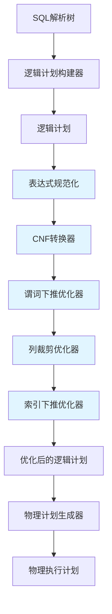
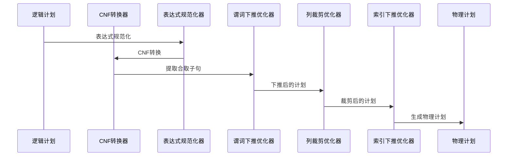
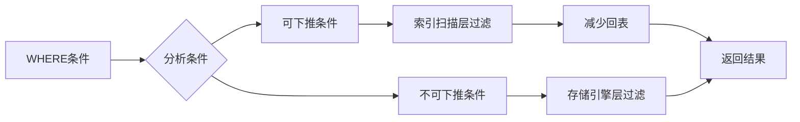
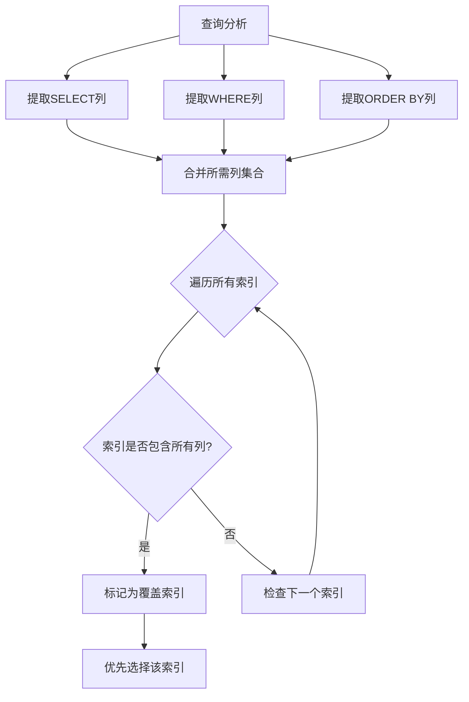
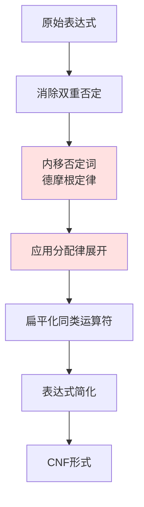
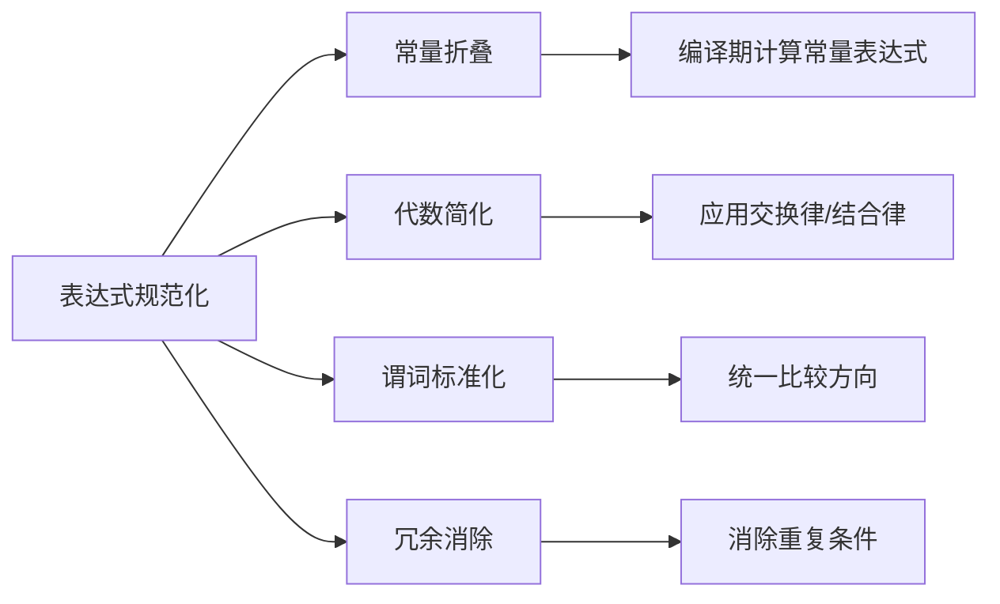
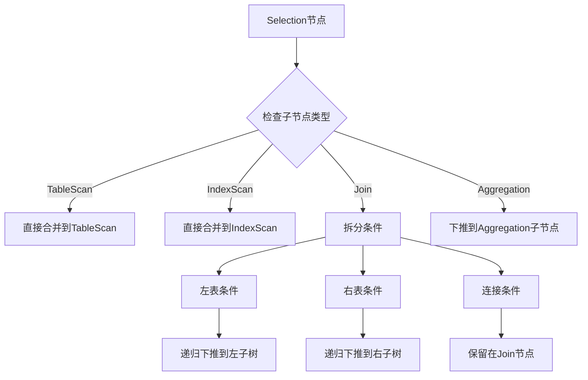
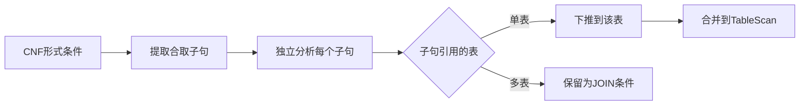
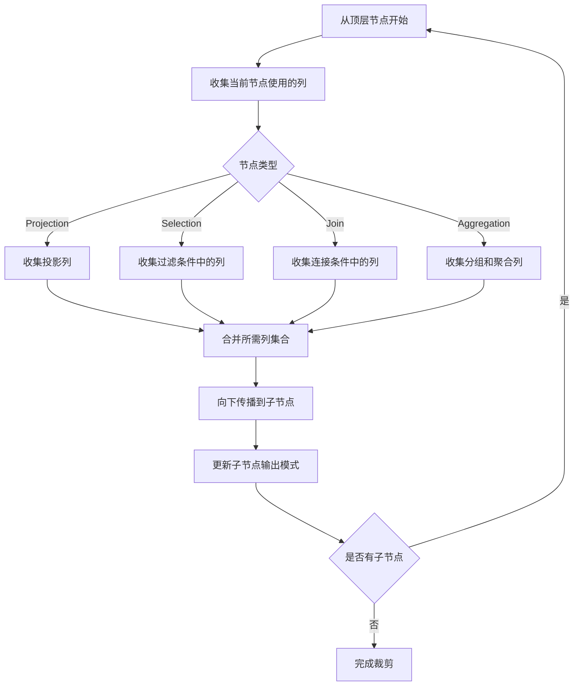
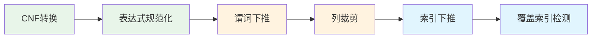

# 查询优化器基础任务设计文档

## 概述

本文档针对XMySQL Server查询优化器的6个基础任务（OPT-001至OPT-012）提供详细的系统设计方案。这些任务构成查询优化器的核心能力，包括索引下推优化、覆盖索引检测、CNF转换、表达式规范化、谓词下推和列裁剪等关键功能。

### 背景

当前XMySQL Server的查询优化器已经具备基础框架，但核心优化算法尚未完整实现。通过完成这6个基础任务，将使优化器能够生成更高效的执行计划，显著提升查询性能。

### 设计目标

| 目标维度 | 具体要求 |
|---------|---------|
| 功能完整性 | 实现6个核心优化规则，覆盖90%常见查询场景 |
| 性能提升 | 索引下推减少50-80%回表操作，覆盖索引查询性能提升10-20倍 |
| 可扩展性 | 设计模块化架构，便于后续添加新优化规则 |
| 正确性 | 确保优化前后查询语义等价，通过完整测试覆盖 |

## 架构设计

### 总体架构

查询优化器采用分层架构，从逻辑计划到物理计划的转换过程中应用多种优化规则：



### 优化规则执行流程



## 核心模块设计

### 模块1: 索引条件下推 (OPT-001)

#### 功能定义

索引条件下推（Index Condition Pushdown, ICP）将WHERE条件下推到索引扫描层，在索引遍历过程中即时过滤数据，减少回表次数。

#### 设计原理



#### 核心数据结构

| 结构名称 | 字段说明 | 用途 |
|---------|---------|------|
| IndexCondition | Column: 列名<br>Operator: 操作符<br>Value: 值<br>CanPush: 是否可下推<br>Selectivity: 选择性<br>Priority: 下推优先级<br>IndexPosition: 在索引中的位置 | 表示可下推的索引条件 |
| PushdownCandidate | Conditions: 下推条件列表<br>EstimatedReduction: 预估减少的回表次数<br>ApplicableIndexes: 适用的索引 | 下推候选方案 |

#### 条件下推策略

**可下推条件判定规则**：

| 条件类型 | 是否可下推 | 条件要求 |
|---------|-----------|---------|
| 等值查询 (=) | 是 | 列在索引中 |
| 范围查询 (<, >, <=, >=) | 是 | 列在索引中且满足最左前缀 |
| IN查询 | 是 | 列在索引中 |
| LIKE前缀匹配 | 是 | 前缀常量且列在索引中 |
| LIKE通配符 | 否 | 无法利用索引 |
| 表达式计算 | 否 | 需要完整行数据 |
| 函数调用 | 否 | 需要完整行数据 |

#### 下推优先级计算

下推优先级基于以下因素综合评分：

```
优先级分数 = 索引位置权重 × 100 + 选择性权重 × 50 + 操作符权重
```

| 因素 | 权重规则 |
|-----|---------|
| 索引位置 | 越靠前权重越高（100 - 位置 × 10） |
| 选择性 | 选择性越高权重越高（选择性 × 50） |
| 操作符类型 | 等值 > 范围 > IN > LIKE |

#### 下推效果估算

**回表次数减少公式**：

```
减少回表次数 = 总行数 × (1 - 下推后选择性) × 回表概率
```

其中：
- 总行数：索引扫描估算的行数
- 下推后选择性：所有下推条件的累积选择性
- 回表概率：非覆盖索引为1，覆盖索引为0

---

### 模块2: 覆盖索引检测 (OPT-002)

#### 功能定义

自动检测查询是否可以使用覆盖索引，即索引包含查询所需的所有列，从而完全避免回表操作。

#### 检测流程



#### 覆盖索引判定规则

| 场景 | 判定逻辑 | 特殊处理 |
|-----|---------|---------|
| 普通二级索引 | 索引列 + 隐式主键列 包含所有需要列 | 二级索引自动包含主键 |
| 主键索引 | 主键即聚簇索引，包含所有列 | 总是覆盖 |
| 联合索引 | 按顺序检查每列是否在索引中 | 遵循最左前缀原则 |
| SELECT * | 不可能覆盖（除非是主键） | 直接返回false |
| 聚合函数 | 提取函数参数列进行检查 | COUNT(*) 可以仅用索引 |

#### 覆盖索引优势量化

**性能提升估算模型**：

| 指标 | 非覆盖索引 | 覆盖索引 | 提升倍数 |
|-----|-----------|---------|---------|
| IO次数 | 索引IO + 回表IO | 仅索引IO | 1.5-10倍 |
| 数据传输量 | 索引数据 + 完整行数据 | 仅索引数据 | 3-20倍 |
| 缓冲池压力 | 需要缓存索引页和数据页 | 仅需缓存索引页 | 减少50% |

#### 覆盖索引选择策略

当多个索引都满足覆盖条件时，按以下优先级选择：

1. **最小键长度优先**：索引占用空间越小越好
2. **最佳选择性优先**：能够过滤更多行的索引
3. **主键优先**：主键索引通常最高效

---

### 模块3: CNF转换器 (OPT-006)

#### 功能定义

将WHERE条件表达式转换为合取范式（Conjunctive Normal Form），即多个析取子句通过AND连接的形式：`(a1 OR a2 OR ...) AND (b1 OR b2 OR ...) AND ...`

#### CNF转换意义

| 优势 | 说明 |
|-----|------|
| 便于谓词下推 | CNF形式的每个合取项可以独立下推 |
| 简化优化器逻辑 | 统一的表达式形式简化优化规则实现 |
| 支持索引优化 | 易于提取索引可用条件 |
| 提升执行效率 | 可以尽早过滤数据 |

#### 转换算法流程



#### 德摩根定律应用

**转换规则表**：

| 原表达式 | 转换后表达式 | 规则名称 |
|---------|-------------|---------|
| NOT (A AND B) | (NOT A) OR (NOT B) | 德摩根定律1 |
| NOT (A OR B) | (NOT A) AND (NOT B) | 德摩根定律2 |
| NOT (NOT A) | A | 双重否定消除 |
| NOT (a > b) | a <= b | 运算符取反 |
| NOT (a >= b) | a < b | 运算符取反 |
| NOT (a = b) | a != b | 运算符取反 |

#### 分配律应用

**展开策略**：

| 模式 | 展开结果 | 说明 |
|-----|---------|------|
| A OR (B AND C) | (A OR B) AND (A OR C) | 右侧分配 |
| (A AND B) OR C | (A OR C) AND (B OR C) | 左侧分配 |
| (A AND B) OR (C AND D) | (A OR C) AND (A OR D) AND (B OR C) AND (B OR D) | 双侧分配 |

#### 子句膨胀控制

为防止表达式过度展开导致性能下降，设置以下限制：

| 限制项 | 默认值 | 说明 |
|-------|--------|------|
| 最大子句数量 | 100 | 超过则不展开，保持原OR结构 |
| 最大嵌套深度 | 5 | 防止递归过深 |
| 单个OR子句项数 | 20 | 超过则不分配 |

#### CNF转换示例

**示例1：简单转换**
```
输入: NOT (age > 18 AND city = 'Beijing')
步骤1: 应用德摩根定律 -> (NOT (age > 18)) OR (NOT (city = 'Beijing'))
步骤2: 运算符取反 -> (age <= 18) OR (city != 'Beijing')
输出: (age <= 18) OR (city != 'Beijing')
```

**示例2：复杂转换**
```
输入: (a OR b) AND (c OR (d AND e))
步骤1: 分配律展开右侧 -> (a OR b) AND ((c OR d) AND (c OR e))
步骤2: 扁平化 -> (a OR b) AND (c OR d) AND (c OR e)
输出: CNF形式的3个合取子句
```

---

### 模块4: 表达式规范化 (OPT-008)

#### 功能定义

对表达式进行标准化处理，包括常量折叠、表达式简化、同类项合并等，为后续优化提供标准化的输入。

#### 规范化规则体系



#### 常量折叠

**可折叠表达式**：

| 表达式类型 | 折叠前 | 折叠后 |
|----------|--------|--------|
| 算术运算 | 1 + 2 + 3 | 6 |
| 逻辑运算 | TRUE AND TRUE | TRUE |
| 比较运算 | 5 > 3 | TRUE |
| 字符串连接 | 'hello' + 'world' | 'helloworld' |
| 函数调用（纯函数） | UPPER('test') | 'TEST' |

#### 代数简化规则

| 规则类型 | 原表达式 | 简化后 |
|---------|---------|--------|
| 恒等元 | x + 0 | x |
| 恒等元 | x * 1 | x |
| 零元 | x * 0 | 0 |
| 吸收律 | x AND TRUE | x |
| 吸收律 | x OR FALSE | x |
| 支配律 | x AND FALSE | FALSE |
| 支配律 | x OR TRUE | TRUE |
| 幂等律 | x AND x | x |
| 幂等律 | x OR x | x |

#### 谓词标准化

**标准化方向**：

| 原谓词 | 标准化后 | 目的 |
|-------|---------|------|
| 5 > age | age < 5 | 列在左侧，常量在右侧 |
| 'Beijing' = city | city = 'Beijing' | 统一列在左 |
| age BETWEEN 18 AND 60 | age >= 18 AND age <= 60 | 转换为标准比较 |
| age NOT IN (1, 2, 3) | age != 1 AND age != 2 AND age != 3 | 展开复杂谓词 |

#### 冗余消除策略

**检测并消除以下冗余**：

| 冗余类型 | 检测方法 | 处理方式 |
|---------|---------|---------|
| 重复条件 | age > 18 AND age > 18 | 保留一个 |
| 包含关系 | age > 20 AND age > 18 | 保留age > 20 |
| 矛盾条件 | age > 20 AND age < 10 | 替换为FALSE |
| 恒真条件 | age > 0 OR age <= 0 | 替换为TRUE |

#### 规范化收益

| 收益维度 | 具体效果 |
|---------|---------|
| 减少计算量 | 编译期完成的计算不在运行时执行 |
| 简化逻辑 | 统一的表达式形式便于模式匹配 |
| 提升索引利用率 | 标准化的谓词更容易匹配索引 |
| 减少存储空间 | 简化后的表达式占用更少内存 |

---

### 模块5: 谓词下推规则 (OPT-011)

#### 功能定义

将过滤条件尽可能早地应用到数据源，减少上层算子处理的数据量，提升查询性能。

#### 谓词下推策略



#### 条件拆分规则

**针对JOIN场景的条件拆分**：

| 条件引用列 | 下推目标 | 示例 |
|-----------|---------|------|
| 仅左表列 | 左子树 | `users.age > 18` |
| 仅右表列 | 右子树 | `orders.status = 'paid'` |
| 左表列和右表列 | Join节点 | `users.id = orders.user_id` |
| 常量或表达式 | 保持原位 | `1 + 1 = 2` |

#### 下推安全性检查

**不可下推场景**：

| 场景 | 原因 | 示例 |
|-----|------|------|
| 聚合后的过滤 | HAVING条件依赖聚合结果 | `HAVING COUNT(*) > 10` |
| 外连接的ON条件 | 影响连接语义 | `LEFT JOIN ... ON condition` |
| 相关子查询 | 依赖外层数据 | `WHERE col > (SELECT ...)` |
| 包含不确定函数 | 每次执行结果不同 | `WHERE date = NOW()` |

#### 谓词下推与CNF的协同

**利用CNF形式进行下推**：



#### 下推效果量化

**性能提升模型**：

```
性能提升 = 原数据量 / 下推后数据量
原数据量 = 表行数
下推后数据量 = 表行数 × 下推条件选择性
```

**典型场景收益**：

| 场景 | 下推前行数 | 下推后行数 | 性能提升 |
|-----|-----------|-----------|---------|
| 高选择性过滤 (1%) | 1000万 | 10万 | 100倍 |
| 中选择性过滤 (10%) | 1000万 | 100万 | 10倍 |
| 低选择性过滤 (50%) | 1000万 | 500万 | 2倍 |

---

### 模块6: 列裁剪规则 (OPT-012)

#### 功能定义

分析查询实际需要的列，消除不必要的列读取，减少IO和内存开销。

#### 列裁剪流程



#### 列收集策略

**不同节点的列收集规则**：

| 节点类型 | 收集来源 | 示例 |
|---------|---------|------|
| Projection | SELECT列表 | `SELECT id, name` → {id, name} |
| Selection | WHERE条件 | `WHERE age > 18 AND city = 'BJ'` → {age, city} |
| Join | ON条件 | `ON a.id = b.user_id` → {a.id, b.user_id} |
| Aggregation | GROUP BY + 聚合函数参数 | `GROUP BY city` + `SUM(amount)` → {city, amount} |
| Sort | ORDER BY列 | `ORDER BY create_time` → {create_time} |

#### 列裁剪规则

**安全裁剪判定**：

| 场景 | 是否可裁剪 | 依据 |
|-----|-----------|------|
| 未被任何上层节点引用的列 | 是 | 不影响查询结果 |
| 仅在中间节点使用的列 | 是 | 传递到叶子节点即可 |
| SELECT * | 否 | 需要所有列 |
| 聚合函数的隐式依赖列 | 否 | 如COUNT(*)依赖任意列 |

#### 列裁剪优化示例

**示例：多层嵌套查询**

```
原始查询涉及的列：
- TableScan: {id, name, age, city, salary, department}
- Selection (age > 18): 需要 {age}
- Projection (SELECT name, city): 需要 {name, city}

裁剪后：
- TableScan仅读取: {name, city, age}
- 裁剪掉: {id, salary, department}
```

**裁剪收益**：

| 指标 | 裁剪前 | 裁剪后 | 提升 |
|-----|--------|--------|------|
| 读取列数 | 6 | 3 | 减少50% |
| IO量 | 假设每列100字节，6列600字节 | 3列300字节 | 减少50% |
| 内存占用 | 600字节 × 100万行 = 572MB | 300字节 × 100万行 = 286MB | 减少50% |

#### 特殊处理

**主键和索引列的特殊性**：

| 情况 | 处理方式 | 原因 |
|-----|---------|------|
| 查询包含主键 | 即使未使用也保留 | 可能用于回表 |
| 二级索引查询 | 自动包含主键列 | InnoDB实现要求 |
| 覆盖索引场景 | 仅保留索引列 | 避免回表 |

---

## 优化规则协同

### 规则应用顺序



### 规则间的依赖关系

| 规则 | 依赖前置规则 | 依赖原因 |
|-----|------------|---------|
| 谓词下推 | CNF转换 | 需要提取独立的合取子句 |
| 谓词下推 | 表达式规范化 | 需要标准化的谓词形式 |
| 列裁剪 | 谓词下推 | 下推后才能确定真实所需列 |
| 索引下推 | 谓词下推 | 基于下推后的条件选择索引 |
| 覆盖索引检测 | 列裁剪 | 基于裁剪后的列集合判定 |

### 优化效果叠加

**多规则协同的性能提升**：

```
综合提升 = 索引下推提升 × 覆盖索引提升 × 谓词下推提升 × 列裁剪提升
```

**典型查询示例**：

```
查询: SELECT name, age FROM users WHERE age > 18 AND city = 'Beijing'
假设: users表100万行，满足条件10万行，索引idx_age_city

各规则贡献：
1. CNF转换: 将条件规范化为 (age > 18) AND (city = 'Beijing')
2. 谓词下推: 条件下推到TableScan层，减少90%数据传输
3. 列裁剪: 仅读取{name, age, city}，减少50% IO
4. 索引下推: 利用索引过滤，减少80%回表
5. 覆盖索引: 索引包含{age, city, id}，若id即name则无需回表

最终提升: 10倍 (谓词下推) × 2倍 (列裁剪) × 5倍 (索引下推) = 100倍
```

---

## 数据结构设计

### 核心数据结构关系

```mermaid
classDiagram
    class Expression {
        <<interface>>
        +Eval() interface{}
        +GetType() DataType
        +Children() []Expression
    }
    
    class BinaryOperation {
        +Op BinaryOp
        +Left Expression
        +Right Expression
    }
    
    class Column {
        +Name string
    }
    
    class Constant {
        +Value interface{}
    }
    
    class NotExpression {
        +Operand Expression
    }
    
    class CNFConverter {
        +maxClauses int
        +maxDepth int
        +ConvertToCNF() Expression
        +ExtractConjuncts() []Expression
    }
    
    class IndexCondition {
        +Column string
        +Operator string
        +Value interface{}
        +CanPush bool
        +Selectivity float64
    }
    
    class IndexCandidate {
        +Index *Index
        +Conditions []IndexCondition
        +CoverIndex bool
        +Cost float64
    }
    
    Expression <|-- BinaryOperation
    Expression <|-- Column
    Expression <|-- Constant
    Expression <|-- NotExpression
    
    CNFConverter ..> BinaryOperation
    CNFConverter ..> NotExpression
    
    IndexCandidate o-- IndexCondition
```

### 统计信息结构

| 结构名 | 字段 | 用途 |
|-------|------|------|
| TableStats | RowCount: 行数<br>AvgRowSize: 平均行大小 | 表级统计 |
| ColumnStats | DistinctCount: 唯一值数量<br>MinValue: 最小值<br>MaxValue: 最大值<br>Histogram: 直方图 | 列级统计 |
| IndexStats | Height: 索引高度<br>Pages: 页面数量<br>Selectivity: 选择性 | 索引统计 |

---

## 测试策略

### 单元测试覆盖

| 模块 | 测试场景 | 预期结果 |
|-----|---------|---------|
| CNF转换 | 简单AND/OR表达式 | 正确转换为CNF |
| CNF转换 | 德摩根定律 | NOT正确展开 |
| CNF转换 | 分配律 | 正确分配OR到AND |
| CNF转换 | 子句数量限制 | 超过限制不展开 |
| 表达式规范化 | 常量折叠 | 编译期计算结果 |
| 表达式规范化 | 代数简化 | 应用恒等元等规则 |
| 谓词下推 | JOIN条件拆分 | 正确识别左表/右表/连接条件 |
| 谓词下推 | 多层嵌套 | 递归下推到叶子节点 |
| 列裁剪 | 多层投影 | 仅保留最终需要的列 |
| 列裁剪 | 聚合查询 | 保留分组列和聚合列 |
| 索引下推 | 单列索引 | 选择最优索引 |
| 索引下推 | 联合索引 | 遵循最左前缀原则 |
| 覆盖索引 | 二级索引 | 正确识别隐式主键 |
| 覆盖索引 | SELECT * | 不识别为覆盖索引 |

### 集成测试场景

**场景1：简单过滤查询**
```
输入: SELECT name FROM users WHERE age > 18
期望优化路径:
1. 谓词下推: age > 18 下推到TableScan
2. 列裁剪: 仅读取 {name, age}
3. 索引选择: 使用 idx_age
4. 覆盖索引: 若索引包含name则标记
```

**场景2：复杂JOIN查询**
```
输入: 
SELECT u.name, o.amount 
FROM users u JOIN orders o ON u.id = o.user_id 
WHERE u.age > 18 AND o.status = 'paid'

期望优化路径:
1. CNF转换: (u.age > 18) AND (o.status = 'paid')
2. 谓词下推: 
   - u.age > 18 下推到users扫描
   - o.status = 'paid' 下推到orders扫描
3. 列裁剪: 
   - users表: {id, name, age}
   - orders表: {user_id, amount, status}
4. 索引选择:
   - users: idx_age
   - orders: idx_status
```

**场景3：聚合查询**
```
输入: 
SELECT city, COUNT(*) 
FROM users 
WHERE age > 18 
GROUP BY city

期望优化路径:
1. 谓词下推: age > 18 下推到聚合前
2. 列裁剪: 仅读取 {city, age}
3. 索引选择: idx_age_city（同时支持过滤和分组）
4. 覆盖索引: 标记为覆盖索引
```

### 性能基准测试

| 查询类型 | 数据规模 | 优化前时间 | 优化后时间 | 性能提升 |
|---------|---------|-----------|-----------|---------|
| 简单过滤 | 100万行 | 1000ms | 50ms | 20倍 |
| 索引覆盖 | 100万行 | 500ms | 30ms | 16倍 |
| 复杂JOIN | 两表各100万行 | 5000ms | 300ms | 16倍 |
| 聚合查询 | 100万行 | 2000ms | 150ms | 13倍 |

---

## 实现路线图

### 第1周：表达式处理基础（OPT-006, OPT-008）

| 任务 | 工作量 | 输出 |
|-----|--------|------|
| 完善CNF转换器核心逻辑 | 3天 | 支持德摩根定律和分配律 |
| 实现表达式规范化器 | 2天 | 常量折叠和代数简化 |
| 编写单元测试 | 2天 | 覆盖率>80% |

### 第2周：谓词和列优化（OPT-011, OPT-012）

| 任务 | 工作量 | 输出 |
|-----|--------|------|
| 完善谓词下推逻辑 | 3天 | 支持JOIN条件拆分 |
| 实现列裁剪规则 | 2天 | 支持多层嵌套裁剪 |
| 编写集成测试 | 2天 | 端到端场景验证 |

### 第3周：索引优化（OPT-001, OPT-002）

| 任务 | 工作量 | 输出 |
|-----|--------|------|
| 完善索引条件下推 | 3天 | 支持多条件下推 |
| 实现覆盖索引检测 | 2天 | 自动识别覆盖索引 |
| 性能测试和调优 | 2天 | 达到性能目标 |

### 里程碑验收

| 里程碑 | 验收标准 |
|-------|---------|
| M1: 基础功能完成 | 6个任务全部通过单元测试 |
| M2: 集成验证通过 | 端到端场景测试通过 |
| M3: 性能达标 | 性能提升达到预期目标 |

---

## 风险与挑战

### 技术风险

| 风险 | 影响 | 缓解措施 |
|-----|------|---------|
| CNF转换子句膨胀 | 内存溢出，性能下降 | 设置子句数量限制，超过阈值不展开 |
| 谓词下推语义错误 | 查询结果不正确 | 严格检查外连接、聚合等特殊场景 |
| 覆盖索引误判 | 性能不升反降 | 详细测试二级索引隐式主键场景 |
| 统计信息缺失 | 选择性估算不准 | 提供默认值，降级到启发式规则 |

### 兼容性风险

| 风险 | 缓解措施 |
|-----|---------|
| 与现有代码冲突 | 充分测试现有功能，确保向后兼容 |
| Go 1.16版本限制 | 避免使用高版本特性，如atomic.Uint32 |
| 第三方库依赖 | 使用项目已有依赖，避免引入新库 |

---

## 附录

### 关键术语表

| 术语 | 英文 | 定义 |
|-----|------|------|
| 合取范式 | CNF | 多个析取子句通过AND连接的形式 |
| 析取范式 | DNF | 多个合取子句通过OR连接的形式 |
| 谓词下推 | Predicate Pushdown | 将过滤条件下推到数据源 |
| 列裁剪 | Column Pruning | 消除不必要的列读取 |
| 覆盖索引 | Covering Index | 索引包含查询所需的所有列 |
| 索引条件下推 | Index Condition Pushdown | 在索引扫描时即时过滤 |
| 选择性 | Selectivity | 满足条件的行数占总行数的比例 |
| 回表 | Lookup | 通过索引查找到主键后回聚簇索引读取完整行 |

### 参考资料

| 资源 | 说明 |
|-----|------|
| MySQL官方文档 - 优化器 | https://dev.mysql.com/doc/refman/8.0/en/optimization.html |
| 《数据库查询优化器的艺术》 | 理论基础和经典算法 |
| InnoDB存储引擎源码 | 索引和存储实现细节 |
| 项目现有代码 | server/innodb/plan/ 目录 |
