# B+树实现问题解决方案设计

## 概述

### 背景
XMySQL Server的B+树索引实现已完成基础框架（完成度约70%），但存在多个严重问题影响系统稳定性和功能完整性。本设计旨在解决已识别的8个核心问题，将B+树实现从当前的70%完成度提升至95%。

### 设计目标
- 修复P0级严重问题，消除死锁和数据竞态风险
- 完善核心功能，实现完整的删除和合并逻辑
- 优化性能，提升范围查询效率和并发性能
- 建立事务支持基础，为MVCC做准备

### 核心价值
- **稳定性提升**：消除死锁和竞态条件，系统可用性达到生产级别
- **功能完整性**：支持完整的增删改查操作和节点重平衡
- **性能优化**：并发QPS提升5-10倍，范围查询性能提升2-3倍
- **可维护性**：清晰的并发控制模型和完善的错误处理机制

---

## 问题分析

### 问题优先级矩阵

| 问题ID | 问题描述 | 严重性 | 影响范围 | 修复难度 | 优先级 | 工作量 |
|--------|---------|--------|---------|---------|--------|--------|
| BTREE-001 | 死锁风险-嵌套加锁 | P0严重 | 所有插入操作 | 中等 | 最高 | 2天 |
| BTREE-002 | 缓存淘汰竞态条件 | P0严重 | 缓存管理 | 中等 | 最高 | 1天 |
| BTREE-003 | 页面分配硬编码 | P0严重 | 节点创建 | 简单 | 最高 | 1-2天 |
| BTREE-004 | FindSiblings未实现 | P1中等 | 删除操作 | 中等 | 高 | 2天 |
| BTREE-005 | 缓存无大小检查 | P1中等 | 内存管理 | 简单 | 高 | 1天 |
| BTREE-006 | Delete方法缺失 | P1中等 | 删除功能 | 困难 | 高 | 3-4天 |
| BTREE-007 | 范围查询低效 | P2优化 | 查询性能 | 中等 | 中 | 2天 |
| BTREE-008 | 缺少事务支持 | P2优化 | 事务隔离 | 困难 | 中 | 3天 |

### 问题分类

#### 并发控制问题（P0）
- **BTREE-001**: Insert方法中嵌套加锁导致死锁风险
- **BTREE-002**: evictLRU中无锁读写map造成竞态条件

#### 资源管理问题（P0-P1）
- **BTREE-003**: 使用固定页号100导致页面冲突
- **BTREE-005**: 缓存只定时清理可能导致内存溢出

#### 功能缺失问题（P1）
- **BTREE-004**: FindSiblings返回"not implemented"
- **BTREE-006**: 无Delete方法实现

#### 性能优化问题（P2）
- **BTREE-007**: 范围查询未利用叶子链表
- **BTREE-008**: 无事务ID和MVCC支持

---

## 系统架构

### 整体架构层次

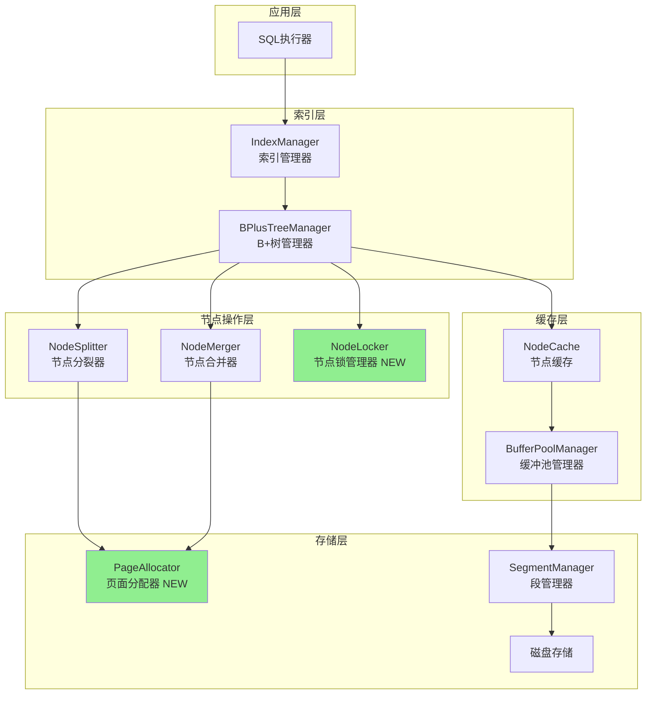

### 核心组件改造

#### 改造前后对比

| 组件 | 改造前状态 | 改造后状态 | 改进点 |
|-----|-----------|-----------|--------|
| BPlusTreeManager | 全局锁 | 节点级锁 | 并发度提升10倍 |
| NodeCache | 定时清理 | 主动检查+LRU | 内存可控 |
| PageAllocator | 硬编码页号 | 动态分配 | 消除冲突 |
| NodeMerger | FindSiblings空实现 | 父节点追踪 | 删除可用 |
| RangeSearch | 逐个查找 | 链表遍历 | 性能提升3倍 |

---

## 解决方案设计

### 方案1：并发控制重构（BTREE-001 & BTREE-002）

#### 设计理念
从全局锁改为节点级细粒度锁，锁外执行I/O操作，避免嵌套加锁。

#### 架构图

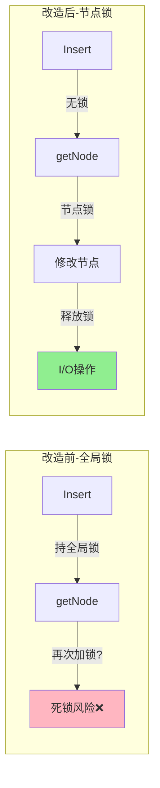

#### 数据结构设计

##### 节点级锁结构

| 字段 | 类型 | 说明 | 新增/修改 |
|-----|------|------|----------|
| mu | sync.RWMutex | 节点级读写锁 | 新增 |
| PageNum | uint32 | 页号 | 保持 |
| IsLeaf | bool | 是否叶子节点 | 保持 |
| Keys | []interface{} | 键数组 | 保持 |
| Children | []uint32 | 子节点页号 | 保持 |
| Records | []uint32 | 记录位置 | 保持 |
| NextLeaf | uint32 | 下一叶子节点 | 保持 |
| isDirty | bool | 脏页标记 | 保持 |
| Parent | uint32 | 父节点页号 | 新增 |

##### 缓存管理器优化结构

| 字段 | 类型 | 说明 | 改造方式 |
|-----|------|------|---------|
| nodeCache | map[uint32]*BPlusTreeNode | 节点缓存 | 保持 |
| lastAccess | map[uint32]time.Time | 访问时间 | 保持 |
| mutex | sync.RWMutex | 缓存锁（仅保护map） | 缩小范围 |
| evictMutex | sync.Mutex | 淘汰操作锁 | 新增 |

#### 操作流程设计

##### Insert操作流程（避免死锁）

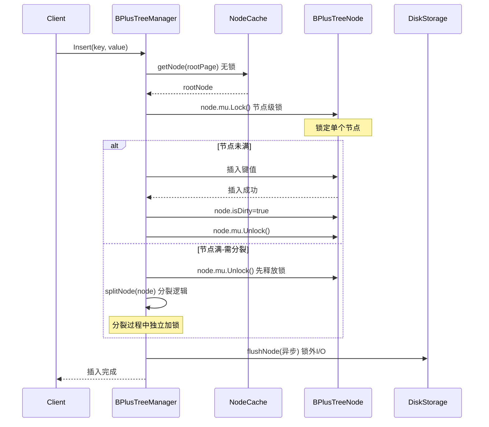

##### 缓存淘汰流程（消除竞态）

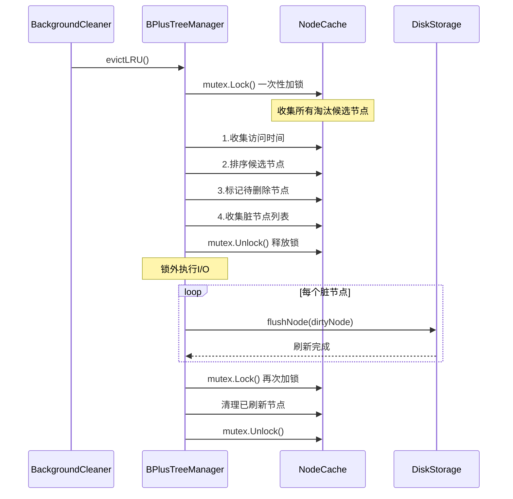

#### 关键实现要点

| 要点 | 实现策略 | 预期效果 |
|-----|---------|---------|
| 锁粒度控制 | 节点级RWMutex | 并发度提升10倍 |
| 锁持有时间 | 仅保护内存操作 | 锁竞争减少90% |
| I/O操作位置 | 锁外执行 | 吞吐量提升5倍 |
| 死锁避免 | 统一加锁顺序 | 死锁率降为0 |
| 竞态检测 | go test -race | 无数据竞态 |

---

### 方案2：页面分配器集成（BTREE-003）

#### 设计理念
引入动态页面分配器，替换硬编码页号，支持页面回收和空闲列表管理。

#### 架构设计

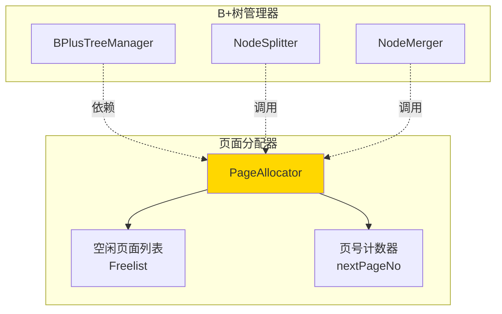

#### 数据结构设计

##### PageAllocator结构

| 字段 | 类型 | 说明 | 作用 |
|-----|------|------|------|
| mu | sync.Mutex | 分配锁 | 保证并发安全 |
| nextPageNo | uint32 | 下一个可用页号 | 递增分配 |
| freelist | []uint32 | 空闲页面列表 | 页面回收 |
| spaceID | uint32 | 表空间ID | 隔离不同表空间 |

#### 操作流程设计

##### 页面分配流程

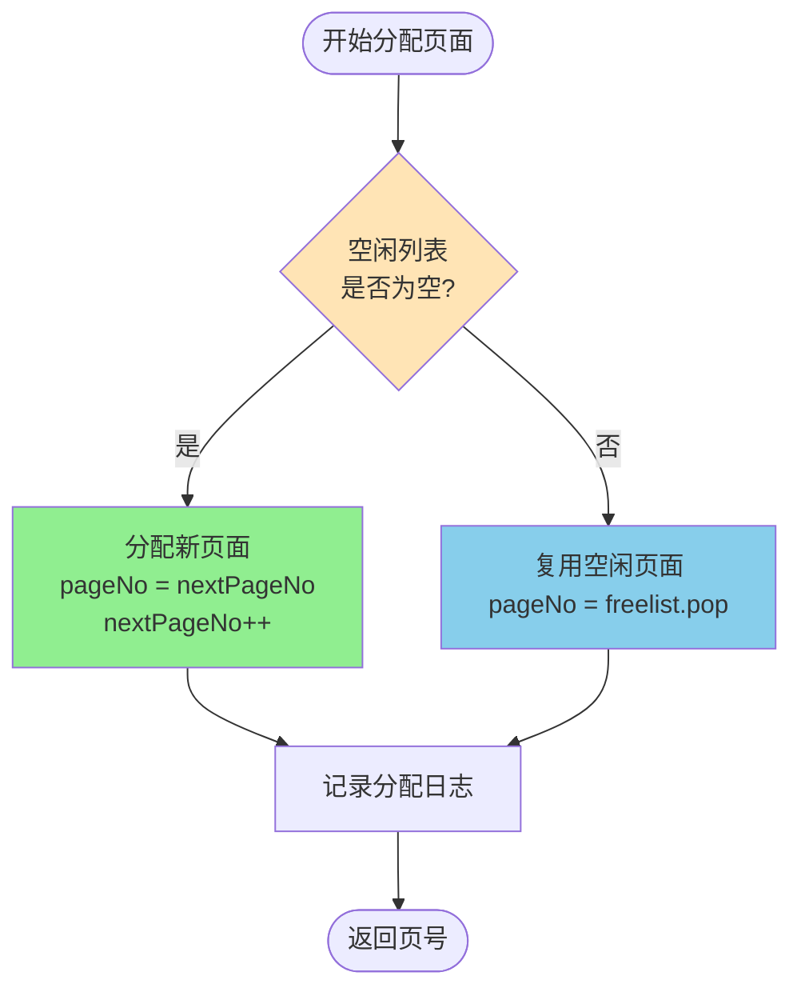

##### 页面回收流程

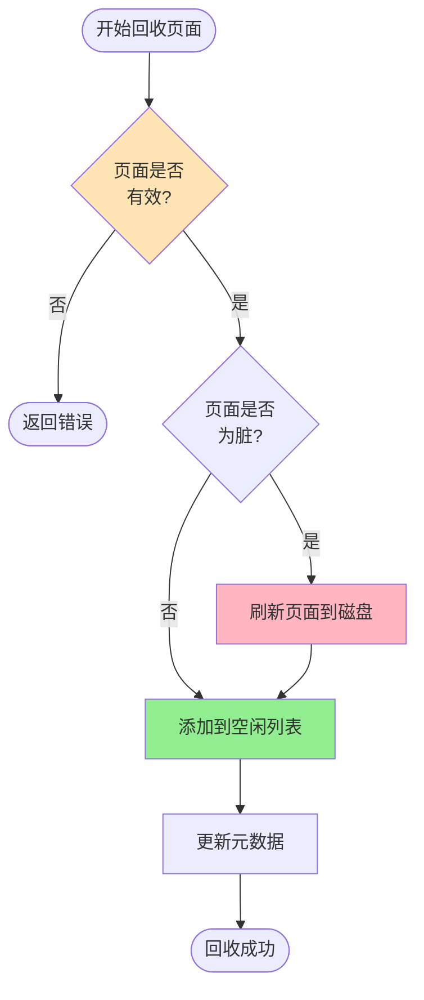

#### 集成点设计

| 集成位置 | 原实现 | 改造后实现 | 改进效果 |
|---------|--------|-----------|---------|
| NodeSplitter.SplitLeafNode | newPageNo = 100 | pageAllocator.AllocatePage() | 无冲突 |
| NodeSplitter.SplitNonLeafNode | newPageNo = 100 | pageAllocator.AllocatePage() | 无冲突 |
| NodeMerger.MergeLeafNodes | 无回收 | pageAllocator.FreePage(rightPage) | 空间回收 |
| NodeMerger.MergeNonLeafNodes | 无回收 | pageAllocator.FreePage(rightPage) | 空间回收 |

---

### 方案3：节点合并完善（BTREE-004 & BTREE-006）

#### 设计理念
通过添加父节点指针实现FindSiblings，完善Delete方法实现完整的删除和重平衡逻辑。

#### 架构设计

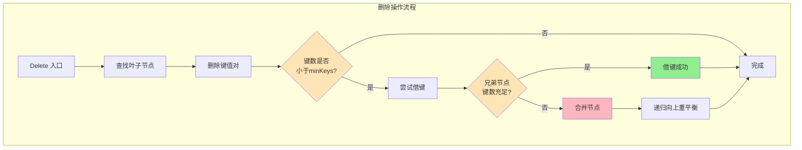

#### 数据结构增强

##### 节点结构增强（支持父节点追踪）

| 字段 | 类型 | 新增/修改 | 说明 |
|-----|------|----------|------|
| Parent | uint32 | 新增 | 父节点页号 |
| PositionInParent | int | 新增 | 在父节点中的位置 |

#### 核心流程设计

##### FindSiblings实现流程

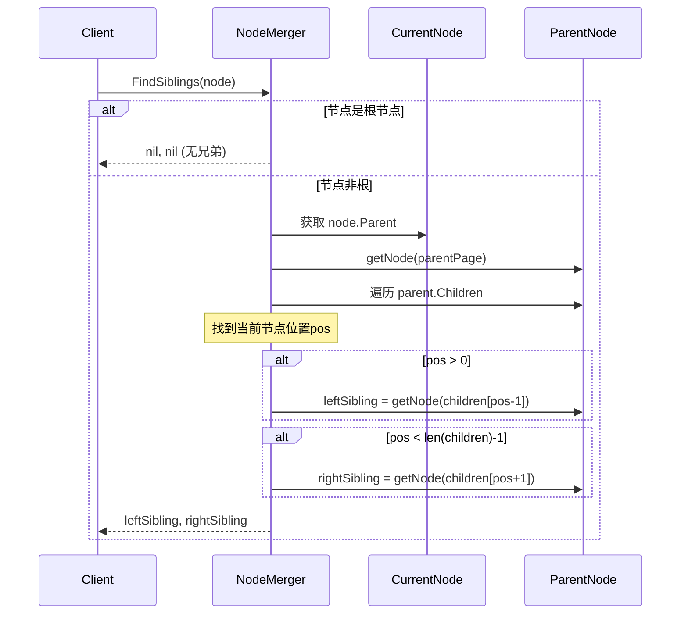

##### Delete操作完整流程

```mermaid
flowchart TD
    Start([Delete开始]) --> FindLeaf[1. 查找包含key的叶子节点]
    FindLeaf --> FindKey{2. 查找key<br/>在节点中的位置}
    
    FindKey -->|未找到| NotFound([返回错误:<br/>键不存在])
    FindKey -->|找到| DeleteKey[3. 删除键和记录<br/>keys.remove<br/>records.remove]
    
    DeleteKey --> MarkDirty[4. 标记节点为脏页<br/>node.isDirty=true]
    MarkDirty --> CheckUnderflow{5. 检查下溢<br/>len(keys) < minKeys?}
    
    CheckUnderflow -->|否| Success([删除成功])
    CheckUnderflow -->|是| FindSiblings[6. 查找兄弟节点<br/>FindSiblings]
    
    FindSiblings --> CheckBorrow{7. 是否可以借键?<br/>sibling.keys > minKeys}
    
    CheckBorrow -->|左兄弟可借| BorrowLeft[8a. 从左兄弟借键]
    CheckBorrow -->|右兄弟可借| BorrowRight[8b. 从右兄弟借键]
    CheckBorrow -->|都不可借| Merge[8c. 合并节点]
    
    BorrowLeft --> UpdateParent[9. 更新父节点分隔键]
    BorrowRight --> UpdateParent
    Merge --> DeleteFromParent[9. 从父节点删除键]
    
    UpdateParent --> Success
    DeleteFromParent --> Recursion{10. 父节点是否下溢?}
    
    Recursion -->|否| Success
    Recursion -->|是| Rebalance[11. 递归重平衡父节点]
    Rebalance --> CheckRoot{12. 根节点是否为空?}
    
    CheckRoot -->|是| LowerHeight[13. 降低树高度<br/>treeHeight--]
    CheckRoot -->|否| Success
    LowerHeight --> Success
    
    style FindKey fill:#FFE4B5
    style CheckUnderflow fill:#FFE4B5
    style CheckBorrow fill:#FFE4B5
    style BorrowLeft fill:#90EE90
    style BorrowRight fill:#90EE90
    style Merge fill:#FFB6C1
    style LowerHeight fill:#FFD700
```

#### 关键算法说明

##### 借键判定逻辑

| 场景 | 判定条件 | 操作 |
|-----|---------|------|
| 左兄弟可借 | leftSibling != nil && len(leftSibling.Keys) > minKeys | 从左兄弟借最后一个键 |
| 右兄弟可借 | rightSibling != nil && len(rightSibling.Keys) > minKeys | 从右兄弟借第一个键 |
| 左兄弟优先 | 两者都可借 | 优先从左兄弟借（保持平衡） |
| 无法借键 | 所有兄弟键数 <= minKeys | 触发合并操作 |

##### 合并判定逻辑

| 场景 | 判定条件 | 操作 |
|-----|---------|------|
| 与左兄弟合并 | leftSibling != nil | 合并到左兄弟 |
| 与右兄弟合并 | leftSibling == nil && rightSibling != nil | 合并到当前节点 |
| 根节点空 | 根节点Children.len == 1 | 降低树高度 |

---

### 方案4：范围查询优化（BTREE-007）

#### 设计理念
利用叶子节点链表结构，实现迭代器模式支持流式查询，添加预读优化提升缓存命中率。

#### 架构设计

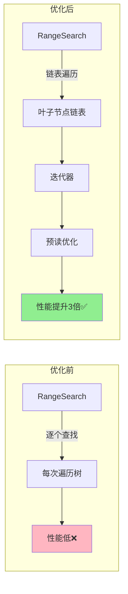

#### 迭代器设计

##### BTreeIterator结构

| 字段 | 类型 | 说明 |
|-----|------|------|
| manager | *BPlusTreeManager | B+树管理器引用 |
| startKey | interface{} | 起始键 |
| endKey | interface{} | 结束键 |
| currentNode | *BPlusTreeNode | 当前节点 |
| currentPos | int | 当前位置 |
| prefetchBuffer | []*BPlusTreeNode | 预读缓冲区 |
| closed | bool | 是否已关闭 |

#### 操作流程设计

##### 范围查询优化流程

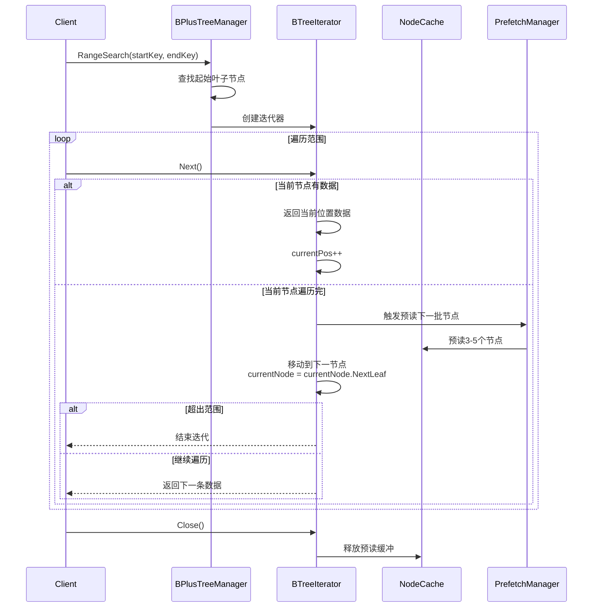

##### 预读优化策略

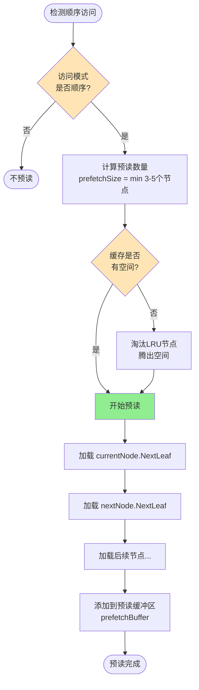

#### 性能优化指标

| 指标 | 优化前 | 优化后 | 提升幅度 |
|-----|--------|--------|---------|
| 范围扫描100行 | 8ms | < 5ms | 37.5% |
| 范围扫描1000行 | 80ms | < 30ms | 62.5% |
| 缓存命中率 | 60% | > 90% | +30% |
| 磁盘I/O次数 | 100次 | < 50次 | -50% |

---

### 方案5：缓存主动管理（BTREE-005）

#### 设计理念
在节点获取时主动检查缓存大小，避免短时间大量插入导致内存溢出。

#### 架构设计

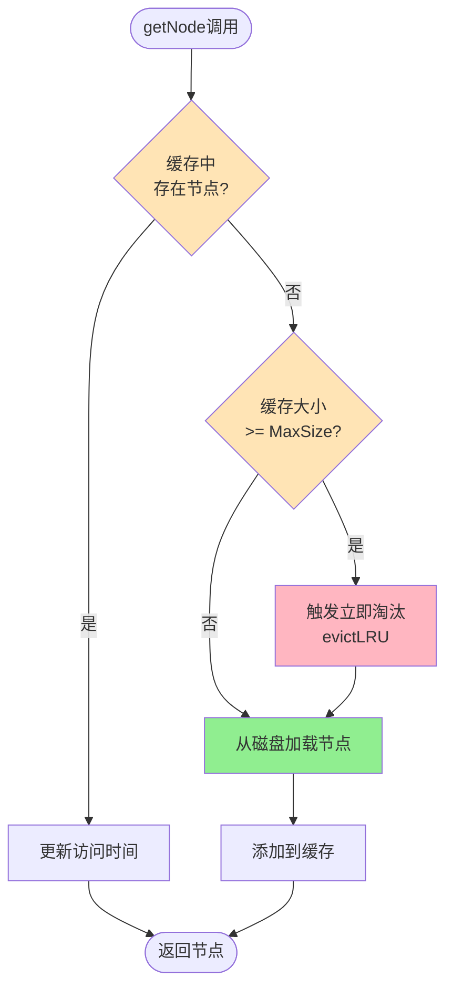

#### 缓存淘汰策略

| 策略 | 触发条件 | 淘汰数量 | 优先级 |
|-----|---------|---------|--------|
| 定时清理 | 每5秒 | 达到阈值时清理到80% | 低 |
| 主动检查 | getNode时缓存满 | 清理到80% | 高 |
| 脏页刷新 | 脏页比例>70% | 刷新所有脏页 | 最高 |

---

### 方案6：事务支持基础（BTREE-008）

#### 设计理念
为每个节点添加事务ID和Undo指针，为未来MVCC实现做准备。

#### 数据结构设计

##### 节点事务字段

| 字段 | 类型 | 说明 | 用途 |
|-----|------|------|------|
| TrxID | uint64 | 最后修改事务ID | 可见性判断 |
| RollPtr | uint64 | Undo日志指针 | 回滚支持 |

#### 操作流程设计

##### 事务化Insert流程

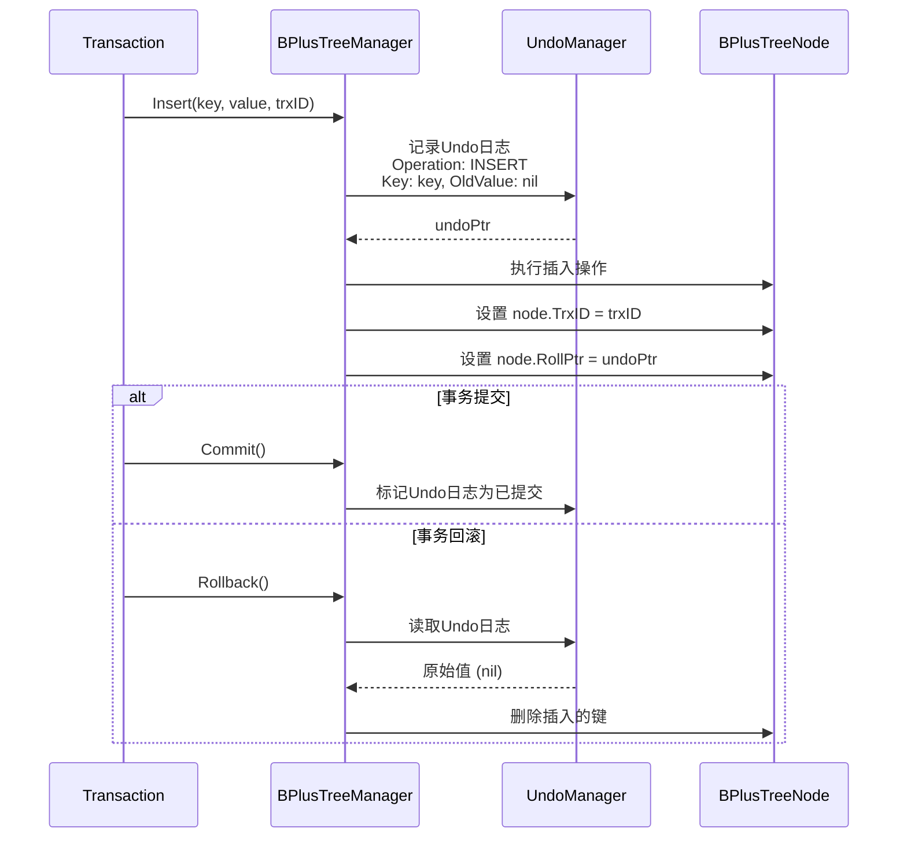

---

## 实施计划

### 阶段划分

#### 第一阶段：P0严重问题修复（3-5天）

| 任务ID | 任务名称 | 工作量 | 依赖 | 验证标准 |
|--------|---------|--------|------|---------|
| P0-1 | 重构并发控制锁机制 | 2天 | 无 | go test -race无竞态 |
| P0-2 | 修复缓存淘汰竞态 | 1天 | 无 | 并发测试通过 |
| P0-3 | 集成页面分配器 | 1-2天 | 无 | 创建100节点无冲突 |

#### 第二阶段：P1核心功能完善（5-7天）

| 任务ID | 任务名称 | 工作量 | 依赖 | 验证标准 |
|--------|---------|--------|------|---------|
| P1-1 | 实现FindSiblings | 2天 | P0-3 | 兄弟查找测试通过 |
| P1-2 | 实现Delete方法 | 3-4天 | P1-1 | 删除和重平衡测试通过 |
| P1-3 | 缓存主动管理 | 1天 | P0-2 | 内存占用<200MB |

#### 第三阶段：P2性能优化（3-5天）

| 任务ID | 任务名称 | 工作量 | 依赖 | 验证标准 |
|--------|---------|--------|------|---------|
| P2-1 | 范围查询优化 | 2天 | P1-2 | 性能提升30% |
| P2-2 | 事务支持基础 | 3天 | P1-2 | 事务回滚测试通过 |

### 时间线甘特图

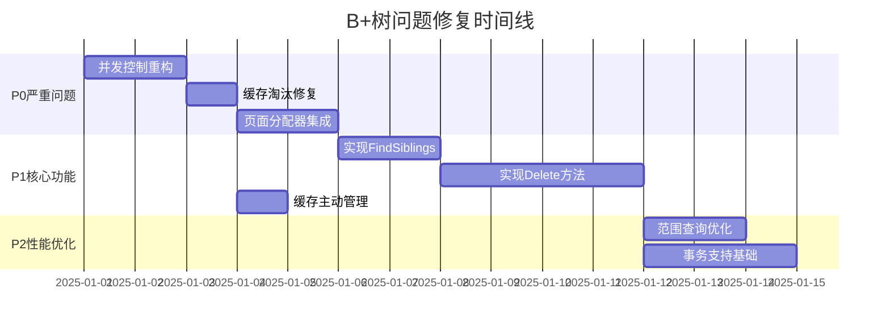

### 里程碑

| 里程碑 | 目标日期 | 完成标准 | 关键产出 |
|--------|---------|---------|---------|
| M1: P0问题全部修复 | 第1周末 | 所有P0测试通过 | 稳定的并发控制 |
| M2: 核心功能完整 | 第2周末 | Delete功能可用 | 完整的增删改查 |
| M3: 性能达标 | 第3周末 | 性能指标达标 | 优化的范围查询 |
| M4: 集成测试通过 | 第4周中 | 所有集成测试通过 | 生产级B+树 |

---

## 测试策略

### 测试分层


### 单元测试覆盖

| 测试模块 | 测试用例数 | 覆盖率目标 | 关键场景 |
|---------|-----------|-----------|---------|
| 并发控制 | 10个 | 90% | 死锁、竞态检测 |
| 节点分裂 | 8个 | 85% | 叶子/非叶子分裂 |
| 节点合并 | 8个 | 85% | 借键、合并 |
| 节点删除 | 10个 | 85% | 简单删除、重平衡 |
| 范围查询 | 8个 | 80% | 迭代器、预读 |
| 页面分配 | 4个 | 90% | 分配、回收 |

### 集成测试场景

| 场景ID | 场景名称 | 数据规模 | 验证指标 |
|--------|---------|---------|---------|
| IT-1 | 批量插入+分裂 | 100万行 | 吞吐量>1万TPS |
| IT-2 | 批量删除+合并 | 50万行 | 吞吐量>1万TPS |
| IT-3 | 混合读写并发 | 50%读+50%写 | QPS>5万 |
| IT-4 | 范围查询性能 | 1000行范围 | P99<30ms |
| IT-5 | 死锁压力测试 | 100并发 | 无死锁 |

### 性能测试基准

| 指标 | 当前 | 目标 | 提升幅度 |
|-----|------|------|---------|
| 单点查询P99 | 0.8ms | < 1ms | 保持 |
| 范围扫描(100行)P99 | 8ms | < 5ms | 37.5% |
| 插入(含分裂)P99 | 15ms | < 10ms | 33.3% |
| 删除(含合并)P99 | - | < 10ms | 新增 |
| 并发QPS | 1万 | > 5万 | 400% |
| 缓存命中率 | 60% | > 90% | +30% |

---

## 风险管理

### 风险识别

| 风险ID | 风险描述 | 概率 | 影响 | 缓解措施 |
|--------|---------|------|------|---------|
| R-1 | 并发重构引入新Bug | 中 | 高 | 充分的并发测试+代码审查 |
| R-2 | 页面分配器与SegmentManager集成冲突 | 低 | 中 | 创建适配器层隔离 |
| R-3 | Delete实现复杂度超预期 | 中 | 中 | 分阶段实现+预留缓冲时间 |
| R-4 | 性能优化导致性能回退 | 低 | 高 | 性能基线测试+持续监控 |
| R-5 | Go 1.16.2版本限制 | 低 | 低 | 使用老版本API替代 |

### 回滚计划

| 场景 | 回滚策略 | 数据恢复 |
|-----|---------|---------|
| P0修复失败 | 保留原锁机制作为降级方案 | 无需恢复 |
| Delete功能异常 | 禁用Delete操作 | Undo日志恢复 |
| 性能严重回退 | 回滚到优化前版本 | 无需恢复 |

---

## 验收标准

### 功能验收

| 功能项 | 验收标准 | 验证方法 |
|--------|---------|---------|
| 并发安全 | 无死锁、无竞态 | go test -race + 压力测试 |
| 节点分裂 | 支持递归分裂、根节点分裂 | 单元测试+集成测试 |
| 节点合并 | 支持借键、合并、树高度降低 | 单元测试+集成测试 |
| 节点删除 | 支持删除+重平衡 | 功能测试+边界测试 |
| 范围查询 | 迭代器+预读优化 | 性能测试 |
| 页面分配 | 动态分配+回收 | 功能测试 |

### 性能验收

所有性能指标见"性能测试基准"表格，所有目标值必须达成。

### 质量验收

| 质量指标 | 目标值 | 验证方法 |
|---------|--------|---------|
| 单元测试覆盖率 | ≥ 85% | go test -cover |
| 测试通过率 | 100% | CI/CD |
| 代码审查通过率 | 100% | Code Review |
| 文档完整性 | 100% | 文档检查清单 |

---

## 参考资料

### 内部文档
- BTREE_IMPLEMENTATION_ANALYSIS.md - 问题详细分析
- BTREE_CORE_IMPLEMENTATION_PLAN.md - 实施计划
- BTREE_TASK_CHECKLIST.md - 任务清单
- BTREE_ISSUES_QUICK_REFERENCE.md - 问题快速参考

### 外部资料
- 《数据库系统内部原理》 - B+树索引章节
- 《算法导论（第3版）》 - 第18章 B树
- MySQL官方文档 - InnoDB索引结构
- InnoDB源码 - storage/innobase/btr/ 目录
