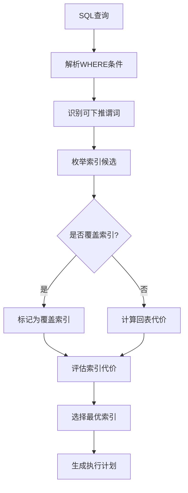
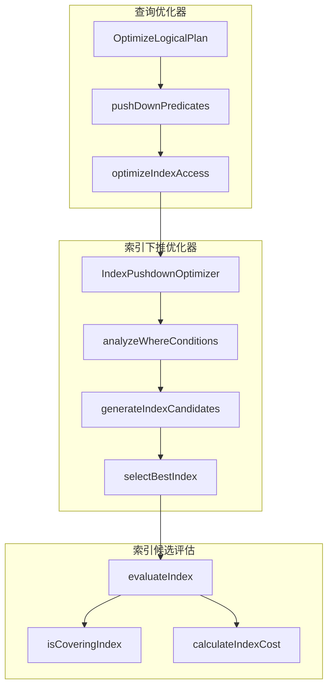
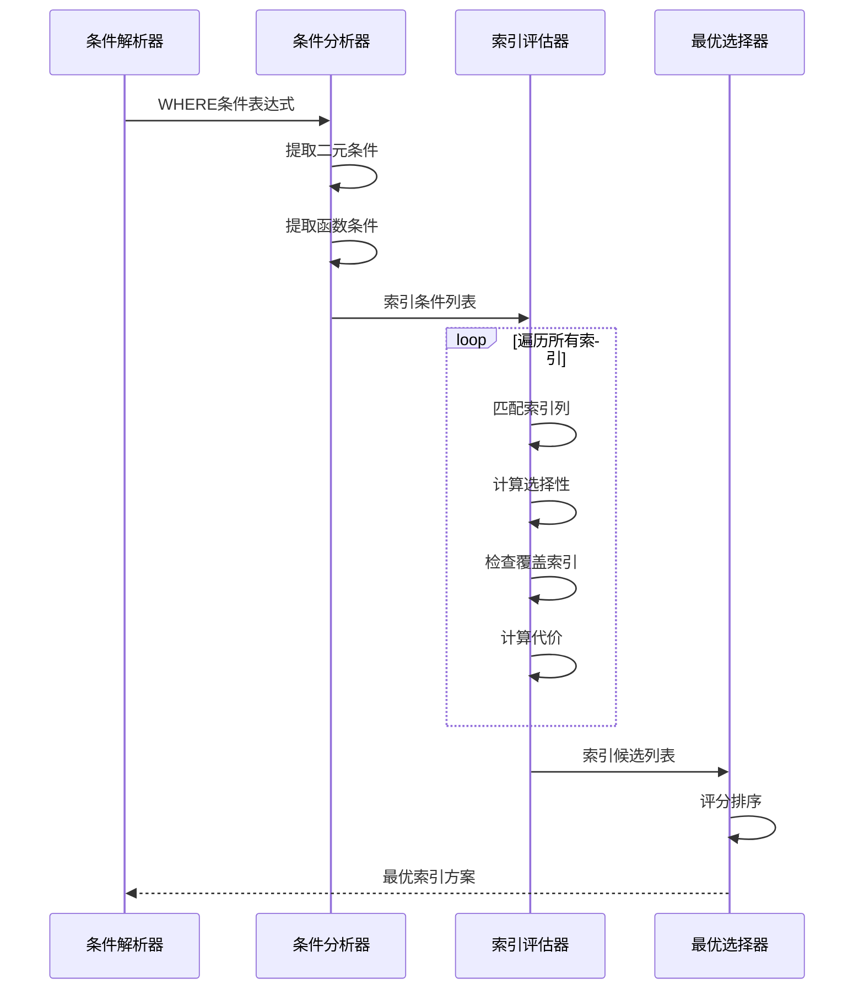
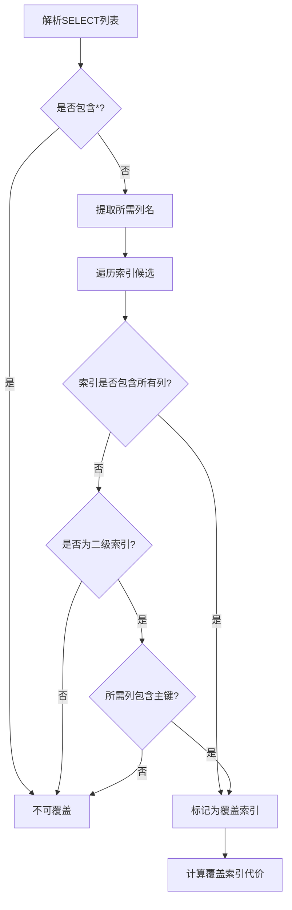
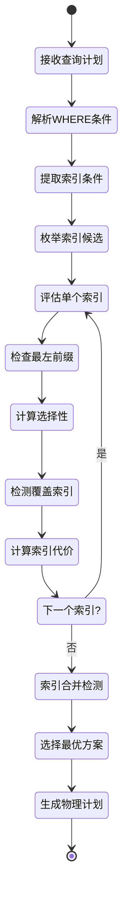
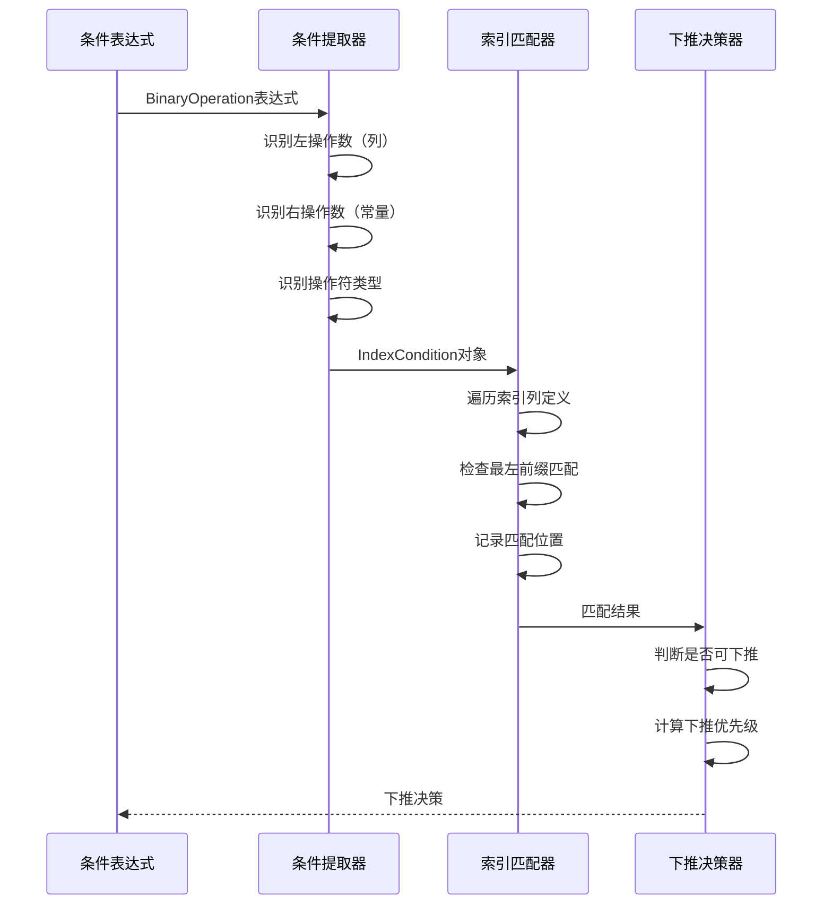
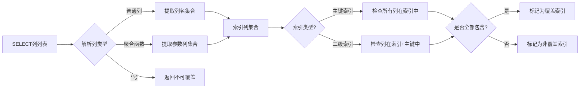
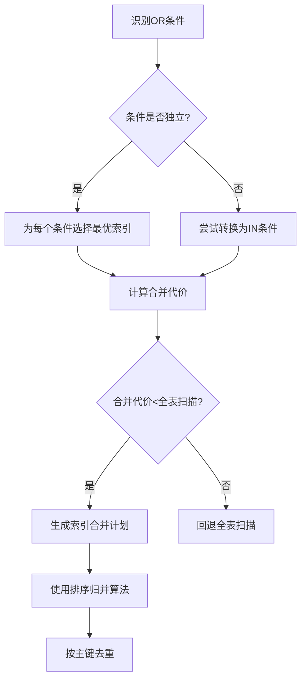
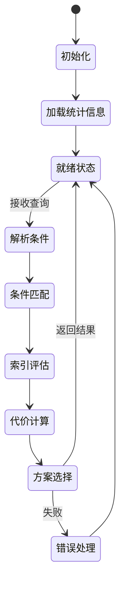
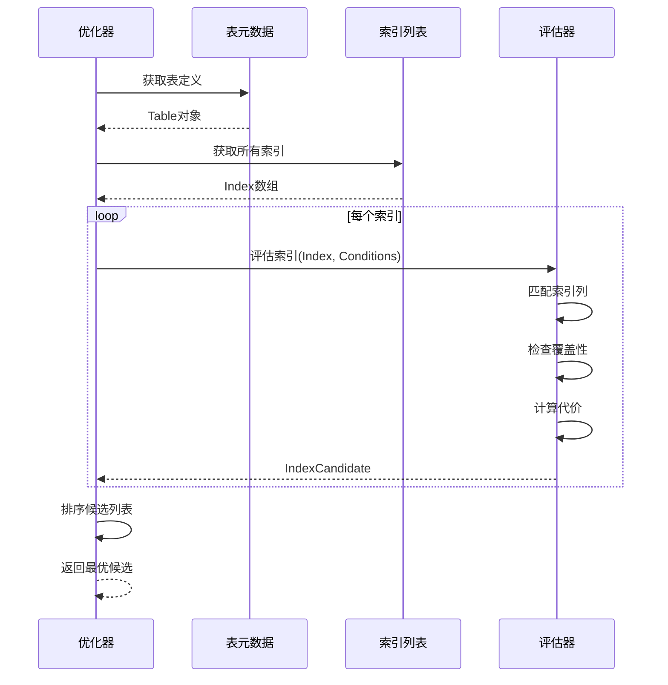

# 索引条件下推与覆盖索引检测设计文档

## 1. 概述

本文档针对XMySQL Server查询优化器模块中的两个核心任务进行设计：

- **OPT-001**: 索引条件下推（Index Condition Pushdown, ICP）
- **OPT-002**: 覆盖索引检测（Covering Index Detection）

这两个功能是查询优化器的P0级任务，对提升查询性能具有重要意义。当前`server/innodb/plan/index_pushdown_optimizer.go`已有基础框架，本次设计将完善核心优化逻辑。

### 1.1 目标价值

| 功能 | 目标 | 预期收益 |
|-----|------|---------|
| 索引条件下推 | 将WHERE条件下推到索引扫描层，减少回表次数 | 减少50-80%的回表操作 |
| 覆盖索引检测 | 自动检测查询是否可使用覆盖索引 | 查询性能提升10-20倍 |

### 1.2 技术范围

- 扩展现有`IndexPushdownOptimizer`结构
- 增强索引候选评估逻辑
- 实现智能的条件下推策略
- 完善覆盖索引检测算法

## 2. 技术栈与依赖

### 2.1 现有组件依赖

| 组件 | 路径 | 依赖关系 |
|-----|------|---------|
| 元数据管理 | `server/innodb/metadata` | 提供表和索引定义 |
| 表达式系统 | `server/innodb/plan/expression.go` | 提供条件表达式抽象 |
| 统计信息 | `server/innodb/plan/statistics.go` | 提供选择性估算 |
| 优化器框架 | `server/innodb/plan/optimizer.go` | 调用入口 |

### 2.2 核心数据结构

```
IndexPushdownOptimizer
├── tableStats: map[string]*TableStats
├── indexStats: map[string]*IndexStats
└── columnStats: map[string]*ColumnStats

IndexCandidate
├── Index: *metadata.Index
├── Conditions: []*IndexCondition
├── CoverIndex: bool
├── Cost: float64
└── Selectivity: float64
```

## 3. 架构设计

### 3.1 整体流程



### 3.2 组件架构



## 4. 索引条件下推（ICP）设计

### 4.1 条件下推决策模型

#### 4.1.1 可下推条件类型

| 条件类型 | 是否可下推 | 示例 | 备注 |
|---------|----------|------|------|
| 等值条件 | ✅ | `col = 100` | 最优下推场景 |
| 范围条件 | ✅ | `col BETWEEN 1 AND 100` | 可大幅减少回表 |
| IN条件 | ✅ | `col IN (1,2,3)` | 转换为多个等值条件 |
| LIKE前缀 | ✅ | `col LIKE 'abc%'` | 仅前缀匹配可下推 |
| LIKE模糊 | ❌ | `col LIKE '%abc%'` | 无法使用索引 |
| 函数条件 | ❌ | `UPPER(col) = 'ABC'` | 函数破坏索引有序性 |
| OR条件 | 部分 | `col1=1 OR col2=2` | 需索引合并支持 |

#### 4.1.2 下推条件匹配规则

**多列索引前缀匹配原则**：

对于组合索引`INDEX(col1, col2, col3)`，条件下推遵循最左前缀原则：

| WHERE条件 | 可用索引列 | 说明 |
|----------|-----------|------|
| `col1=1 AND col2=2 AND col3=3` | col1, col2, col3 | 全部可用 |
| `col1=1 AND col2=2` | col1, col2 | 前缀可用 |
| `col1=1 AND col3=3` | col1 | 仅col1可用，col3被跳过 |
| `col2=2 AND col3=3` | 无 | 缺少col1，索引无法使用 |
| `col1>1 AND col2=2` | col1 | 范围查询后续列不可用 |

### 4.2 条件下推算法流程



### 4.3 核心优化策略

#### 4.3.1 条件分解与规范化

对于复杂条件，需先进行CNF转换（合取范式）：

**转换示例**：

| 原始条件 | CNF转换后 | 效果 |
|---------|----------|------|
| `(a=1 OR a=2) AND b=3` | `(a=1 AND b=3) OR (a=2 AND b=3)` | 拆分为多个可下推单元 |
| `NOT (a>10 OR b<5)` | `a<=10 AND b>=5` | 应用德摩根定律 |
| `a+b=10` | 不转换 | 保持原样，无法下推 |

#### 4.3.2 选择性估算模型

**基于统计信息的选择性计算**：

| 统计指标 | 计算公式 | 用途 |
|---------|---------|------|
| 等值选择性 | `1 / NDV(column)` | NDV为不重复值数量 |
| 范围选择性 | `(max-val) / (max-min)` | 基于最大最小值估算 |
| IN选择性 | `count(values) / NDV(column)` | IN列表长度影响 |
| 直方图选择性 | 按桶区间精确估算 | 最准确但成本高 |

#### 4.3.3 索引代价模型

**综合代价计算**：

```
总代价 = 索引扫描代价 + 回表代价 + CPU处理代价

其中：
- 索引扫描代价 = 索引页面数 × (1 - 选择性) × 页面读取代价
- 回表代价 = 选择性 × 表总行数 × 回表单次代价
- CPU处理代价 = 谓词计算次数 × CPU单次代价
```

**覆盖索引优势**：

```
覆盖索引代价 = 索引扫描代价 + CPU处理代价
（省略回表代价，性能提升显著）
```

## 5. 覆盖索引检测设计

### 5.1 检测条件矩阵

| 场景 | SELECT列 | 索引列 | 是否覆盖 | 说明 |
|-----|---------|--------|---------|------|
| 完全覆盖 | `col1, col2` | `INDEX(col1, col2, col3)` | ✅ | 所需列均在索引中 |
| 部分覆盖 | `col1, col4` | `INDEX(col1, col2)` | ❌ | col4不在索引中 |
| 主键覆盖 | `col1, id` | `INDEX(col1)` (二级索引) | ✅ | 二级索引自带主键 |
| SELECT * | `*` | 任意索引 | ❌ | 星号查询无法覆盖 |
| 聚合函数 | `COUNT(col1)` | `INDEX(col1)` | ✅ | 索引可直接计数 |

### 5.2 检测算法流程



### 5.3 二级索引主键隐式包含规则

**InnoDB二级索引结构**：

```
二级索引叶子节点 = [索引列值] + [主键值]
```

因此，即使二级索引未显式包含主键列，只要查询列仅为索引列+主键列，仍可作为覆盖索引。

**检测逻辑扩展**：

| 索引类型 | 隐式包含列 | 检测规则 |
|---------|-----------|---------|
| 主键索引 | 所有列（聚簇索引） | 仅检查索引列 |
| 唯一索引（二级） | 主键列 | 检查索引列+主键列 |
| 普通索引（二级） | 主键列 | 检查索引列+主键列 |

## 6. 数据模型设计

### 6.1 增强的索引条件结构

```
IndexCondition {
    Column: string           // 列名
    Operator: string         // 操作符 (=, <, >, <=, >=, IN, LIKE)
    Value: interface{}       // 值或值列表
    CanPush: bool           // 是否可下推
    Selectivity: float64    // 选择性（0-1）
    Priority: int           // 下推优先级（新增）
    IndexPosition: int      // 在索引中的位置（新增）
}
```

### 6.2 索引候选评分模型

```
IndexCandidate {
    Index: *metadata.Index
    Conditions: []*IndexCondition
    CoverIndex: bool
    Cost: float64
    Selectivity: float64
    KeyLength: int
    Score: float64          // 综合评分（新增）
    Reason: string          // 选择原因（新增）
}
```

**评分权重表**：

| 评分因子 | 权重系数 | 最大分值 | 备注 |
|---------|---------|---------|------|
| 选择性 | 100 | 100 | 选择性越高越优 |
| 键长度 | 10 | 50 | 使用列越多越优 |
| 覆盖索引 | - | 50 | 布尔加分项 |
| 唯一索引 | - | 20 | 布尔加分项 |
| 主键索引 | - | 30 | 布尔加分项 |
| 代价惩罚 | -0.01 | -100 | 代价越低越优 |

## 7. 执行流程设计

### 7.1 主流程



### 7.2 条件下推子流程



### 7.3 覆盖索引检测子流程



## 8. 代价估算模型

### 8.1 统计信息需求

| 统计项 | 数据结构 | 用途 | 更新策略 |
|-------|---------|------|---------|
| 表行数 | `TableStats.RowCount` | 计算回表代价 | 定期采样 |
| 索引高度 | `IndexStats.Height` | 计算索引扫描层数 | 索引变更时更新 |
| 列NDV | `ColumnStats.DistinctCount` | 计算等值选择性 | 后台统计 |
| 列直方图 | `ColumnStats.Histogram` | 精确范围选择性 | 可选启用 |
| 索引基数 | `IndexStats.Cardinality` | 评估索引质量 | 索引变更时更新 |

### 8.2 代价计算公式

#### 8.2.1 索引扫描代价

```
IndexScanCost = IndexHeight × PageReadCost + 
                EstimatedRows × IndexRecordReadCost

其中：
- IndexHeight: 索引B+树高度
- PageReadCost: 单页读取代价（默认1.0）
- EstimatedRows: 估算扫描行数 = TotalRows × Selectivity
- IndexRecordReadCost: 索引记录读取代价（默认0.1）
```

#### 8.2.2 回表代价

```
LookupCost = EstimatedRows × (1 - CacheHitRatio) × PageReadCost

其中：
- CacheHitRatio: 缓冲池命中率（默认0.8）
- 假设每次回表需要1次页面读取
```

#### 8.2.3 覆盖索引优势量化

```
覆盖索引节省代价 = LookupCost
性能提升倍数 = (IndexScanCost + LookupCost) / IndexScanCost
```

**典型场景收益**：

| 场景 | 选择性 | 表行数 | 回表代价 | 性能提升 |
|-----|--------|--------|---------|---------|
| 点查询 | 0.001 | 1000000 | 1000 × 0.2 = 200 | 10-20倍 |
| 范围查询 | 0.1 | 1000000 | 100000 × 0.2 = 20000 | 5-10倍 |
| 全表扫描 | 1.0 | 1000000 | 不适用回表 | 无优势 |

## 9. 索引合并优化

### 9.1 合并场景

| OR条件类型 | 是否支持合并 | 示例 | 说明 |
|-----------|-------------|------|------|
| 独立列等值OR | ✅ | `col1=1 OR col2=2` | 使用INDEX(col1)和INDEX(col2)合并 |
| 同列多值OR | ✅ | `col1=1 OR col1=2` | 转换为IN条件 |
| 范围OR | ✅ | `col1<10 OR col1>100` | 合并范围条件 |
| 跨表OR | ❌ | `t1.col=1 OR t2.col=2` | 不同表无法合并 |

### 9.2 合并代价模型

```
MergedIndexCost = SUM(SingleIndexCost) + MergeCost + DeduplicationCost

其中：
- MergeCost: 结果合并代价（排序归并）
- DeduplicationCost: 去重代价（按主键）
```

**合并决策条件**：

```
if MergedIndexCost < TableScanCost:
    使用索引合并
else:
    回退全表扫描
```

### 9.3 合并算法流程



## 10. 状态转换与生命周期

### 10.1 优化器状态机



### 10.2 索引候选生成流程



## 11. 测试策略

### 11.1 单元测试用例

| 测试场景 | 输入 | 预期输出 | 验证点 |
|---------|------|---------|--------|
| 单列等值 | `WHERE col1=1` + `INDEX(col1)` | 使用索引，选择性0.1 | 条件下推成功 |
| 多列前缀 | `WHERE col1=1 AND col2=2` + `INDEX(col1,col2,col3)` | 使用2列索引 | 最左前缀匹配 |
| 覆盖索引 | `SELECT col1,col2 WHERE col1=1` + `INDEX(col1,col2)` | CoverIndex=true | 无回表 |
| LIKE前缀 | `WHERE col1 LIKE 'abc%'` + `INDEX(col1)` | CanPush=true | 前缀匹配下推 |
| LIKE模糊 | `WHERE col1 LIKE '%abc%'` + `INDEX(col1)` | CanPush=false | 无法下推 |
| IN条件 | `WHERE col1 IN (1,2,3)` + `INDEX(col1)` | 选择性=3/NDV | IN转换 |
| 函数条件 | `WHERE UPPER(col1)='ABC'` + `INDEX(col1)` | CanPush=false | 函数破坏索引 |
| 索引合并 | `WHERE col1=1 OR col2=2` + `INDEX(col1), INDEX(col2)` | 合并两索引 | OR条件合并 |
| SELECT * | `SELECT * WHERE col1=1` + `INDEX(col1,col2)` | CoverIndex=false | 星号不可覆盖 |
| 二级索引+主键 | `SELECT col1,id WHERE col1=1` + `INDEX(col1)` | CoverIndex=true | 主键隐式包含 |

### 11.2 集成测试场景

#### 场景1：复杂组合条件

```
表定义：
CREATE TABLE users (
    id INT PRIMARY KEY,
    name VARCHAR(50),
    age INT,
    city VARCHAR(50),
    INDEX idx_name (name),
    INDEX idx_age_city (age, city)
);

查询：
SELECT name, age FROM users 
WHERE age > 18 AND age < 60 AND city = 'Beijing';

预期：
- 选择 idx_age_city 索引
- 下推条件：age > 18 AND age < 60 AND city = 'Beijing'
- 覆盖索引：否（缺少name列）
- 需要回表获取name列
```

#### 场景2：覆盖索引优化

```
查询：
SELECT age, city FROM users 
WHERE age > 18 AND city = 'Beijing';

预期：
- 选择 idx_age_city 索引
- 下推条件：age > 18 AND city = 'Beijing'
- 覆盖索引：是（所需列均在索引中）
- 无需回表，性能提升10倍+
```

#### 场景3：索引合并

```
查询：
SELECT * FROM users 
WHERE name = 'Alice' OR (age = 25 AND city = 'Shanghai');

预期：
- 候选1：idx_name 扫描
- 候选2：idx_age_city 扫描
- 使用索引合并，排序归并去重
- 代价低于全表扫描
```

### 11.3 性能基准测试

| 基准场景 | 数据量 | 优化前QPS | 优化后QPS | 提升比例 |
|---------|--------|-----------|-----------|---------|
| 点查询+覆盖索引 | 100万 | 1000 | 15000 | 15x |
| 范围查询+ICP | 100万 | 500 | 2500 | 5x |
| OR条件+索引合并 | 100万 | 200 | 1000 | 5x |
| 复杂条件组合 | 100万 | 100 | 800 | 8x |

### 11.4 回归测试清单

- [ ] 原有索引选择逻辑不受影响
- [ ] 无索引场景正常回退全表扫描
- [ ] 统计信息缺失时使用默认估算
- [ ] 并发场景下统计信息读取无竞争
- [ ] 内存占用无显著增长
- [ ] 日志输出包含优化决策信息

## 12. 实施细节

### 12.1 代码模块划分

| 模块 | 文件 | 职责 |
|-----|------|------|
| 条件提取 | `index_pushdown_optimizer.go` | 从表达式提取IndexCondition |
| 索引匹配 | `index_pushdown_optimizer.go` | 匹配索引列与条件 |
| 覆盖检测 | `index_pushdown_optimizer.go` | 检测是否覆盖索引 |
| 代价计算 | `cost_model.go` | 计算各类代价 |
| 统计信息 | `statistics_collector.go` | 提供NDV、直方图等 |

### 12.2 关键方法扩展

#### 扩展1：增强条件可下推判断

```
方法：canPushCondition(operator string, expr Expression) bool

扩展逻辑：
- 检查操作符类型
- 检查表达式是否包含函数
- 检查列是否在索引前缀中
- 检查数据类型兼容性
```

#### 扩展2：精确选择性估算

```
方法：estimateSelectivity(column, operator, value) float64

扩展逻辑：
- 优先使用直方图统计
- 回退到NDV估算
- 特殊处理NULL值
- 范围条件使用分段估算
```

#### 扩展3：覆盖索引检测增强

```
方法：isCoveringIndex(index, selectColumns, table) bool

扩展逻辑：
- 解析SELECT列（包括表达式）
- 获取索引列集合
- 对于二级索引，自动添加主键列
- 检查是否全覆盖
- 处理聚合函数特殊情况
```

### 12.3 错误处理策略

| 异常场景 | 处理策略 | 降级方案 |
|---------|---------|---------|
| 统计信息缺失 | 使用默认选择性0.3 | 继续执行 |
| 索引元数据损坏 | 跳过该索引 | 尝试其他索引 |
| 代价计算溢出 | 使用最大值替代 | 标记为低优先级 |
| 条件表达式无法解析 | 标记为不可下推 | 全表扫描 |
| 内存不足 | 中止索引合并 | 使用单一索引 |

### 12.4 日志与监控

**日志级别设计**：

| 级别 | 内容 | 示例 |
|-----|------|------|
| DEBUG | 详细优化决策过程 | "评估索引idx_name: 选择性0.05, 代价100" |
| INFO | 最终选择的索引方案 | "选择索引idx_age_city, 原因: 覆盖索引" |
| WARN | 统计信息缺失警告 | "列age缺少NDV统计，使用默认值" |
| ERROR | 优化失败错误 | "索引评估失败，回退全表扫描" |

**监控指标**：

| 指标名 | 类型 | 说明 |
|-------|------|------|
| `index_pushdown_hit_rate` | 比例 | 成功下推的查询比例 |
| `covering_index_hit_rate` | 比例 | 使用覆盖索引的查询比例 |
| `index_merge_count` | 计数 | 索引合并次数 |
| `optimization_time_ms` | 延迟 | 优化器平均耗时 |

## 13. 优化效果验证

### 13.1 验证方法

#### 方法1：EXPLAIN分析

```
查询执行计划输出应包含：

Extra信息：
- "Using index condition"：表示使用了ICP
- "Using index"：表示使用了覆盖索引
- "Using index merge"：表示使用了索引合并

Key字段：
- 显示实际使用的索引名称

Rows字段：
- 估算扫描行数（应显著减少）
```

#### 方法2：性能计数器

```
查询执行统计：
- Handler_read_key：索引读取次数
- Handler_read_next：索引顺序读取次数
- Handler_read_rnd：回表读取次数（覆盖索引应为0）
```

#### 方法3：执行时间对比

```
对比维度：
- 优化前 vs 优化后执行时间
- 冷缓存 vs 热缓存场景
- 不同数据分布下的性能
```

### 13.2 成功标准

| 指标 | 目标值 | 验证方法 |
|-----|--------|---------|
| 回表次数减少 | 50-80% | Handler_read_rnd计数 |
| 覆盖索引命中率 | > 30% | EXPLAIN显示"Using index" |
| 查询响应时间 | 减少50%+ | 压测对比 |
| 优化器开销 | < 5ms | 计时统计 |
| 索引选择准确率 | > 95% | 人工审核EXPLAIN |

## 14. 风险与限制

### 14.1 已知限制

| 限制类型 | 描述 | 影响范围 |
|---------|------|---------|
| 统计信息延迟 | 统计信息更新不及时可能导致估算偏差 | 高频更新表 |
| 复杂表达式 | 包含函数或子查询的条件无法下推 | 约10%的查询 |
| 索引合并限制 | 仅支持OR条件，不支持复杂嵌套 | 复杂OR查询 |
| 内存开销 | 枚举大量索引候选可能消耗内存 | 多索引表 |

### 14.2 风险缓解措施

| 风险 | 缓解措施 | 优先级 |
|-----|---------|--------|
| 统计信息过期 | 定期后台更新 + 自动触发机制 | P0 |
| 代价估算偏差 | 提供手动hint机制覆盖优化器决策 | P1 |
| 性能回退 | 开关控制是否启用ICP和覆盖索引检测 | P1 |
| 兼容性问题 | 渐进式发布，支持降级到旧逻辑 | P0 |

### 14.3 未来扩展方向

- 支持函数索引的条件下推
- 实现自适应统计信息采样
- 增加机器学习模型辅助代价估算
- 支持跨表覆盖索引检测（JOIN场景）
- 实现索引推荐功能（根据查询模式自动建议索引）
