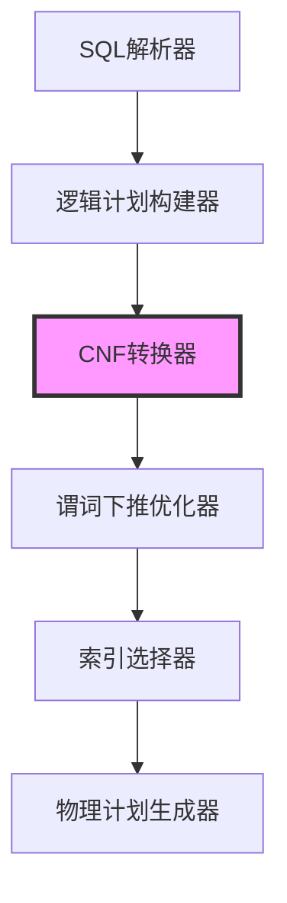
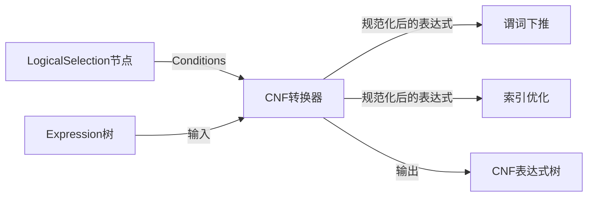
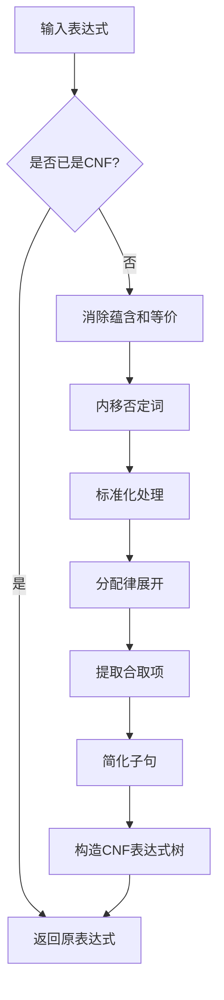
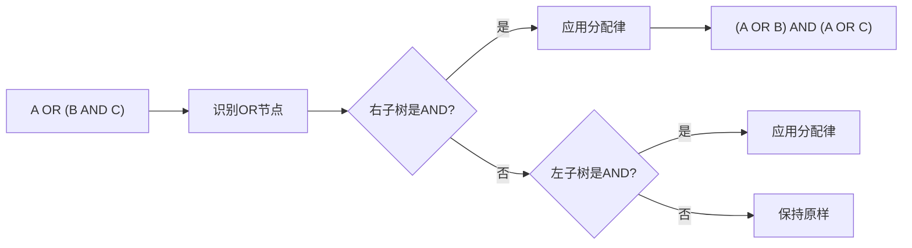
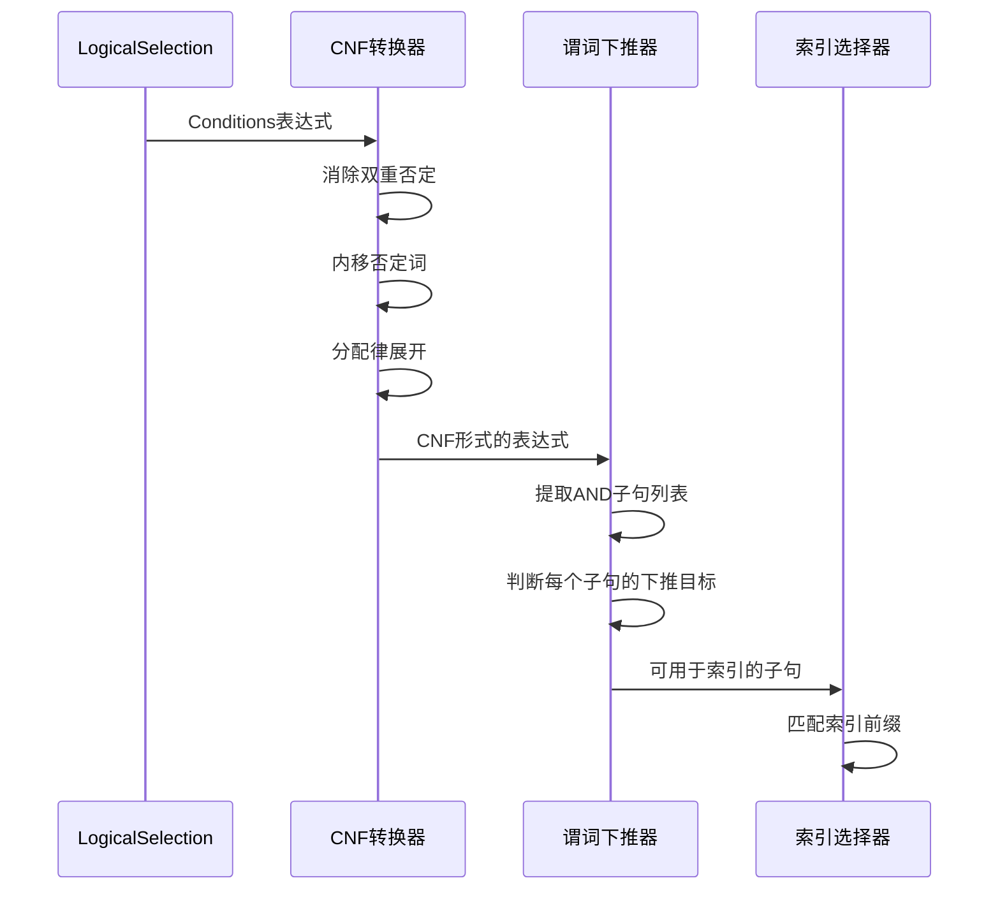
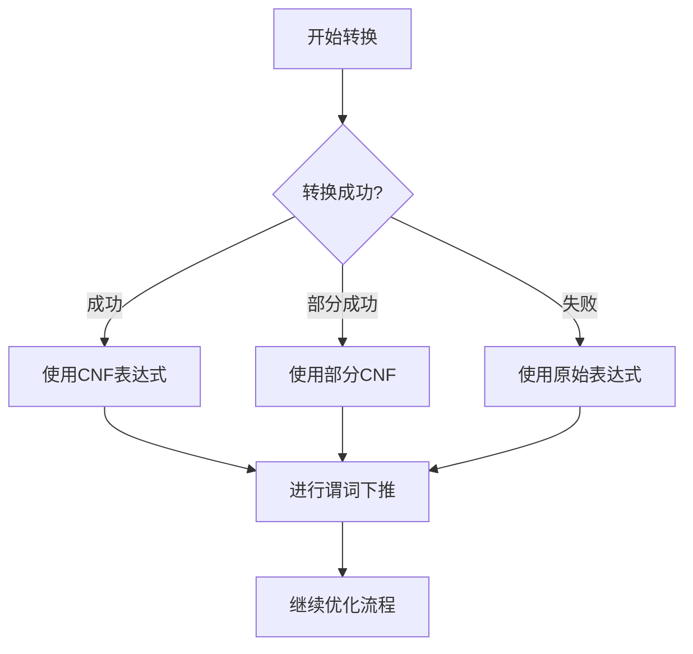
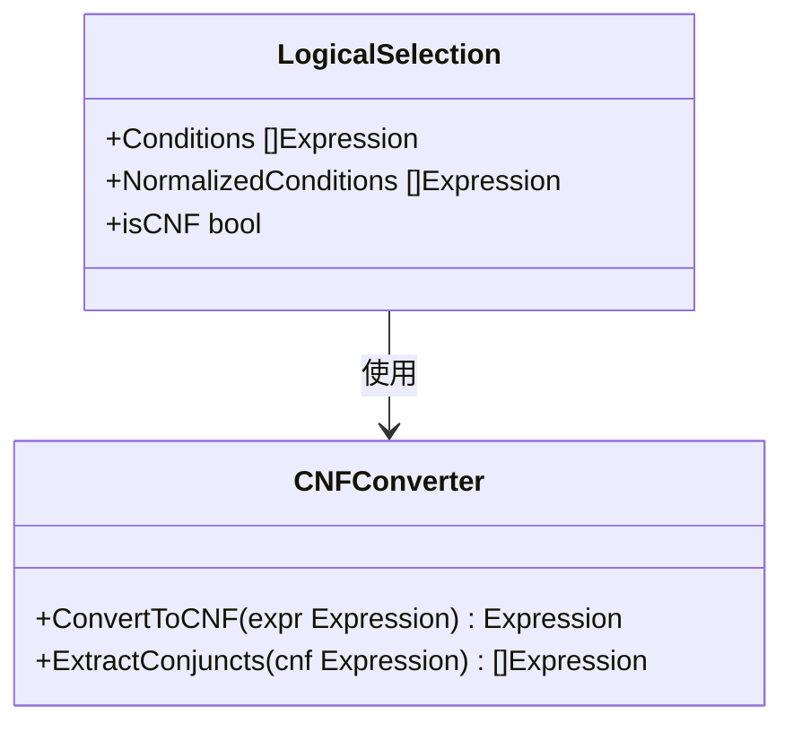

# CNF转换器设计文档

## 1. 概述

### 1.1 功能定位
CNF转换器负责将WHERE子句中的布尔表达式转换为合取范式(Conjunctive Normal Form),为查询优化器提供规范化的谓词结构,以支持高级谓词下推和索引优化。

### 1.2 核心价值
- **统一表达式形式**: 将复杂的嵌套逻辑表达式转换为标准的AND-OR两层结构
- **优化基础**: 为谓词下推、索引选择、范围分析等优化提供便利的表达式形式
- **简化分析**: 便于识别独立的过滤条件和可下推的谓词

### 1.3 适用场景
- WHERE子句包含复杂的AND/OR/NOT组合
- 需要进行谓词下推到JOIN的左右子树
- 需要从复杂表达式中提取索引可用的条件
- 多表JOIN时需要分解和重组过滤条件

## 2. 系统架构

### 2.1 组件定位

CNF转换器属于查询优化器的表达式规范化模块,位于逻辑计划优化阶段。



### 2.2 模块交互



## 3. 核心数据模型

### 3.1 CNF表达式结构

合取范式的标准形式为: `(a1 OR a2 OR ...) AND (b1 OR b2 OR ...) AND ...`

| 层级 | 类型 | 说明 | 示例 |
|-----|------|------|------|
| 第一层 | AND连接 | 多个子句的合取 | C1 AND C2 AND C3 |
| 第二层 | OR连接 | 单个子句内的析取 | (a OR b OR c) |
| 第三层 | 原子谓词 | 不可再分的比较表达式 | age > 18, name = 'John' |

### 3.2 表达式节点扩展

为了支持CNF转换,需要对现有Expression接口进行功能扩展:

| 方法名 | 功能 | 返回值 |
|--------|------|--------|
| IsNegated | 判断是否为NOT表达式 | bool |
| IsCNF | 判断是否已为CNF形式 | bool |
| Clone | 深度复制表达式树 | Expression |

## 4. CNF转换算法

### 4.1 转换流程



### 4.2 核心转换规则

#### 4.2.1 德摩根定律

| 原始表达式 | 转换后 | 规则名称 |
|-----------|--------|---------|
| NOT (A AND B) | NOT A OR NOT B | 德摩根-AND |
| NOT (A OR B) | NOT A AND NOT B | 德摩根-OR |

#### 4.2.2 双重否定消除

| 原始表达式 | 转换后 |
|-----------|--------|
| NOT (NOT A) | A |

#### 4.2.3 分配律

| 原始表达式 | 转换后 | 说明 |
|-----------|--------|------|
| A OR (B AND C) | (A OR B) AND (A OR C) | OR对AND的分配 |
| (A AND B) OR C | (A OR C) AND (B OR C) | 左结合形式 |
| (A AND B) OR (C AND D) | (A OR C) AND (A OR D) AND (B OR C) AND (B OR D) | 复合分配 |

#### 4.2.4 运算符规范化

| 原始运算符 | 转换后 | 条件 |
|-----------|--------|------|
| NOT (a > b) | a <= b | 否定内移 |
| NOT (a >= b) | a < b | 否定内移 |
| NOT (a = b) | a != b | 否定内移 |
| NOT (a != b) | a = b | 否定内移 |

### 4.3 转换步骤详解

#### 步骤1: 消除双重否定

遍历表达式树,递归移除连续的NOT节点。

**处理逻辑**:
- 如果当前节点为NOT,检查子节点是否也为NOT
- 若是,则直接返回孙子节点
- 递归处理所有子表达式

#### 步骤2: 内移否定词(德摩根定律)

将NOT运算符下推到叶子节点(原子谓词)。

**处理逻辑**:
- NOT (A AND B) → (NOT A) OR (NOT B)
- NOT (A OR B) → (NOT A) AND (NOT B)
- 递归处理直到NOT只出现在原子谓词前

#### 步骤3: 消除运算符级别的NOT

对于比较运算符,将NOT直接吸收到运算符中。

**转换映射**:
```
NOT (a = b)  → a != b
NOT (a != b) → a = b
NOT (a > b)  → a <= b
NOT (a >= b) → a < b
NOT (a < b)  → a >= b
NOT (a <= b) → a > b
```

#### 步骤4: 分配律展开

将OR运算符分配到AND运算符上,形成CNF结构。

**算法流程**:



**复杂分配示例**:

原始: `(A AND B) OR (C AND D)`

步骤:
1. 识别为 `X OR Y`, 其中 X = (A AND B), Y = (C AND D)
2. 展开为 `(A OR Y) AND (B OR Y)`
3. 继续展开 Y: `(A OR C) AND (A OR D) AND (B OR C) AND (B OR D)`

#### 步骤5: 扁平化AND/OR链

将多层嵌套的同类运算符扁平化为单层列表。

**扁平化前**: `A AND (B AND (C AND D))`
**扁平化后**: `A AND B AND C AND D`

### 4.4 优化策略

| 优化名称 | 触发条件 | 优化效果 |
|---------|---------|---------|
| 常量折叠 | 表达式包含常量 | 在转换过程中计算常量表达式 |
| 重复项消除 | 同一子句包含重复谓词 | 减少冗余条件 |
| 矛盾检测 | 子句包含 A AND NOT A | 识别永假条件 |
| 恒真消除 | 子句为 A OR NOT A | 移除恒真子句 |

## 5. 接口设计

### 5.1 核心转换器接口

| 方法名 | 输入 | 输出 | 说明 |
|--------|------|------|------|
| ConvertToCNF | Expression | Expression | 主入口,完成完整的CNF转换 |
| eliminateDoubleNegation | Expression | Expression | 消除双重否定 |
| pushDownNegation | Expression | Expression | 内移否定词 |
| applyDistributiveLaw | Expression | Expression | 应用分配律 |
| flattenExpression | Expression | Expression | 扁平化同类运算符 |
| simplifyClause | Expression | Expression | 简化单个子句 |

### 5.2 辅助工具方法

| 方法名 | 功能 | 返回值 |
|--------|------|--------|
| isCNF | 检查表达式是否为CNF | bool |
| isAtomic | 检查是否为原子谓词 | bool |
| negateOperator | 对运算符取反 | BinaryOp |
| extractConjuncts | 提取AND连接的子句 | []Expression |
| extractDisjuncts | 提取OR连接的项 | []Expression |
| cloneExpression | 深度复制表达式 | Expression |

## 6. 与现有系统集成

### 6.1 集成点

CNF转换器集成到现有优化器的谓词下推阶段之前。

| 集成阶段 | 原有流程 | 新增流程 |
|---------|---------|---------|
| 逻辑计划优化入口 | pushDownPredicates | **CNF转换** → pushDownPredicates |
| Selection节点处理 | 直接下推Conditions | **CNF规范化** → 提取可下推子句 → 下推 |

### 6.2 修改点

**文件**: `server/innodb/plan/optimizer.go`

**函数**: `pushDownPredicates`

**修改内容**:
在处理 LogicalSelection 节点时,先对 Conditions 进行 CNF 转换,再执行下推逻辑。

**修改前逻辑**:
```
获取Selection的Conditions → 直接分析下推
```

**修改后逻辑**:
```
获取Selection的Conditions → CNF转换 → 提取合取子句 → 分析每个子句是否可下推 → 下推
```

### 6.3 数据流转



## 7. 典型转换示例

### 示例1: 简单德摩根定律

**输入**:
```
NOT (age > 18 AND city = 'Beijing')
```

**转换步骤**:
1. 应用德摩根: `NOT (age > 18) OR NOT (city = 'Beijing')`
2. 内移否定: `age <= 18 OR city != 'Beijing'`

**输出**:
```
age <= 18 OR city != 'Beijing'
```

### 示例2: 复杂分配律

**输入**:
```
(age > 18 OR status = 'active') AND (city = 'Beijing' OR city = 'Shanghai')
```

**分析**:
- 已经是CNF形式(两个OR子句通过AND连接)
- 无需转换

**输出**:
```
(age > 18 OR status = 'active') AND (city = 'Beijing' OR city = 'Shanghai')
```

### 示例3: 需要分配律展开

**输入**:
```
age > 18 OR (city = 'Beijing' AND status = 'active')
```

**转换步骤**:
1. 识别为 `A OR (B AND C)` 形式
2. 应用分配律: `(age > 18 OR city = 'Beijing') AND (age > 18 OR status = 'active')`

**输出**:
```
(age > 18 OR city = 'Beijing') AND (age > 18 OR status = 'active')
```

### 示例4: 多重嵌套

**输入**:
```
NOT ((age > 18 AND city = 'Beijing') OR (status = 'inactive'))
```

**转换步骤**:
1. 应用德摩根: `NOT (age > 18 AND city = 'Beijing') AND NOT (status = 'inactive')`
2. 再次应用德摩根: `(NOT age > 18 OR NOT city = 'Beijing') AND status != 'inactive'`
3. 内移否定: `(age <= 18 OR city != 'Beijing') AND status != 'inactive'`

**输出**:
```
(age <= 18 OR city != 'Beijing') AND status != 'inactive'
```

## 8. 性能考虑

### 8.1 复杂度分析

| 操作 | 时间复杂度 | 空间复杂度 | 说明 |
|------|-----------|-----------|------|
| 消除双重否定 | O(n) | O(1) | n为表达式节点数 |
| 内移否定词 | O(n) | O(h) | h为树高度(递归栈) |
| 分配律展开 | O(2^k) | O(2^k) | k为OR和AND嵌套深度,最坏情况指数级 |
| 整体转换 | O(2^k) | O(2^k) | 受分配律展开影响 |

### 8.2 表达式膨胀问题

分配律展开可能导致表达式大小指数级增长。

**示例**:
```
原始: (A OR B) AND (C OR D) AND (E OR F)
展开后: 2^3 = 8个子句的CNF
```

**控制策略**:

| 策略 | 触发条件 | 处理方式 |
|------|---------|---------|
| 子句数量限制 | CNF子句超过100个 | 停止分配,保持部分CNF |
| 深度限制 | 嵌套深度超过5层 | 仅处理前5层 |
| 启发式判断 | 预估膨胀率 > 10倍 | 跳过分配律,保持原始形式 |

### 8.3 优化手段

| 优化名称 | 实现方式 | 效果 |
|---------|---------|------|
| 提前剪枝 | 在分配前检测子句数量 | 避免无意义的大规模展开 |
| 缓存结果 | 对相同子表达式缓存转换结果 | 减少重复计算 |
| 增量转换 | 仅转换新增或修改的条件 | 优化多次调用场景 |

## 9. 错误处理

### 9.1 异常场景

| 场景 | 处理策略 | 返回值 |
|------|---------|--------|
| 输入为nil | 返回nil,不报错 | nil |
| 不支持的表达式类型 | 保持原样,记录警告 | 原表达式 |
| 转换超时(复杂度过高) | 终止转换,返回部分结果 | 部分CNF表达式 |
| 内存溢出风险 | 限制子句数量,提前退出 | 截断的CNF |

### 9.2 降级策略

当转换失败或不完整时,系统仍能继续运行:



## 10. 测试策略

### 10.1 单元测试用例

| 测试用例 | 输入 | 期望输出 | 覆盖点 |
|---------|------|---------|--------|
| 简单AND | a AND b | a AND b | 已是CNF |
| 简单OR | a OR b | a OR b | 单子句CNF |
| 双重否定 | NOT (NOT a) | a | 否定消除 |
| 德摩根-AND | NOT (a AND b) | (NOT a) OR (NOT b) | 德摩根定律 |
| 德摩根-OR | NOT (a OR b) | (NOT a) AND (NOT b) | 德摩根定律 |
| 简单分配 | a OR (b AND c) | (a OR b) AND (a OR c) | 分配律 |
| 复杂分配 | (a AND b) OR (c AND d) | (a OR c) AND (a OR d) AND (b OR c) AND (b OR d) | 分配律 |
| 运算符否定 | NOT (age > 18) | age <= 18 | 运算符取反 |
| 复合嵌套 | NOT ((a OR b) AND c) | (NOT a AND NOT b) OR NOT c | 多步转换 |
| 常量表达式 | true AND a | a | 常量折叠 |

### 10.2 集成测试场景

| 场景 | 测试SQL | 验证点 |
|------|---------|--------|
| 简单WHERE | SELECT * FROM t WHERE NOT (a > 10 AND b < 20) | 德摩根定律应用 |
| 复杂OR | SELECT * FROM t WHERE a = 1 OR (b = 2 AND c = 3) | 分配律展开 |
| 多表JOIN | SELECT * FROM t1 JOIN t2 WHERE NOT (t1.a = 1 OR t2.b = 2) | JOIN条件分解 |
| 子查询 | SELECT * FROM t WHERE NOT EXISTS (...) | 处理特殊谓词 |

### 10.3 性能测试

| 测试项 | 规模 | 指标 | 目标 |
|--------|------|------|------|
| 转换延迟 | 10层嵌套表达式 | 耗时 | < 10ms |
| 内存占用 | 100个AND/OR节点 | 内存增长 | < 2MB |
| 子句膨胀率 | 5个AND-OR嵌套 | 输出子句数 | < 原始的10倍 |

## 11. 后续扩展

### 11.1 DNF转换器(任务 OPT-007)

基于CNF转换器的设计,DNF(析取范式)转换器可复用以下组件:
- 双重否定消除逻辑
- 德摩根定律实现
- 表达式克隆工具

主要区别:
- 分配律方向相反: AND对OR分配
- 最终结构: `(a AND b) OR (c AND d) OR ...`

### 11.2 表达式规范化(任务 OPT-008)

CNF转换是表达式规范化的基础,后续可扩展:
- 表达式比较和等价判断
- 表达式哈希和缓存
- 表达式化简和优化

### 11.3 常量折叠优化(任务 OPT-009)

在CNF转换过程中嵌入常量折叠:
- 计算常量表达式的值
- 简化恒真/恒假条件
- 传播常量值

## 12. 与现有计划节点的关系

### 12.1 LogicalSelection节点增强



### 12.2 谓词下推流程改进

| 阶段 | 原流程 | 增强流程 |
|------|--------|---------|
| 获取条件 | 直接使用 Conditions | 先转CNF,缓存到 NormalizedConditions |
| 条件分解 | 手动解析AND | 调用 ExtractConjuncts 提取子句 |
| 下推判断 | 逐个表达式判断 | 对每个CNF子句独立判断 |
| 条件合并 | 重新构造AND表达式 | 直接使用CNF结构 |

## 13. 实现优先级

| 优先级 | 功能模块 | 实现难度 | 原因 |
|--------|---------|---------|------|
| P0 | 双重否定消除 | ⭐ | 基础功能,简单 |
| P0 | 德摩根定律 | ⭐⭐ | 核心转换规则 |
| P0 | 运算符否定内移 | ⭐⭐ | 索引优化依赖 |
| P0 | 简单分配律(单OR对AND) | ⭐⭐⭐ | 常见场景 |
| P1 | 复杂分配律(AND-OR嵌套) | ⭐⭐⭐⭐ | 复杂但重要 |
| P1 | 子句膨胀控制 | ⭐⭐ | 性能保障 |
| P2 | 常量折叠集成 | ⭐⭐ | 可延后 |
| P2 | 表达式缓存优化 | ⭐ | 性能优化 |

## 14. 验收标准

### 14.1 功能完整性

- [ ] 能正确处理所有德摩根定律场景
- [ ] 能正确应用分配律展开OR-AND嵌套
- [ ] 能消除双重否定
- [ ] 能将NOT内移到原子谓词
- [ ] 输出表达式符合CNF定义

### 14.2 性能指标

- [ ] 普通查询转换延迟 < 5ms
- [ ] 复杂查询转换延迟 < 50ms
- [ ] 内存占用增长 < 原表达式的3倍
- [ ] 子句膨胀率 < 10倍

### 14.3 集成验证

- [ ] 与谓词下推器无缝集成
- [ ] 与索引选择器协同工作
- [ ] 不影响现有测试用例通过率
- [ ] 新增测试用例覆盖率 > 90%
