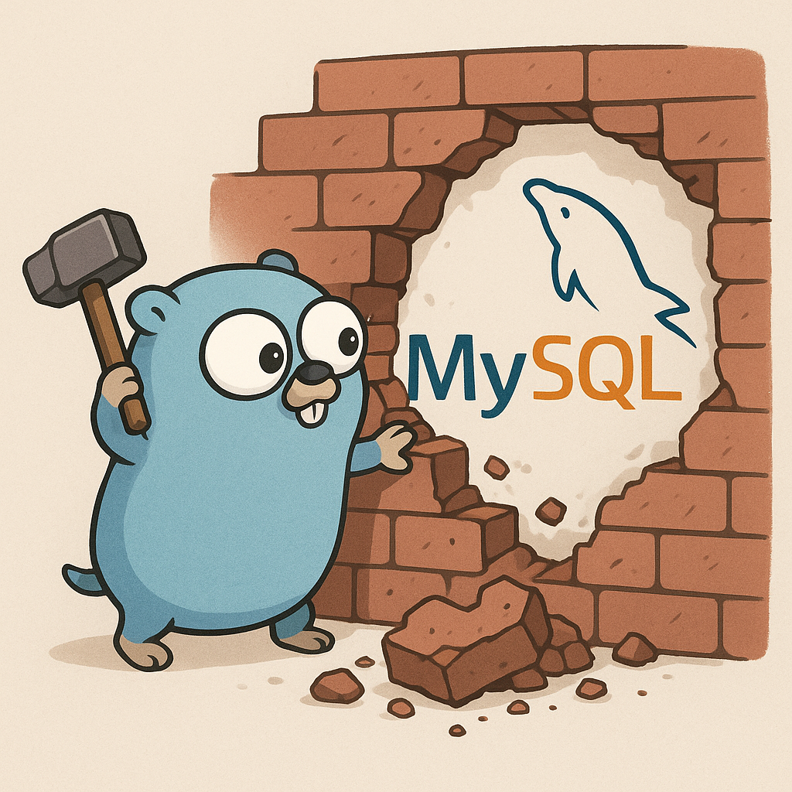

# XMySQL Server

<div align="center">



**一个使用 Go 语言实现的高性能 MySQL 兼容数据库服务器**

[](https://golang.org)
[](LICENSE)
[]()

</div>

## 📋 目录

- [项目介绍](#项目介绍)
- [核心特性](#核心特性)
- [架构设计](#架构设计)
- [项目结构](#项目结构)
- [技术实现](#技术实现)
- [快速开始](#快速开始)
- [配置说明](#配置说明)
- [性能测试](#性能测试)
- [开发指南](#开发指南)
- [贡献指南](#贡献指南)

## 🚀 项目介绍

XMySQL Server 是一个完全使用 Go 语言从零开始实现的 MySQL 兼容数据库服务器。项目实现了完整的 MySQL 协议栈、InnoDB 存储引擎以及查询优化器，支持多核并发处理，提供了企业级的数据库服务器功能。

### 项目统计
- **模块数量**: 15+ 核心模块
- **支持协议**: MySQL 5.7+ 兼容

## ✨ 核心特性

### 🔌 协议兼容性
- ✅ **完整 MySQL 协议支持** - 兼容 MySQL 5.7+ 客户端
- ✅ **标准认证机制** - 支持 mysql_native_password 认证
- ✅ **连接池管理** - 高效的连接复用和会话管理
- ✅ **SSL/TLS 支持** - 安全的数据传输

### 🗄️ 存储引擎 (InnoDB)
- ✅ **ACID 事务** - 完整的事务处理支持
- ✅ **MVCC 并发控制** - 多版本并发控制
- ✅ **行级锁定** - 细粒度锁定机制
- ✅ **B+ 树索引** - 高效的索引结构
- ✅ **缓冲池管理** - 智能内存管理
- ✅ **崩溃恢复** - Redo/Undo 日志恢复

### 🚄 查询处理
- ✅ **SQL 解析器** - 完整的 SQL 语法支持
- ✅ **查询优化器** - 基于代价的查询优化
- ✅ **执行引擎** - 火山模型执行器
- ✅ **并行处理** - 多核 CPU 并发支持

### 🔧 运维特性
- ✅ **配置管理** - 灵活的配置系统
- ✅ **监控指标** - 详细的性能监控
- ✅ **日志系统** - 完整的日志记录
- ✅ **热备份** - 在线备份恢复

## 🏗️ 架构设计

### 分层架构

```
┌─────────────────────────────────────────────────────────────┐
│                    应用层 (main.go)                         │
├─────────────────────────────────────────────────────────────┤
│                  网络层 (server/net/)                       │
│  ┌─────────────────┐ ┌─────────────────┐ ┌─────────────────┐ │
│  │  MySQLServer    │ │ MessageHandler  │ │  Session管理    │ │
│  │  (网络服务)     │ │   (消息处理)     │ │  (会话管理)     │ │
│  └─────────────────┘ └─────────────────┘ └─────────────────┘ │
├─────────────────────────────────────────────────────────────┤
│                 协议层 (server/protocol/)                   │
│  ┌─────────────────┐ ┌─────────────────┐ ┌─────────────────┐ │
│  │   AuthPacket    │ │  MySQL编码器     │ │  MySQL解码器    │ │
│  │   (认证处理)     │ │  (响应编码)     │ │  (请求解析)     │ │
│  └─────────────────┘ └─────────────────┘ └─────────────────┘ │
├─────────────────────────────────────────────────────────────┤
│               SQL分发层 (server/dispatcher/)                │
│  ┌─────────────────┐ ┌─────────────────┐ ┌─────────────────┐ │
│  │ SQLDispatcher   │ │   SQLRouter     │ │   SQLEngine     │ │
│  │  (查询分发)     │ │   (路由策略)     │ │   (引擎接口)    │ │
│  └─────────────────┘ └─────────────────┘ └─────────────────┘ │
├─────────────────────────────────────────────────────────────┤
│              引擎业务层 (server/innodb/engine/)              │
│  ┌─────────────────┐ ┌─────────────────┐ ┌─────────────────┐ │
│  │  XMySQLEngine   │ │   执行器        │ │   管理器        │ │
│  │  (InnoDB引擎)   │ │  (查询执行)     │ │  (存储管理)     │ │
│  └─────────────────┘ └─────────────────┘ └─────────────────┘ │
└─────────────────────────────────────────────────────────────┘
```

### 数据流向

```
客户端请求 → 网络层 → 协议层 → SQL分发层 → 引擎业务层 → 存储层
    ↓           ↓        ↓         ↓           ↓          ↓
响应返回 ← 协议编码 ← 结果聚合 ← 查询执行 ← SQL解析 ← 数据读取
```

## 📁 项目结构

```
xmysql-server/
├── 📁 server/                    # 服务器核心实现 
│   ├── 📁 net/                   # 网络层
│   │   ├── mysql_server.go       # MySQL服务器主体
│   │   ├── handler.go            # 消息处理器 (集成协议+分发)
│   │   ├── session.go            # 会话管理
│   │   └── connection.go         # 连接管理
│   │
│   ├── 📁 protocol/              # MySQL协议层
│   │   ├── auth.go               # 认证协议
│   │   ├── mysql_codec.go        # 协议编码/解码
│   │   ├── handshark.go          # 握手协议
│   │   └── com_query.go          # 查询命令
│   │
│   ├── 📁 dispatcher/            # SQL分发层 
│   │   └── query_dispatcher.go   # 查询分发器 
│   │
│   ├── 📁 innodb/                # InnoDB存储引擎
│   │   ├── 📁 engine/            # 查询执行引擎
│   │   │   ├── enginx.go         # 主引擎 (XMySQLEngine)
│   │   │   ├── executor.go       # 查询执行器
│   │   │   └── volcano_executor.go # 火山模型执行器
│   │   │
│   │   ├── 📁 manager/           # 资源管理器 
│   │   │   ├── storage_manager.go      # 存储管理器
│   │   │   ├── buffer_pool_manager.go  # 缓冲池管理器
│   │   │   ├── transaction_manager.go  # 事务管理器
│   │   │   ├── index_manager.go        # 索引管理器
│   │   │   ├── mvcc_manager.go         # MVCC管理器
│   │   │   └── lock_manager.go         # 锁管理器
│   │   │
│   │   ├── 📁 storage/           # 存储层实现
│   │   │   ├── 📁 store/         # 存储核心
│   │   │   │   ├── pages/        # 页面管理
│   │   │   │   ├── logs/         # 日志管理 
│   │   │   │   ├── mvcc/         # MVCC实现 
│   │   │   │   └── table/        # 表管理 
│   │   │   │
│   │   │   └── 📁 wrapper/       # 存储包装器
│   │   │       ├── page/         # 页面包装器 
│   │   │       ├── record/       # 记录包装器 
│   │   │       └── space/        # 表空间包装器 
│   │   │
│   │   ├── 📁 sqlparser/         # SQL解析器 
│   │   │   ├── sql.go            # 主解析器
│   │   │   ├── ast.go            # 抽象语法树
│   │   │   └── expression.go     # 表达式处理
│   │   │
│   │   ├── 📁 metadata/          # 元数据管理 
│   │   │   ├── schema.go         # 模式管理
│   │   │   ├── table.go          # 表元数据
│   │   │   └── column.go         # 列定义
│   │   │
│   │   ├── 📁 plan/              # 查询计划
│   │   │   ├── optimizer.go      # 查询优化器
│   │   │   ├── cost_model.go     # 代价模型
│   │   │   └── statistics.go     # 统计信息
│   │   │
│   │   ├── 📁 buffer_pool/       # 缓冲池 
│   │   │   ├── buffer_pool.go    # 缓冲池主体
│   │   │   ├── buffer_lru.go     # LRU策略
│   │   │   └── prefetch.go       # 预读机制
│   │   │
│   │   ├── 📁 basic/             # 基础接口 
│   │   │   ├── interfaces.go     # 核心接口定义
│   │   │   ├── page.go           # 页面接口
│   │   │   └── btree.go          # B+树接口
│   │   │
│   │   └── 📁 util/              # 工具函数 
│   │       ├── buffer.go         # 缓冲区工具
│   │       └── hash_table.go     # 哈希表工具
│   │
│   ├── 📁 common/                # 通用功能 
│   │   ├── constant.go           # 常量定义
│   │   ├── type.go               # 类型定义
│   │   └── util.go               # 工具函数
│   │
│   └── 📁 conf/                  # 配置管理 
│       └── config.go             # 配置系统
│
├── 📁 client/                    # 客户端工具
├── 📁 cmd/                       # 命令行工具
├── 📁 util/                      # 全局工具
├── 📁 redo/                      # Redo日志目录
├── 📁 undo/                      # Undo日志目录
├── main.go                       # 程序入口
├── go.mod                        # Go模块定义
└── README.md                     # 项目文档
```

## 🔧 技术实现

### 1. 存储引擎 (InnoDB)

#### 1.1 页面管理系统
```go
// 支持多种页面类型
- FIL_PAGE_INDEX          // B+树索引页
- FIL_PAGE_UNDO_LOG       // Undo日志页  
- FIL_PAGE_INODE          // Inode页
- FIL_PAGE_IBUF_FREE_LIST // Insert Buffer空闲列表页
- FIL_PAGE_TYPE_ALLOCATED // 已分配页
- FIL_PAGE_TYPE_SYS       // 系统页
- FIL_PAGE_TYPE_TRX_SYS   // 事务系统页
```

#### 1.2 缓冲池 (Buffer Pool)
- **自动调优**: 根据工作负载自动调整缓冲池大小
- **LRU策略**: 改进的LRU算法，支持热点数据保护
- **预读机制**: 线性预读和随机预读
- **脏页管理**: 异步刷新脏页到磁盘

#### 1.3 B+树索引
- **聚簇索引**: 数据和索引存储在一起
- **二级索引**: 支持多个二级索引
- **索引优化**: 索引合并、索引下推等优化

#### 1.4 事务处理
- **隔离级别**: 支持 READ UNCOMMITTED, READ COMMITTED, REPEATABLE READ, SERIALIZABLE
- **MVCC**: 多版本并发控制，无锁读取
- **死锁检测**: 自动死锁检测和解决
- **两阶段提交**: 分布式事务支持

### 2. 查询处理引擎

#### 2.1 SQL解析器
```go
// 支持的SQL语句类型
- SELECT (查询)
- INSERT (插入) 
- UPDATE (更新)
- DELETE (删除)
- CREATE TABLE (建表)
- DROP TABLE (删表)
- ALTER TABLE (修改表)
- CREATE DATABASE (建库)
- SHOW (显示)
- SET (设置)
```

#### 2.2 查询优化器
- **基于代价的优化**: CBO (Cost-Based Optimizer)
- **连接算法**: Nested Loop Join, Hash Join, Sort Merge Join
- **索引选择**: 自动选择最优索引
- **谓词下推**: 将过滤条件下推到存储层

#### 2.3 执行引擎
- **火山模型**: 基于迭代器的执行模型
- **向量化执行**: 批量数据处理
- **并行执行**: 多线程并行查询处理

### 3. 网络协议层

#### 3.1 MySQL协议实现
```go
// 支持的协议包类型
- COM_SLEEP      // 空闲
- COM_QUIT       // 退出
- COM_INIT_DB    // 切换数据库
- COM_QUERY      // 查询
- COM_PING       // 心跳
- COM_STATISTICS // 统计信息
```

#### 3.2 连接管理
- **连接池**: 高效的连接复用
- **会话管理**: 用户会话状态跟踪
- **认证机制**: mysql_native_password 认证
- **SSL/TLS**: 安全连接支持

## 🚀 快速开始

### 环境要求

- **Go版本**: 1.13 或更高
- **操作系统**: Linux, macOS, Windows
- **内存**: 最少 2GB RAM
- **磁盘**: 最少 1GB 可用空间

### 编译安装

```bash
# 1. 克隆项目
git clone https://github.com/your-org/xmysql-server.git
cd xmysql-server

# 2. 下载依赖
go mod download

# 3. 编译项目
go build -o xmysql-server .

# 或使用构建脚本
./build.sh
```

### 配置文件

创建配置文件 `my.ini`:

```ini
[mysqld]
# 服务器配置
bind-address = 127.0.0.1
port = 3308
datadir = ./data
basedir = ./
user = mysql

# 性能配置
profile_port = 6060

[session]
# 会话配置
compress_encoding = false
tcp_no_delay = true
tcp_keep_alive = true
keep_alive_period = 180s
tcp_r_buf_size = 262144
tcp_w_buf_size = 65536
pkg_rq_size = 1024
pkg_wq_size = 1024
tcp_read_timeout = 1s
tcp_write_timeout = 5s
wait_timeout = 7s
max_msg_len = 1024
session_name = xmysql-server

[innodb]
# InnoDB配置
redo_log_dir = ./redo
undo_log_dir = ./undo

# 加密配置
master_key = your-secret-key
key_rotation_days = 90
threads = 4
buffer_size = 8388608
```

### 启动服务器

```bash
# 使用默认配置启动
./xmysql-server

# 指定配置文件启动
./xmysql-server -configPath=./my.ini

# 初始化数据库
./xmysql-server -configPath=./my.ini -initialize
```

### 连接测试

```bash
# 使用MySQL客户端连接
mysql -h 127.0.0.1 -P 3308 -u root -p

# 或使用任何MySQL兼容的客户端工具
```

## ⚙️ 配置说明

### 服务器配置 [mysqld]

| 参数 | 默认值 | 说明 |
|------|--------|------|
| `bind-address` | 127.0.0.1 | 绑定IP地址 |
| `port` | 3308 | 监听端口 |
| `datadir` | ./data | 数据目录 |
| `basedir` | ./ | 基础目录 |
| `user` | mysql | 运行用户 |
| `profile_port` | 6060 | 性能分析端口 |

### 会话配置 [session]

| 参数 | 默认值 | 说明 |
|------|--------|------|
| `tcp_keep_alive` | true | TCP保活 |
| `keep_alive_period` | 180s | 保活周期 |
| `tcp_read_timeout` | 1s | 读取超时 |
| `tcp_write_timeout` | 5s | 写入超时 |
| `max_msg_len` | 1024 | 最大消息长度 |

### InnoDB配置 [innodb]

| 参数 | 默认值 | 说明 |
|------|--------|------|
| `redo_log_dir` | ./redo | Redo日志目录 |
| `undo_log_dir` | ./undo | Undo日志目录 |
| `master_key` | - | 加密主密钥 |
| `key_rotation_days` | 90 | 密钥轮换天数 |
| `buffer_size` | 8388608 | 缓冲区大小 |

## 📊 性能测试

### 基准测试

项目目前处于开发阶段，性能测试正在进行中。我们将在后续版本中提供详细的基准测试结果，包括：

- **TPS (每秒事务数)**: SELECT, INSERT, UPDATE, DELETE 操作的性能指标
- **并发连接**: 最大并发连接数和响应时间统计
- **内存使用**: 缓冲池和内存管理效率
- **磁盘I/O**: 存储层读写性能

### 性能优化建议

1. **缓冲池调优**: 根据可用内存调整缓冲池大小
2. **索引优化**: 为频繁查询的列创建合适的索引
3. **连接池配置**: 根据并发需求调整连接池大小
4. **日志配置**: 合理配置Redo/Undo日志大小

## 🗺️ 开发路线图

### ✅ 已完成功能

#### 核心架构
- ✅ **分层架构设计** - 网络层、协议层、SQL分发层、存储引擎层
- ✅ **MySQL协议实现** - 握手、认证、基本命令处理
- ✅ **网络服务器** - 基于Getty的高性能网络框架
- ✅ **配置系统** - 完整的INI配置文件支持

#### 存储引擎基础
- ✅ **页面管理系统** - 多种页面类型支持 (index, fsp, dict, xdes)
- ✅ **缓冲池框架** - Buffer Pool基础架构
- ✅ **存储包装器** - Page、Record、Space包装器
- ✅ **基础接口定义** - 核心接口和类型定义

#### SQL处理
- ✅ **SQL解析器** - 基于yacc的SQL语法解析
- ✅ **查询分发器** - SQL查询路由和引擎管理
- ✅ **基础执行器** - 查询执行框架

### 🚧 开发中功能

#### InnoDB存储引擎
- 🔄 **B+树索引实现** - 基础框架已完成，细节优化中
- 🔄 **事务管理器** - MVCC和锁管理基础架构
- 🔄 **Redo/Undo日志** - 日志框架已建立，恢复机制开发中
- 🔄 **缓冲池优化** - LRU策略和预读机制完善中

#### 查询优化
- 🔄 **代价模型** - 查询优化器基础框架
- 🔄 **统计信息** - 表和索引统计信息收集
- 🔄 **执行计划** - 物理执行计划生成

### ❌ 待开发功能

#### 存储引擎完善
- ❌ **行格式实现** - Compact、Dynamic行格式支持
- ❌ **段管理实现** - 表空间段分配和管理
- ❌ **区管理实现** - 区的分配和回收机制
- ❌ **Insert Buffer** - 二级索引插入优化
- ❌ **自适应哈希索引** - 热点数据快速访问

#### 事务和并发
- ❌ **完整MVCC实现** - 多版本并发控制细节
- ❌ **死锁检测** - 自动死锁检测和解决
- ❌ **锁升级机制** - 行锁到表锁的升级
- ❌ **事务隔离级别** - 四种隔离级别的完整实现
- ❌ **分布式事务** - 两阶段提交协议

#### SQL功能扩展
- ❌ **完整DDL支持** - CREATE/ALTER/DROP的完整实现
- ❌ **复杂查询支持** - 子查询、窗口函数、CTE
- ❌ **存储过程** - 存储过程和函数支持
- ❌ **触发器** - 数据库触发器机制
- ❌ **视图** - 视图的创建和查询

#### 查询优化器
- ❌ **连接算法** - Hash Join、Sort Merge Join实现
- ❌ **谓词下推** - 过滤条件优化
- ❌ **索引选择** - 最优索引选择算法
- ❌ **并行查询** - 多线程并行执行

#### 高级特性
- ❌ **分区表** - 表分区支持
- ❌ **全文索引** - 全文搜索功能
- ❌ **空间索引** - 地理空间数据支持
- ❌ **JSON支持** - JSON数据类型和函数
- ❌ **压缩** - 表和页面压缩

#### 运维和监控
- ❌ **性能监控** - Performance Schema实现
- ❌ **慢查询日志** - 慢查询记录和分析
- ❌ **错误日志** - 完整的错误日志系统
- ❌ **备份恢复** - 热备份和增量备份
- ❌ **主从复制** - 数据复制机制

#### 客户端支持
- ❌ **完整协议支持** - 更多MySQL协议命令
- ❌ **SSL/TLS加密** - 安全连接支持
- ❌ **连接池优化** - 连接池性能优化
- ❌ **负载均衡** - 多实例负载均衡

#### 工具和生态
- ❌ **管理工具** - 数据库管理界面
- ❌ **迁移工具** - 数据迁移和同步工具
- ❌ **性能分析工具** - 查询性能分析
- ❌ **监控集成** - Prometheus/Grafana集成

### 📅 开发计划

#### 第一阶段 (当前) - 核心存储引擎
**目标**: 完成基础的InnoDB存储引擎实现
- 完善B+树索引实现
- 实现基础的事务管理
- 完成行格式和页面管理
- 实现简单的查询执行

#### 第二阶段 - 查询优化和SQL扩展
**目标**: 提升查询性能和SQL兼容性
- 实现查询优化器
- 支持复杂SQL语句
- 完善事务和并发控制
- 添加索引优化

#### 第三阶段 - 高级特性和工具
**目标**: 企业级功能和生态完善
- 实现高级存储特性
- 开发管理和监控工具
- 支持分布式特性
- 性能优化和稳定性提升

### 🎯 贡献机会

我们欢迎社区贡献者参与以下模块的开发：

#### 🟢 适合新手
- **测试用例编写** - 为现有功能编写单元测试
- **文档完善** - 改进代码注释和用户文档
- **示例程序** - 编写使用示例和教程
- **性能测试** - 编写基准测试程序

#### 🟡 中等难度
- **SQL解析器扩展** - 添加新的SQL语法支持
- **协议层完善** - 实现更多MySQL协议命令
- **工具开发** - 开发数据库管理工具
- **监控集成** - 集成监控和日志系统

#### 🔴 高难度
- **存储引擎核心** - B+树、事务、MVCC实现
- **查询优化器** - 代价模型和优化算法
- **分布式特性** - 复制、分片、一致性
- **性能优化** - 关键路径性能优化

想要参与开发的朋友，请查看我们的 [贡献指南](#贡献指南) 或在 Issues 中找到感兴趣的任务！

## 🛠️ 开发指南

### 代码结构说明

#### 1. 网络层 (server/net/)
负责网络通信和连接管理，采用事件驱动的异步I/O模型。

#### 2. 协议层 (server/protocol/)
实现MySQL协议的编码和解码，处理客户端认证和命令解析。

#### 3. SQL分发层 (server/dispatcher/)
将SQL查询路由到合适的存储引擎，支持多引擎架构。

#### 4. 存储引擎层 (server/innodb/)
实现完整的InnoDB存储引擎，包括事务、索引、缓冲池等。

### 添加新功能

#### 1. 添加新的SQL命令
```go
// 在 sqlparser/ 中添加新的AST节点
type NewStatement struct {
    // 字段定义
}

// 在 engine/executor.go 中添加执行逻辑
func (e *XMySQLExecutor) executeNewStatement(ctx *ExecutionContext, stmt *NewStatement) error {
    // 执行逻辑
}
```

#### 2. 添加新的存储引擎
```go
// 实现 SQLEngine 接口
type MyEngine struct {
    name string
}

func (e *MyEngine) ExecuteQuery(session server.MySQLServerSession, query string, databaseName string) <-chan *SQLResult {
    // 实现查询执行逻辑
}

// 注册引擎
dispatcher.RegisterEngine(&MyEngine{name: "myengine"})
```

### 调试和测试

```bash
# 运行单元测试
go test ./...

# 运行特定模块测试
go test ./server/innodb/manager/

# 启用调试模式
./xmysql-server -configPath=./my.ini -debug

# 查看性能分析
go tool pprof http://localhost:6060/debug/pprof/profile
```

## 🤝 贡献指南

我们欢迎所有形式的贡献！

### 贡献方式

1. **报告Bug**: 在 Issues 中报告发现的问题
2. **功能建议**: 提出新功能的建议和想法
3. **代码贡献**: 提交Pull Request改进代码
4. **文档完善**: 改进文档和示例

### 开发流程

1. Fork 项目到你的GitHub账户
2. 创建功能分支: `git checkout -b feature/new-feature`
3. 提交更改: `git commit -am 'Add new feature'`
4. 推送分支: `git push origin feature/new-feature`
5. 创建Pull Request

### 代码规范

- 遵循Go语言官方代码规范
- 添加必要的注释和文档
- 编写单元测试覆盖新功能
- 确保所有测试通过

## 📄 许可证

本项目采用 [Apache License 2.0](LICENSE) 许可证。

## 🙏 致谢

感谢所有为这个项目做出贡献的开发者和社区成员！

特别感谢以下开源项目的启发：
- [MySQL](https://www.mysql.com/) - 参考实现
- [TiDB](https://github.com/pingcap/tidb) - 架构设计
- [Getty](https://github.com/AlexStocks/getty) - 网络框架
- OpenAI

## 📞 联系我们

- **项目主页**: https://github.com/zhukovaskychina/xmysql-server
- **问题反馈**: https://github.com/zhukovaskychina/xmysql-server/issues
- **邮箱**: zhukovasky@163.com

---

<div align="center">

**⭐ 如果这个项目对你有帮助，请给我们一个Star！⭐**

</div>
