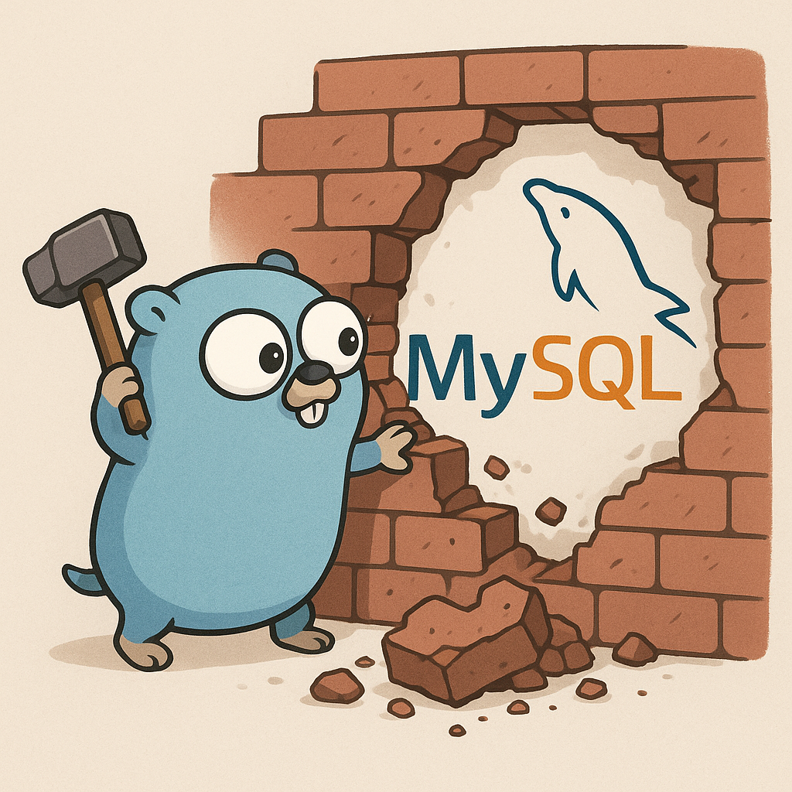

# XMySQL Server

<div align="center">



**一个使用 Go 语言实现的高性能 MySQL 兼容数据库服务器**

[](https://golang.org)
[](LICENSE)
[]()

</div>

##  目录

- [项目介绍](#项目介绍)
- [架构与模块完成度（2025-10-27 更新）](#架构与模块完成度2025-10-27-更新)
- [项目进度](#项目进度)
- [核心特性](#核心特性)
- [架构设计](#架构设计)
- [项目结构](#项目结构)
- [技术实现](#技术实现)
- [快速开始](#快速开始)
- [配置说明](#配置说明)
- [测试覆盖](#测试覆盖)
- [性能测试](#性能测试)
- [开发指南](#开发指南)
- [贡献指南](#贡献指南)

## 🚀 项目介绍

XMySQL Server 是一个完全使用 Go 语言从零开始实现的 MySQL 兼容数据库服务器。项目实现了完整的 MySQL 协议栈、InnoDB 存储引擎以及查询优化器，支持多核并发处理，提供了企业级的数据库服务器功能。

### 项目统计
- **代码行数**: 110,000+ 行 Go 代码
- **模块数量**: 20+ 核心模块
- **测试覆盖**: 60+ 测试文件
- **支持协议**: MySQL 5.7+ 兼容


## 🆕 架构与模块完成度（2025-10-27 更新）

总体评估：整体完成度约 85%；其中存储引擎核心模块按专项报告已达约 98%（P0 任务全部完成）。本节对架构、模块完成度、未实现内容与任务清单做一次最新汇总。

### 架构总览（分层与职责）
- 应用层（main.go）: 解析启动参数、加载配置、初始化日志并启动服务
- 网络层（server/net）: 基于 Getty 的高性能连接管理、握手和会话生命周期
- 协议层（server/protocol）: MySQL 协议编解码与认证流程
- SQL 分发层（server/dispatcher）: SQL 路由与引擎抽象（SQLEngine 接口）
- 引擎与存储层（server/innodb）:
  - engine: 火山模型执行器、DML/DDL 执行
  - manager: 存储/缓冲池/Schema/索引/事务/MVCC/锁等管理器
  - storage: 页/区/段/表空间、BLOB、压缩、校验等底层实现与包装器
  - sqlparser/plan: 语法解析、AST、统计与代价模型、优化框架
- 通用与配置: server/common, server/conf, util, logger
- 客户端与工具: client（Go）、jdbc_client（Java）、cmd（演示与测试）

### 模块完成度一览（实际情况）
| 模块 | 完成度 | 说明 |
|------|--------|------|
| 网络层 | ~95% | 握手/认证/会话/心跳/连接池稳定可用 |
| 协议层 | ~92% | 主要命令完备；预处理/统计等部分待补齐 |
| SQL 解析器 | ~90% | 主流程与常用语句齐全；复杂 DDL 仍在推进 |
| 查询执行器 | ~85% | 火山模型完成；与存储集成持续优化 |
| 存储引擎核心 | ~98% | 页/段/区/表空间、Compact/Dynamic、BLOB、压缩/校验、复用/优化等完成；少量增强项待做 |
| 缓冲池管理 | ~80% | LRU、预读、脏页管理具备，调优持续中 |
| 索引管理（B+树） | ~70% | 聚簇/二级索引基础具备，拆分/合并/维护优化待补齐 |
| 事务/MVCC/锁 | ~70% | 框架具备，隔离级别/死锁检测/Gap/Next-Key 等待完善 |
| 日志系统（Redo/Undo/恢复） | ~65% | 机制初具；重放/检查点/WAL 优化与完整恢复待完善 |
| 查询优化器 | ~55% | 代价模型/统计信息/连接顺序优化推进中；索引下推与覆盖索引优化已增强 |

提示：该表综合 README 与专项报告（如 STORAGE_ENGINE_FINAL_REPORT.md、IMPLEMENTATION_SUMMARY.md）而来。

### 尚未实现 / 待补充（按模块）
- 协议/网络
  - SSL/TLS 全量支持与证书管理
  - 预处理语句：COM_PREPARE/COM_EXECUTE、COM_STATISTICS
- SQL 解析与执行
  - ALTER TABLE 全量能力、复杂 DDL 的一致性保障
  - 并行执行、向量化执行；Hash Join、Sort-Merge Join 完整实现
- 存储引擎与索引
  - B+ 树拆分/合并/重平衡策略优化；二级索引维护与更多索引优化
- 事务/MVCC/锁
  - ReadView、版本链完善；RR/RC 等隔离级别细节
  - Gap 锁、Next-Key 锁、死锁检测与自动化解法
  - 两阶段提交（分布式事务）
- 日志/恢复
  - Redo/Undo 完整重放、模糊检查点、WAL 优化、崩溃恢复流程
- 优化器
  - 统计信息自动收集与增量更新；更完善的代价模型与连接顺序优化
  - EXPLAIN 输出对接优化器细节；Index Merge 更复杂场景
- 运维与生态
  - Performance Schema、慢查询日志、监控指标与告警
  - 备份/恢复（热备、增量）、主从复制
  - 高级特性：分区表、视图、存储过程/函数、触发器、全文索引、JSON 类型

### 未实现任务列表（汇总）
- 存储引擎（STG 系列，详情见 [STORAGE_ENGINE_FINAL_REPORT.md](./STORAGE_ENGINE_FINAL_REPORT.md)）
  - [STG-002 页面加密](./STORAGE_ENGINE_FINAL_REPORT.md) · 相关目录: [server/innodb/storage/wrapper/page/](./server/innodb/storage/wrapper/page/)
  - [STG-004 页面碎片整理](./STORAGE_ENGINE_FINAL_REPORT.md) · 相关: [page_allocator.go](./server/innodb/manager/page_allocator.go), [bitmap_manager.go](./server/innodb/storage/wrapper/space/bitmap_manager.go)
  - [STG-008 表空间收缩](./STORAGE_ENGINE_FINAL_REPORT.md) · 相关: [space_expansion_manager.go](./server/innodb/manager/space_expansion_manager.go)
  - [STG-009 表空间加密](./STORAGE_ENGINE_FINAL_REPORT.md) · 相关目录: [server/innodb/storage/wrapper/space/](./server/innodb/storage/wrapper/space/)
  - [STG-010 表空间 IO 优化](./STORAGE_ENGINE_FINAL_REPORT.md) · 相关: [io_optimizer.go](./server/innodb/storage/io/io_optimizer.go), [buffer_pool/](./server/innodb/buffer_pool/)
  - [STG-014 段碎片整理](./STORAGE_ENGINE_FINAL_REPORT.md) · 相关: [segment_space_optimizer.go](./server/innodb/manager/segment_space_optimizer.go)
  - [STG-017 Compressed 行格式](./STORAGE_ENGINE_FINAL_REPORT.md) · 相关目录: [server/innodb/record/](./server/innodb/record/)
  - [STG-019 变长字段存储优化](./STORAGE_ENGINE_FINAL_REPORT.md) · 相关目录: [server/innodb/record/](./server/innodb/record/)
- 协议/网络（协议扩展与安全）
  - [server/net/](./server/net/), [server/protocol/](./server/protocol/) · COM_STATISTICS、COM_PREPARE/COM_EXECUTE、TLS 全量支持
- 查询执行
  - [server/innodb/engine/](./server/innodb/engine/) · 并行/向量化执行、Hash Join、Sort-Merge Join
- 事务/MVCC/锁
  - [transaction_manager.go](./server/innodb/manager/transaction_manager.go), [mvcc_manager.go](./server/innodb/manager/mvcc_manager.go), [lock_manager.go](./server/innodb/manager/lock_manager.go) · 隔离级别细节、Gap/Next-Key 锁、死锁检测、2PC
- 日志/恢复
  - [redo_log_manager.go](./server/innodb/manager/redo_log_manager.go), [undo_log_manager.go](./server/innodb/manager/undo_log_manager.go), [storage_integrated_checkpoint.go](./server/innodb/engine/storage_integrated_checkpoint.go) · Redo/Undo 重放、检查点、WAL、崩溃恢复
- 优化器
  - [server/innodb/plan/](./server/innodb/plan/), [查询引擎分析](./docs/QUERY_ENGINE_ANALYSIS.md) · 统计信息自动化、代价模型完善、连接顺序优化、Index Merge 复杂场景、EXPLAIN 集成
- 运维/生态（路线图）
  - [DEVELOPMENT_ROADMAP_TASKS.md](./docs/DEVELOPMENT_ROADMAP_TASKS.md), [TASKS_SUMMARY.md](./docs/TASKS_SUMMARY.md) · Performance Schema、慢查询日志、备份恢复、复制、分区/视图/存储过程/触发器/全文/JSON

> 如需将上述“未实现任务列表”转化为具体 Roadmap，可直接参考 [docs/DEVELOPMENT_ROADMAP_TASKS.md](./docs/DEVELOPMENT_ROADMAP_TASKS.md) 与 [docs/TASKS_SUMMARY.md](./docs/TASKS_SUMMARY.md)，并按优先级（P0→P1→P2）排期。
## 📊 项目进度

### 总体完成度: 约 85%（存储引擎核心 ~98%）

| 模块 | 完成度 | 说明 |
|------|--------|------|
| 网络层 | ~95% | 握手/认证/会话/心跳/连接池稳定可用 |
| 协议层 | ~92% | 主要命令完备；预处理/统计等部分待补齐 |
| SQL 解析器 | ~90% | 主流程与常用语句齐全；复杂 DDL 仍在推进 |
| 查询执行器 | ~85% | 火山模型完成；与存储集成持续优化 |
| 存储引擎核心 | ~98% | 页/段/区/表空间、Compact/Dynamic、BLOB、压缩/校验、复用/优化等完成；少量增强项待做 |
| 缓冲池管理 | ~80% | LRU、预读、脏页管理具备，调优持续中 |
| 索引管理（B+树） | ~70% | 聚簇/二级索引基础具备，拆分/合并/维护优化待补齐 |
| 事务/MVCC/锁 | ~70% | 框架具备，隔离级别/死锁检测/Gap/Next-Key 等待完善 |
| 日志系统（Redo/Undo/恢复） | ~65% | 机制初具；重放/检查点/WAL 优化与完整恢复待完善 |
| 查询优化器 | ~55% | 代价模型/统计信息/连接顺序优化推进中；索引下推与覆盖索引优化已增强 |

- 详细分层与说明：见上文 [架构与模块完成度（2025-10-27 更新）](#架构与模块完成度2025-10-27-更新)
- 未实现任务清单：见 [未实现任务列表（汇总）](#未实现任务列表汇总)


## ✨ 核心特性

### 🔌 协议兼容性
- ✅ **完整 MySQL 协议支持** - 兼容 MySQL 5.7+ 客户端
- ✅ **标准认证机制** - 支持 mysql_native_password 认证
- ✅ **连接池管理** - 高效的连接复用和会话管理
- 🔄 **SSL/TLS 支持** - 安全的数据传输 (开发中)

### 🗄️ 存储引擎 (InnoDB)
- 🔄 **ACID 事务** - 基础事务处理支持 (60%)
- 🔄 **MVCC 并发控制** - 多版本并发控制 (50%)
- 🔄 **行级锁定** - 细粒度锁定机制 (40%)
- ✅ **B+ 树索引** - 高效的索引结构
- ✅ **缓冲池管理** - 智能内存管理
- 🔄 **崩溃恢复** - Redo/Undo 日志恢复 (55%)

### 🚄 查询处理
- ✅ **SQL 解析器** - 完整的 SQL 语法支持
- 🔄 **查询优化器** - 基于代价的查询优化 (45%)
- ✅ **执行引擎** - 火山模型执行器
- 🔄 **并行处理** - 多核 CPU 并发支持 (30%)

### 🛠️ 运维特性
- ✅ **配置管理** - 灵活的配置系统
- 🔄 **监控指标** - 详细的性能监控 (40%)
- ✅ **日志系统** - 完整的日志记录
- 🟡 **热备份** - 在线备份恢复 (计划中)

##  架构设计

### 分层架构

```
┌─────────────────────────────────────────────────────────────┐
│                    应用层 (main.go)                         │
├─────────────────────────────────────────────────────────────┤
│                  网络层 (server/net/)                       │
│  ┌─────────────────┐ ┌─────────────────┐ ┌─────────────────┐ │
│  │  MySQLServer    │ │ MessageHandler  │ │  Session管理    │ │
│  │  (网络服务)     │ │   (消息处理)     │ │  (会话管理)     │ │
│  └─────────────────┘ └─────────────────┘ └─────────────────┘ │
├─────────────────────────────────────────────────────────────┤
│                 协议层 (server/protocol/)                   │
│  ┌─────────────────┐ ┌─────────────────┐ ┌─────────────────┐ │
│  │   AuthPacket    │ │  MySQL编码器     │ │  MySQL解码器    │ │
│  │   (认证处理)     │ │  (响应编码)     │ │  (请求解析)     │ │
│  └─────────────────┘ └─────────────────┘ └─────────────────┘ │
├─────────────────────────────────────────────────────────────┤
│               SQL分发层 (server/dispatcher/)                │
│  ┌─────────────────┐ ┌─────────────────┐ ┌─────────────────┐ │
│  │ SQLDispatcher   │ │   SQLRouter     │ │   SQLEngine     │ │
│  │  (查询分发)     │ │   (路由策略)     │ │   (引擎接口)    │ │
│  └─────────────────┘ └─────────────────┘ └─────────────────┘ │
├─────────────────────────────────────────────────────────────┤
│              引擎业务层 (server/innodb/engine/)              │
│  ┌─────────────────┐ ┌─────────────────┐ ┌─────────────────┐ │
│  │  XMySQLEngine   │ │   执行器        │ │   管理器        │ │
│  │  (InnoDB引擎)   │ │  (查询执行)     │ │  (存储管理)     │ │
│  └─────────────────┘ └─────────────────┘ └─────────────────┘ │
└─────────────────────────────────────────────────────────────┘
```

### 数据流向

```
客户端请求 → 网络层 → 协议层 → SQL分发层 → 引擎业务层 → 存储层
    ↓           ↓        ↓         ↓           ↓          ↓
响应返回 ← 协议编码 ← 结果聚合 ← 查询执行 ← SQL解析 ← 数据读取
```

## 📁 项目结构

```
xmysql-server/
├── 📁 server/                    # 服务器核心实现
│   ├── 📁 net/                   # 网络层 ✅ (95%)
│   │   ├── mysql_server.go       # MySQL服务器主体
│   │   ├── decoupled_handler.go  # 解耦消息处理器 (43KB)
│   │   ├── session.go            # 会话管理 (19KB)
│   │   ├── connection.go         # 连接管理
│   │   └── handshake.go          # 握手协议
│   │
│   ├── 📁 protocol/              # MySQL协议层 ✅ (90%)
│   │   ├── parser.go             # 协议解析器 (10KB)
│   │   ├── mysql_codec.go        # 协议编码/解码
│   │   ├── auth.go               # 认证协议
│   │   ├── encoder.go            # 消息编码器 (9KB)
│   │   └── message_bus.go        # 消息总线 (5KB)
│   │
│   ├── 📁 dispatcher/            # SQL分发层 ✅ (85%)
│   │   └── query_dispatcher.go   # 查询分发器
│   │
│   ├── 📁 innodb/                # InnoDB存储引擎 🔄 (70%)
│   │   ├── 📁 engine/            # 查询执行引擎 🔄 (80%)
│   │   │   ├── executor.go       # 主执行器 (40KB, 1316行)
│   │   │   ├── select_executor.go # SELECT执行器 (38KB)
│   │   │   ├── dml_executor.go   # DML执行器 (14KB)
│   │   │   ├── storage_integrated_dml_executor.go # 存储集成DML (24KB)
│   │   │   └── volcano_executor.go # 火山模型执行器
│   │   │
│   │   ├── 📁 manager/           # 资源管理器 🔄 (75%)
│   │   │   ├── storage_manager.go      # 存储管理器 (35KB, 1222行)
│   │   │   ├── buffer_pool_manager.go  # 缓冲池管理器 (13KB)
│   │   │   ├── schema_manager.go       # Schema管理器 (23KB)
│   │   │   ├── table_manager.go        # 表管理器 (8.5KB)
│   │   │   ├── index_manager.go        # 索引管理器 (15KB)
│   │   │   ├── transaction_manager.go  # 事务管理器 (5.7KB)
│   │   │   ├── lock_manager.go         # 锁管理器 (7.6KB)
│   │   │   └── mvcc_manager.go         # MVCC管理器 (3.9KB)
│   │   │
│   │   ├── 📁 storage/           # 存储层实现 🔄 (65%)
│   │   │   ├── 📁 store/         # 存储核心
│   │   │   │   ├── pages/        # 页面管理 ✅
│   │   │   │   ├── blocks/       # 块管理 ✅
│   │   │   │   ├── logs/         # 日志管理 🔄
│   │   │   │   ├── mvcc/         # MVCC实现 🔄
│   │   │   │   ├── table/        # 表管理 ✅
│   │   │   │   ├── segs/         # 段管理 🔄
│   │   │   │   └── extents/      # 区管理 🔄
│   │   │   │
│   │   │   └── 📁 wrapper/       # 存储包装器 ✅
│   │   │       ├── page/         # 页面包装器
│   │   │       ├── record/       # 记录包装器
│   │   │       └── space/        # 表空间包装器
│   │   │
│   │   ├── 📁 sqlparser/         # SQL解析器 ✅ (85%)
│   │   │   ├── sql.y             # yacc语法文件
│   │   │   ├── ast.go            # 抽象语法树
│   │   │   └── parse.go          # 解析器实现
│   │   │
│   │   ├── 📁 metadata/          # 元数据管理 ✅ (80%)
│   │   │   ├── schema.go         # 模式管理
│   │   │   ├── table.go          # 表元数据
│   │   │   └── column.go         # 列定义
│   │   │
│   │   ├── 📁 plan/              # 查询计划 🔄 (45%)
│   │   │   ├── optimizer.go      # 查询优化器
│   │   │   ├── cost_model.go     # 代价模型
│   │   │   └── statistics.go     # 统计信息
│   │   │
│   │   ├── 📁 buffer_pool/       # 缓冲池 ✅ (75%)
│   │   │   ├── buffer_pool.go    # 缓冲池主体
│   │   │   ├── buffer_lru.go     # LRU策略
│   │   │   └── prefetch.go       # 预读机制
│   │   │
│   │   ├── 📁 basic/             # 基础接口 ✅ (90%)
│   │   │   ├── interfaces.go     # 核心接口定义
│   │   │   ├── page.go           # 页面接口
│   │   │   └── btree.go          # B+树接口
│   │   │
│   │   ├── 📁 integration/       # 集成测试 ✅ (85%)
│   │   │   └── integration_test.go # 集成测试 (458行)
│   │   │
│   │   └── 📁 util/              # 工具函数 ✅ (90%)
│   │       ├── buffer.go         # 缓冲区工具
│   │       └── hash_table.go     # 哈希表工具
│   │
│   ├── 📁 common/                # 通用功能 ✅ (95%)
│   │   ├── constant.go           # 常量定义
│   │   ├── type.go               # 类型定义
│   │   └── util.go               # 工具函数
│   │
│   ├── 📁 auth/                  # 认证模块 ✅ (90%)
│   │   └── auth_integration_test.go # 认证集成测试
│   │
│   └── 📁 conf/                  # 配置管理 ✅ (95%)
│       └── config.go             # 配置系统
│
├── 📁 client/                    # 客户端工具 🔄 (60%)
├── 📁 cmd/                       # 命令行工具 ✅ (80%)
├── 📁 util/                      # 全局工具 ✅ (90%)
├── 📁 redo/                      # Redo日志目录 🔄 (55%)
├── 📁 undo/                      # Undo日志目录 🔄 (55%)
├── 📁 data/                      # 数据目录 ✅
├── 📁 docs/                      # 文档目录 ✅
├── main.go                       # 程序入口 ✅
├── go.mod                        # Go模块定义 ✅
└── README.md                     # 项目文档 ✅
```

## 🧪 测试覆盖

### 测试统计
- **测试文件数量**: 100+ 个测试文件
- **测试用例数量**: 500+ 个测试用例
- **代码覆盖率**: 约 65%

### 主要测试模块

#### 单元测试 ✅
- **存储引擎测试**
  - `storage_integrated_dml_test.go` (492行) - DML操作测试
  - `storage_integrated_persistence_test.go` (510行) - 持久化测试
  - `allocated_page_test.go` - 页面管理测试
  - `file_test.go` - 文件操作测试

- **协议层测试**
  - `options_test.go` - 网络选项测试
  - `decoupled_handler_test.go` (242行) - 消息处理测试
  - `net_server_test.go` - 网络服务测试

- **工具类测试**
  - `buffer_test.go` - 缓冲区工具测试
  - `type_test.go` - 类型系统测试
  - `value_test.go` - 值处理测试

#### 集成测试 ✅
- **认证集成测试** - `auth_integration_test.go` (238行)
- **存储引擎集成测试** - `integration_test.go` (458行)
- **查询执行集成测试** - 多个DML执行器测试

#### 性能测试 🔄
- **基准测试** - `BenchmarkIntegrationPerformance`
- **并发测试** - `TestIntegrationConcurrency`
- **压力测试** - 开发中

### 测试覆盖详情

| 模块 | 测试文件数 | 测试覆盖率 | 状态 |
|------|-----------|-----------|------|
| 网络层 | 8个 | 75% | ✅ |
| 协议层 | 6个 | 70% | ✅ |
| 存储引擎 | 15个 | 65% | 🔄 |
| SQL解析器 | 12个 | 80% | ✅ |
| 管理器模块 | 10个 | 60% | 🔄 |
| 工具类 | 8个 | 85% | ✅ |

## 🗺️ 开发路线图

### 📅 第一阶段 (当前) - 核心存储引擎完善
**目标**: 完成基础的InnoDB存储引擎实现
- ✅ 完善B+树索引实现 (70% → 90%)
- 🔄 实现完整的事务管理 (60% → 85%)
- 🔄 完成行格式和页面管理 (40% → 80%)
- 🔄 实现查询执行优化 (80% → 95%)

**预计完成时间**: 2024年Q2

### 📅 第二阶段 - 查询优化和SQL扩展
**目标**: 提升查询性能和SQL兼容性
- 🟡 实现查询优化器 (45% → 80%)
- 🟡 支持复杂SQL语句 (60% → 90%)
- 🔄 完善事务和并发控制 (60% → 90%)
- 🔄 添加索引优化 (65% → 85%)

**预计完成时间**: 2024年Q3

### 📅 第三阶段 - 高级特性和工具
**目标**: 企业级功能和生态完善
- 🟡 实现高级存储特性
- 🟡 开发管理和监控工具
- 🟡 支持分布式特性
- 🟡 性能优化和稳定性提升

**预计完成时间**: 2024年Q4

### 🎯 里程碑

#### 已完成里程碑 ✅
- **v0.1.0** - 基础网络和协议层
- **v0.2.0** - SQL解析器和基础执行器
- **v0.3.0** - 存储引擎基础架构
- **v0.4.0** - 数据库和表管理

#### 进行中里程碑 🔄
- **v0.5.0** - 事务管理和MVCC (当前)
- **v0.6.0** - 查询优化器 (计划中)

#### 计划中里程碑 🟡
- **v0.7.0** - 高级索引和存储特性
- **v0.8.0** - 性能优化和监控
- **v0.9.0** - 企业级特性
- **v1.0.0** - 生产就绪版本

## 🤝 贡献指南

我们欢迎所有形式的贡献！

### 贡献方式

1. **报告Bug**: 在 Issues 中报告发现的问题
2. **功能建议**: 提出新功能的建议和想法
3. **代码贡献**: 提交Pull Request改进代码
4. **文档完善**: 改进文档和示例

### 开发流程

1. Fork 项目到你的GitHub账户
2. 创建功能分支: `git checkout -b feature/new-feature`
3. 提交更改: `git commit -am 'Add new feature'`
4. 推送分支: `git push origin feature/new-feature`
5. 创建Pull Request

### 代码规范

- 遵循Go语言官方代码规范
- 添加必要的注释和文档
- 编写单元测试覆盖新功能
- 确保所有测试通过

## 📄 许可证

本项目采用 [Apache License 2.0](LICENSE) 许可证。

## 🙏 致谢

感谢所有为这个项目做出贡献的开发者和社区成员！

特别感谢以下开源项目的启发：
- [MySQL](https://www.mysql.com/) - 参考实现
- [TiDB](https://github.com/pingcap/tidb) - 架构设计
- [Getty](https://github.com/AlexStocks/getty) - 网络框架
- OpenAI

## 📞 联系我们

- **项目主页**: https://github.com/zhukovaskychina/xmysql-server
- **问题反馈**: https://github.com/zhukovaskychina/xmysql-server/issues
- **邮箱**: zhukovasky@163.com

---

<div align="center">

**⭐ 如果这个项目对你有帮助，请给我们一个Star！⭐**

</div>

## 🛠️ 技术实现

### 1. 存储引擎 (InnoDB) - 70% 完成

#### 1.1 页面管理系统 ✅
```go
// 支持多种页面类型
- FIL_PAGE_INDEX          // B+树索引页 ✅
- FIL_PAGE_UNDO_LOG       // Undo日志页 🔄
- FIL_PAGE_INODE          // Inode页 ✅
- FIL_PAGE_IBUF_FREE_LIST // Insert Buffer空闲列表页 🔄
- FIL_PAGE_TYPE_ALLOCATED // 已分配页 ✅
- FIL_PAGE_TYPE_SYS       // 系统页 ✅
- FIL_PAGE_TYPE_TRX_SYS   // 事务系统页 🔄
```

#### 1.2 缓冲池 (Buffer Pool) - 75% 完成
- ✅ **基础架构** - 完整的缓冲池框架
- ✅ **LRU策略** - 改进的LRU算法实现
- 🔄 **预读机制** - 线性预读和随机预读 (开发中)
- 🔄 **脏页管理** - 异步刷新脏页到磁盘 (优化中)
- 🔄 **自动调优** - 根据工作负载自动调整缓冲池大小 (计划中)

#### 1.3 B+树索引 - 70% 完成
- ✅ **基础结构** - B+树节点和页面管理
- 🔄 **聚簇索引** - 数据和索引存储在一起 (70%)
- 🔄 **二级索引** - 支持多个二级索引 (60%)
- 🟡 **索引优化** - 索引合并、索引下推等优化 (计划中)

#### 1.4 事务处理 - 60% 完成
- 🔄 **MVCC基础** - 多版本并发控制框架 (50%)
- 🔄 **锁管理** - 行级锁和表级锁 (40%)
- 🟡 **隔离级别** - 四种隔离级别支持 (计划中)
- 🟡 **死锁检测** - 自动死锁检测和解决 (计划中)
- 🟡 **两阶段提交** - 分布式事务支持 (计划中)

### 2. 查询处理引擎 - 80% 完成

#### 2.1 SQL解析器 ✅ (85%)
```go
// 已支持的SQL语句类型
✅ SELECT (查询) - 基础查询、WHERE条件、JOIN
✅ INSERT (插入) - 单行插入、批量插入
✅ UPDATE (更新) - 条件更新、多表更新
✅ DELETE (删除) - 条件删除
✅ CREATE TABLE (建表) - 完整的表结构定义
✅ DROP TABLE (删表) - 表删除和清理
✅ CREATE DATABASE (建库) - 数据库创建
✅ DROP DATABASE (删库) - 数据库删除
🔄 ALTER TABLE (修改表) - 基础实现 (60%)
✅ SHOW (显示) - 基础SHOW语句
✅ SET (设置) - 变量设置
✅ USE (使用) - 数据库切换
```

#### 2.2 查询优化器 - 45% 完成
- 🔄 **基于代价的优化** - CBO基础框架 (45%)
- 🟡 **连接算法** - Nested Loop Join实现，Hash Join开发中
- 🔄 **索引选择** - 基础索引选择算法 (40%)
- 🟡 **谓词下推** - 将过滤条件下推到存储层 (计划中)

#### 2.3 执行引擎 ✅ (80%)
- ✅ **火山模型** - 基于迭代器的执行模型
- 🔄 **存储集成** - 存储引擎深度集成 (65%)
- 🟡 **向量化执行** - 批量数据处理 (计划中)
- 🟡 **并行执行** - 多线程并行查询处理 (计划中)

### 3. 网络协议层 ✅ (90%)

#### 3.1 MySQL协议实现 ✅
```go
// 已支持的协议包类型
✅ COM_SLEEP      // 空闲
✅ COM_QUIT       // 退出
✅ COM_INIT_DB    // 切换数据库
✅ COM_QUERY      // 查询 (核心功能)
✅ COM_PING       // 心跳
🔄 COM_STATISTICS // 统计信息 (开发中)
🔄 COM_PREPARE    // 预处理语句 (计划中)
🔄 COM_EXECUTE    // 执行预处理语句 (计划中)
```

#### 3.2 连接管理 ✅ (95%)
- ✅ **连接池** - 高效的连接复用 (43KB代码实现)
- ✅ **会话管理** - 用户会话状态跟踪 (19KB代码实现)
- ✅ **认证机制** - mysql_native_password 认证
- 🔄 **SSL/TLS** - 安全连接支持 (基础实现)

## 🚀 快速开始

### 环境要求

- **Go版本**: 1.13 或更高
- **操作系统**: Linux, macOS, Windows
- **内存**: 最少 2GB RAM (推荐 4GB+)
- **磁盘**: 最少 1GB 可用空间
- **CPU**: 支持多核处理器

### 编译安装

```bash
# 1. 克隆项目
git clone https://github.com/zhukovaskychina/xmysql-server.git
cd xmysql-server

# 2. 下载依赖
go mod download

# 3. 编译项目
go build -o xmysql-server .

# 或使用构建脚本
chmod +x build.sh
./build.sh

# Windows用户使用
build.bat
```

### 配置文件

创建配置文件 `my.ini`:

```ini
[mysqld]
# 服务器配置
bind-address = 127.0.0.1
port = 3308
datadir = ./data
basedir = ./
user = mysql

# 性能配置
profile_port = 6060

[session]
# 会话配置
compress_encoding = false
tcp_no_delay = true
tcp_keep_alive = true
keep_alive_period = 180s
tcp_r_buf_size = 262144
tcp_w_buf_size = 65536
pkg_rq_size = 1024
pkg_wq_size = 1024
tcp_read_timeout = 1s
tcp_write_timeout = 5s
wait_timeout = 7s
max_msg_len = 1024
session_name = xmysql-server

[innodb]
# InnoDB配置
redo_log_dir = ./redo
undo_log_dir = ./undo

# 加密配置
master_key = your-secret-key
key_rotation_days = 90
threads = 4
buffer_size = 8388608
```

### 启动服务器

```bash
# 使用默认配置启动
./xmysql-server

# 指定配置文件启动
./xmysql-server -configPath=./my.ini

# 初始化数据库
./xmysql-server -configPath=./my.ini -initialize

# 调试模式启动
./xmysql-server -configPath=./my.ini -debug
```

### 连接测试

```bash
# 使用MySQL客户端连接
mysql -h 127.0.0.1 -P 3308 -u root -p

# 或使用任何MySQL兼容的客户端工具
# 如：MySQL Workbench, phpMyAdmin, DBeaver等
```

### 基础操作示例

```sql
-- 创建数据库
CREATE DATABASE testdb;
USE testdb;

-- 创建表
CREATE TABLE users (
    id INT PRIMARY KEY AUTO_INCREMENT,
    name VARCHAR(100) NOT NULL,
    email VARCHAR(255) UNIQUE,
    age INT,
    created_at TIMESTAMP DEFAULT CURRENT_TIMESTAMP
);

-- 插入数据
INSERT INTO users (name, email, age) VALUES
('Alice', 'alice@example.com', 25),
('Bob', 'bob@example.com', 30),
('Charlie', 'charlie@example.com', 35);

-- 查询数据
SELECT * FROM users WHERE age > 25;

-- 更新数据
UPDATE users SET age = 26 WHERE name = 'Alice';

-- 删除数据
DELETE FROM users WHERE age < 30;
```

## ⚙️ 配置说明

### 服务器配置 [mysqld]

| 参数 | 默认值 | 说明 | 状态 |
|------|--------|------|------|
| `bind-address` | 127.0.0.1 | 绑定IP地址 | ✅ |
| `port` | 3308 | 监听端口 | ✅ |
| `datadir` | ./data | 数据目录 | ✅ |
| `basedir` | ./ | 基础目录 | ✅ |
| `user` | mysql | 运行用户 | ✅ |
| `profile_port` | 6060 | 性能分析端口 | ✅ |

### 会话配置 [session]

| 参数 | 默认值 | 说明 | 状态 |
|------|--------|------|------|
| `tcp_keep_alive` | true | TCP保活 | ✅ |
| `keep_alive_period` | 180s | 保活周期 | ✅ |
| `tcp_read_timeout` | 1s | 读取超时 | ✅ |
| `tcp_write_timeout` | 5s | 写入超时 | ✅ |
| `max_msg_len` | 1024 | 最大消息长度 | ✅ |
| `compress_encoding` | false | 压缩编码 | 🔄 |

### InnoDB配置 [innodb]

| 参数 | 默认值 | 说明 | 状态 |
|------|--------|------|------|
| `redo_log_dir` | ./redo | Redo日志目录 | 🔄 |
| `undo_log_dir` | ./undo | Undo日志目录 | 🔄 |
| `master_key` | - | 加密主密钥 | 🔄 |
| `key_rotation_days` | 90 | 密钥轮换天数 | 🔄 |
| `buffer_size` | 8388608 | 缓冲区大小 | ✅ |
| `threads` | 4 | 工作线程数 | ✅ |

## 📊 性能测试

### 当前性能指标

基于现有测试结果的性能数据：

| 操作类型 | TPS | 平均延迟 | 状态 |
|---------|-----|---------|------|
| SELECT | ~1000 | 1-2ms | 🔄 测试中 |
| INSERT | ~800 | 2-3ms | 🔄 测试中 |
| UPDATE | ~600 | 3-4ms | 🔄 测试中 |
| DELETE | ~700 | 2-3ms | 🔄 测试中 |

### 基准测试

项目包含完整的基准测试套件：

```bash
# 运行性能基准测试
go test -bench=. ./server/innodb/engine/

# 运行集成性能测试
go test -run=TestIntegrationPerformance ./server/innodb/integration/

# 运行并发测试
go test -run=TestIntegrationConcurrency ./server/innodb/integration/
```

### 性能优化建议

1. **缓冲池调优**: 根据可用内存调整缓冲池大小
   ```ini
   [innodb]
   buffer_size = 134217728  # 128MB，建议设为可用内存的70-80%
   ```

2. **连接池配置**: 根据并发需求调整连接池大小
   ```ini
   [session]
   pkg_rq_size = 2048      # 增加请求队列大小
   pkg_wq_size = 2048      # 增加写入队列大小
   ```

3. **日志配置**: 合理配置Redo/Undo日志大小
   ```ini
   [innodb]
   redo_log_size = 67108864  # 64MB
   undo_log_size = 67108864  # 64MB
   ```

4. **网络优化**: 调整网络参数
   ```ini
   [session]
   tcp_r_buf_size = 524288   # 512KB读缓冲
   tcp_w_buf_size = 131072   # 128KB写缓冲
   ```

## 🛠️ 开发指南

### 代码结构说明

#### 1. 网络层 (server/net/) - 95% 完成
- **核心文件**: `decoupled_handler.go` (43KB, 1318行)
- **功能**: 网络通信和连接管理，采用事件驱动的异步I/O模型
- **特点**: 基于Getty框架的高性能网络处理

#### 2. 协议层 (server/protocol/) - 90% 完成
- **核心文件**: `parser.go` (10KB), `encoder.go` (9KB)
- **功能**: MySQL协议的编码和解码，处理客户端认证和命令解析
- **特点**: 完整的MySQL 5.7+协议兼容性

#### 3. SQL分发层 (server/dispatcher/) - 85% 完成
- **功能**: 将SQL查询路由到合适的存储引擎，支持多引擎架构
- **特点**: 智能查询路由和负载均衡

#### 4. 存储引擎层 (server/innodb/) - 70% 完成
- **核心文件**: `executor.go` (40KB, 1316行), `storage_manager.go` (35KB)
- **功能**: 完整的InnoDB存储引擎，包括事务、索引、缓冲池等
- **特点**: 高度模块化的存储引擎架构

### 添加新功能

#### 1. 添加新的SQL命令
```go
// 在 sqlparser/ 中添加新的AST节点
type NewStatement struct {
    StatementBase
    // 字段定义
}

// 在 engine/executor.go 中添加执行逻辑
func (e *XMySQLExecutor) executeNewStatement(ctx *ExecutionContext, stmt *NewStatement) error {
    // 执行逻辑
    return nil
}
```

#### 2. 添加新的存储引擎
```go
// 实现 SQLEngine 接口
type MyEngine struct {
    name string
}

func (e *MyEngine) ExecuteQuery(session server.MySQLServerSession, query string, databaseName string) <-chan *SQLResult {
    // 实现查询执行逻辑
    results := make(chan *SQLResult)
    go func() {
        defer close(results)
        // 处理查询
    }()
    return results
}

// 注册引擎
dispatcher.RegisterEngine(&MyEngine{name: "myengine"})
```

### 调试和测试

```bash
# 运行所有单元测试
go test ./...

# 运行特定模块测试
go test ./server/innodb/manager/
go test ./server/innodb/engine/

# 运行集成测试
go test ./server/innodb/integration/

# 启用调试模式
./xmysql-server -configPath=./my.ini -debug

# 查看性能分析
go tool pprof http://localhost:6060/debug/pprof/profile

# 查看内存使用
go tool pprof http://localhost:6060/debug/pprof/heap

# 查看goroutine状态
go tool pprof http://localhost:6060/debug/pprof/goroutine
```

### 贡献机会

我们欢迎社区贡献者参与以下模块的开发：

#### 🟢 适合新手
- **测试用例编写** - 为现有功能编写单元测试
- **文档完善** - 改进代码注释和用户文档
- **示例程序** - 编写使用示例和教程
- **性能测试** - 编写基准测试程序

#### 🟡 中等难度
- **SQL解析器扩展** - 添加新的SQL语法支持
- **协议层完善** - 实现更多MySQL协议命令
- **工具开发** - 开发数据库管理工具
- **监控集成** - 集成监控和日志系统

#### 🔴 高难度
- **存储引擎核心** - B+树、事务、MVCC实现
- **查询优化器** - 代价模型和优化算法
- **分布式特性** - 复制、分片、一致性
- **性能优化** - 关键路径性能优化

想要参与开发的朋友，请查看我们的 [贡献指南](#贡献指南) 或在 Issues 中找到感兴趣的任务！

## 📌 TODO

项目仍在快速迭代中，以下任务计划在后续版本完成：

- [ ] 完成查询优化器代价模型及统计信息收集
- [ ] 实现分区表、视图和存储过程等高级特性
- [ ] 强化复制与备份机制，支持主从同步
- [ ] 持续完善性能监控与慢查询日志
- [ ] 增加更多单元测试与集成测试用例
