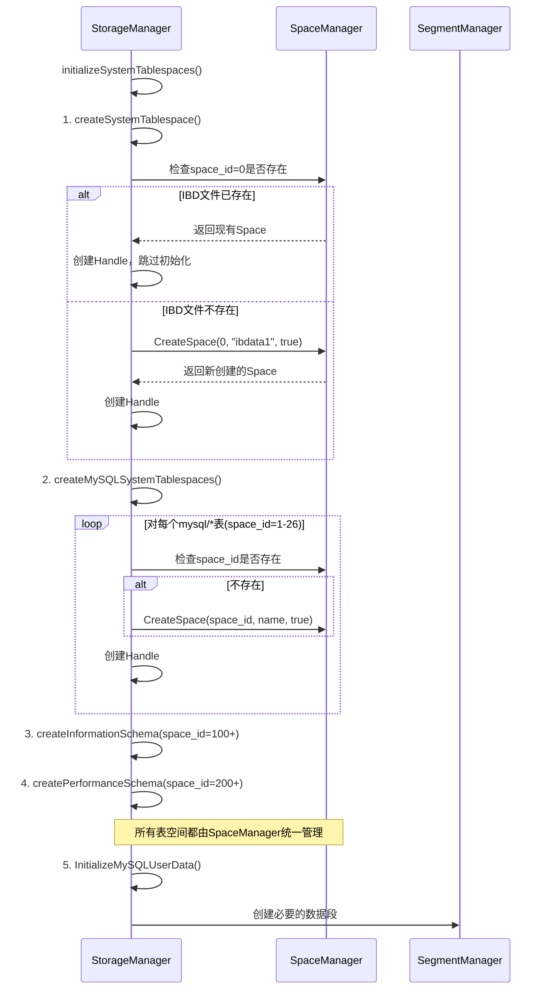

# InnoDB 存储引擎架构职责分离文档 (简化版)

## 概述

经过架构简化，我们将存储管理分为两个主要层次的管理器，每个管理器有其专门的职责范围。简化后的架构更加清晰，避免了复杂的层次划分。

##  架构层次图

```
┌─────────────────────────────────────────────────────────────┐
│                    StorageManager                          │
│                   (顶层统一协调器)                           │
├─────────────────────────────────────────────────────────────┤
│  职责: 统一协调、生命周期管理、事务管理、接口暴露              │
│  - 管理所有子组件的生命周期                                   │
│  - 协调各组件间的交互                                        │
│  - 对外提供统一的存储接口                                     │
│  - 管理事务和会话                                           │
│  - 智能检测并避免重复初始化IBD文件                             │
└─────────────────────────────────────────────────────────────┘
                              │
            ┌─────────────────┼─────────────────┐
            │                 │                 │
┌───────────▼──────┐ ┌───────▼─────────┐ ┌─────▼──────┐
│   SpaceManager   │ │  SegmentManager │ │其他管理器    │
│  (统一IBD管理)   │ │  (段管理器)     │ │BufferPool  │
├──────────────────┤ ├─────────────────┤ │PageMgr     │
│ 职责: 所有IBD管理 │ │职责: 段管理      │ │            │
│ - 系统表空间     │ │ - 数据段管理    │ │            │
│ - 用户表空间     │ │ - 索引段管理    │ │            │
│ - 表空间CRUD     │ │ - 段分配回收    │ │            │
│ - 区段分配回收    │ │ - 段生命周期    │ │            │
│ - 文件I/O操作    │ │                │ │            │
└──────────────────┘ └─────────────────┘ └────────────┘
```

##  详细职责分离

### 1. StorageManager (存储统一协调器)

**定位**: 最顶层的管理器，负责统一协调和对外接口

**核心职责**:
```go
type StorageManager struct {
    spaceMgr             basic.SpaceManager          // 委托给SpaceManager
    segmentMgr           *SegmentManager             // 段管理
    bufferPool           *buffer_pool.BufferPool     // 缓冲池管理
    pageMgr              *DefaultPageManager         // 页面管理
    tablespaces          map[string]*TablespaceHandle // 表空间缓存
    nextTxID             uint64                      // 事务ID生成
    mu                   sync.RWMutex               // 并发控制
}
```

**具体职责**:
1. **系统初始化协调**: 
   - 检查IBD文件是否存在，避免重复创建
   - 协调系统表空间和用户表空间的初始化顺序
   - 处理并发创建时的冲突检测

2. **智能初始化逻辑**:
   ```go
   // 智能检测现有IBD文件
   func (sm *StorageManager) createSystemTablespace(conf *conf.Cfg) error {
       // 1. 先检查是否已存在
       if existingSpace, err := sm.spaceMgr.GetSpace(0); err == nil {
           // 已存在 -> 直接创建handle，不重复初始化
           sm.createHandle(existingSpace)
           return nil
       }
       
       // 2. 不存在 -> 创建新的系统表空间
       systemSpace, err := sm.spaceMgr.CreateSpace(0, fileName, true)
       return err
   }
   ```

3. **职责委托**: 将所有具体操作委托给专门的管理器
4. **生命周期管理**: 管理所有子组件的创建、初始化、关闭
5. **事务协调**: 协调各组件参与事务处理
6. **接口暴露**: 为上层提供统一的存储操作接口

---

### 2. SpaceManager (统一IBD文件管理器) 

**定位**: 基础设施层，负责所有IBD文件的统一管理

**核心职责**:
```go
type SpaceManager interface {
    // 表空间生命周期管理
    CreateSpace(spaceID uint32, name string, isSystem bool) error
    GetSpace(spaceID uint32) (basic.IBDSpace, error)
    DropSpace(spaceID uint32) error
    
    // 区段分配管理
    AllocateExtent(spaceID uint32, purpose basic.ExtentPurpose) error
    FreeExtent(spaceID, extentID uint32) error
    
    // 文件I/O操作
    ReadPage(spaceID, pageNo uint32) ([]byte, error)
    WritePage(spaceID, pageNo uint32, data []byte) error
}
```

**管理范围**:
1. **所有IBD文件**: 
   - 系统表空间(space_id=0, ibdata1)
   - MySQL系统数据库表空间(space_id=1-26, mysql/*)
   - information_schema表空间(space_id=100+)
   - performance_schema表空间(space_id=200+)
   - 用户表空间(space_id自定义)

2. **统一文件管理**: 
   - 创建、打开、关闭、删除 `.ibd` 文件
   - 不区分系统表空间和用户表空间，统一处理

3. **空间分配**: 
   - 管理区(Extent)和页面的分配与回收
   - 处理底层的文件读写操作

**简化优势**: SpaceManager不需要关心表空间内容的语义差异，专注于物理文件管理

---

### 3. SegmentManager (段管理器)

**定位**: 段级别的管理器，负责数据段和索引段的管理

**核心职责**:
```go
type SegmentManager struct {
    bufferPool     *buffer_pool.BufferPool
    segments       map[uint32]*SegmentImpl  // 段缓存
    mu             sync.RWMutex
}
```

**专业职责**:
1. **段类型管理**:
   - 数据段(SEGMENT_TYPE_DATA): 存储表数据
   - 索引段(SEGMENT_TYPE_INDEX): 存储索引数据

2. **段生命周期**:
   - 创建段(CreateSegment)
   - 获取段(GetSegment) 
   - 删除段(DropSegment)

3. **页面分配**:
   - 为段分配页面(AllocatePage)
   - 管理段内的页面使用

---

## 🔄 简化后的初始化流程

### 系统启动时的职责分工:



##  关键设计原则

### 1. **职责单一性**
- **SpaceManager**: 专注所有IBD文件管理，不区分系统/用户表空间
- **SegmentManager**: 专注段级别的管理
- **StorageManager**: 专注协调，不直接操作文件

### 2. **智能避重复**
```go
// StorageManager的智能检查逻辑
func (sm *StorageManager) createMySQLSystemTablespaces() error {
    for i, tableName := range systemTables {
        spaceID := uint32(i + 1)
        
        // 1. 检查我们的tablespaces缓存
        if _, exists := sm.tablespaces[tableName]; exists {
            continue // 已在缓存中
        }
        
        // 2. 检查SpaceManager中是否已存在
        if existingSpace, err := sm.spaceMgr.GetSpace(spaceID); err == nil {
            // 已存在，只创建handle
            sm.createHandle(existingSpace)
            continue
        }
        
        // 3. 不存在，创建新的
        sm.spaceMgr.CreateSpace(spaceID, tableName, true)
        sm.createHandle(...)
    }
}
```

### 3. **错误恢复能力**
- 检测并发创建的重复IBD文件
- 处理部分初始化失败的恢复
- 验证现有IBD文件的完整性

### 4. **统一管理优势**
- 所有IBD文件由SpaceManager统一管理，简化了接口
- 避免了系统表空间和用户表空间的复杂区分
- 更易于维护和扩展

##  IBD文件分布

经过简化的架构中，所有IBD文件都由SpaceManager统一管理：

```
data/
├── ibdata1                    # 系统表空间 (Space ID: 0)
├── mysql_user.ibd            # MySQL用户表 (Space ID: 1)
├── mysql_db.ibd              # MySQL数据库表 (Space ID: 2)
├── ...                       # 其他MySQL系统表 (Space ID: 3-26)
├── information_schema_schemata.ibd  # info schema (Space ID: 100+)
├── performance_schema_accounts.ibd  # perf schema (Space ID: 200+)
└── user_table.ibd            # 用户表 (Space ID: 自定义)
```

## ✨ 简化架构的优势

1. **更清晰的职责**: 去除了SystemSpaceManager的复杂层次
2. **统一的管理**: SpaceManager统一管理所有IBD文件
3. **简化的接口**: 减少了组件间的复杂交互
4. **更好的维护性**: 代码结构更简单，易于理解和维护
5. **智能初始化**: 自动检测现有文件，避免重复创建

这样的简化设计确保了：
- **SpaceManager**专注于所有IBD文件的物理管理
- **SegmentManager**专注于段级别的逻辑管理  
- **StorageManager**专注于整体协调和生命周期管理
- 避免了重复初始化和覆盖现有数据的问题 