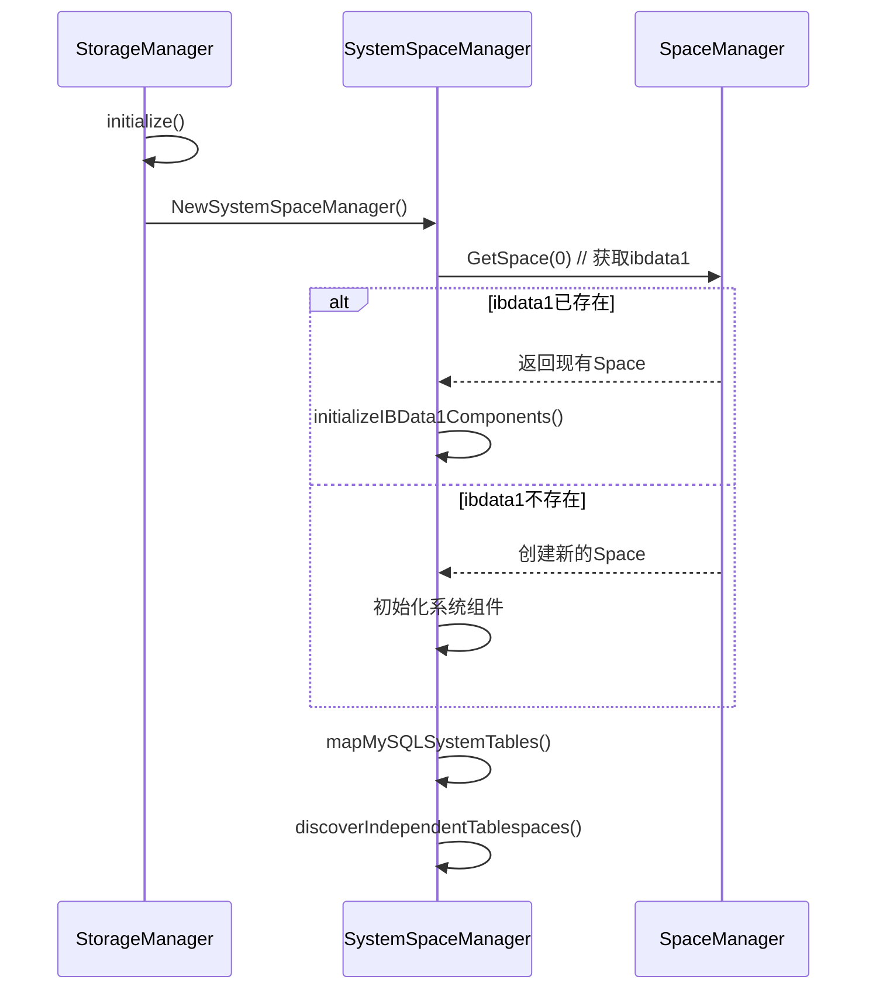

# InnoDB ibdata1 与独立表空间映射架构设计

## 📖 概述

基于 `innodb_file_per_table=ON` 配置，本文档详细说明了 InnoDB 存储引擎中 `ibdata1` 系统表空间与独立表空间的映射关系，以及在 XMySQL 项目中的实现架构。

##  设计原则

### 1. 存储分离策略

```
innodb_file_per_table=ON 模式下的存储分离:

┌─────────────────────────────────────────────────────────────┐
│                     Storage Architecture                    │
├─────────────────────────────────────────────────────────────┤
│  ibdata1 (Space ID=0)    │   Independent Tablespaces       │
│  ────────────────────    │   ──────────────────────────     │
│   Undo Logs            │    mysql.user.ibd (Space 1)   │
│   Insert Buffer        │    mysql.db.ibd (Space 2)     │
│   Double Write Buffer  │    mysql.tables_priv.ibd (3)  │
│   System Pages         │    ... (Space 4-46)           │
│   Transaction Data     │    information_schema tables   │
│   Lock Information     │    performance_schema tables   │
│   Data Dictionary      │    User tables                 │
│     (Root Page 5)        │                                  │
└─────────────────────────────────────────────────────────────┘
```

### 2. 职责分工

| 组件 | 管理内容 | 职责范围 |
|------|----------|----------|
| **ibdata1** | 系统级核心数据 | 事务系统、缓冲管理、元数据 |
| **独立表空间** | 表数据和索引 | 具体表的数据存储 |
| **SpaceManager** | 所有IBD文件 | 统一文件管理 |
| **SystemSpaceManager** | 系统组件映射 | 专业化系统管理 |

##  架构实现

### 1. SystemSpaceManager 架构

```go
type SystemSpaceManager struct {
    // 配置信息
    config       *conf.Cfg
    filePerTable bool  // 启用独立表空间

    // 系统表空间 (Space ID = 0, ibdata1)
    systemSpace  basic.IBDSpace

    // ibdata1中的系统级组件映射
    systemComponents *IBData1Components

    // 独立表空间映射 (Space ID -> TablespaceInfo)
    independentSpaces map[uint32]*TablespaceInfo

    // MySQL系统表映射 (表名 -> Space ID)
    mysqlSystemTables map[string]uint32
}
```

### 2. IBData1Components 系统组件

```go
type IBData1Components struct {
    // Undo日志相关
    UndoLogs *UndoLogManager
    
    // 插入缓冲
    InsertBuffer *InsertBufferManager
    
    // 双写缓冲
    DoubleWriteBuffer *DoubleWriteBufferManager
    
    // 系统表空间管理页面
    SpaceManagementPages *SpaceManagementPages
    
    // 事务系统数据
    TransactionSystemData *TransactionSystemManager
    
    // 锁信息管理
    LockInfoManager *LockInfoManager
    
    // 数据字典核心元数据 (Space ID 0, Page 5)
    DataDictionaryRoot *pages.DataDictionaryHeaderSysPage
}
```

##  Space ID 分配策略

### 1. 系统保留空间

| Space ID | 用途 | 文件名 | 存储内容 |
|----------|------|--------|----------|
| **0** | 系统表空间 | `ibdata1` | Undo logs, Insert buffer, Double write, 系统管理页, 事务数据, 数据字典根页面 |

### 2. MySQL 系统表空间 (1-46)

```go
var MySQLSystemTableSpaceIDs = map[string]uint32{
    "mysql.user":                    1,
    "mysql.db":                      2,
    "mysql.tables_priv":             3,
    "mysql.columns_priv":            4,
    "mysql.procs_priv":              5,
    "mysql.proxies_priv":            6,
    "mysql.role_edges":              7,
    "mysql.default_roles":           8,
    "mysql.global_grants":           9,
    "mysql.password_history":        10,
    "mysql.func":                    11,
    "mysql.plugin":                  12,
    "mysql.servers":                 13,
    "mysql.help_topic":              14,
    "mysql.help_category":           15,
    "mysql.help_relation":           16,
    "mysql.help_keyword":            17,
    "mysql.time_zone_name":          18,
    "mysql.time_zone":               19,
    "mysql.time_zone_transition":    20,
    "mysql.time_zone_transition_type": 21,
    "mysql.time_zone_leap_second":   22,
    "mysql.innodb_table_stats":      23,
    "mysql.innodb_index_stats":      24,
    "mysql.slave_relay_log_info":    25,
    "mysql.slave_master_info":       26,
    "mysql.slave_worker_info":       27,
    "mysql.gtid_executed":           28,
    // ... 预留到46
}
```

### 3. 虚拟表空间 (100+)

| Space ID 范围 | 用途 | 特点 |
|---------------|------|------|
| **100-199** | information_schema | 虚拟表，系统生成 |
| **200-299** | performance_schema | 性能监控表 |
| **1000+** | 用户表空间 | 用户自定义表 |

##  ibdata1 详细内容分析

### 1. 固定页面分配

| Page No | 页面类型 | 用途说明 |
|---------|----------|----------|
| **0** | FSP_HDR | 文件空间头页面，管理整个表空间 |
| **1** | IBUF_BITMAP | 插入缓冲位图页 |
| **2** | INODE | 段信息节点页 |
| **3** | SYS | 系统页面 |
| **4** | INDEX | 索引页面 |
| **5** | **DICT_ROOT** | **数据字典根页面** |
| **6** | TRX_SYS | 事务系统页面 |
| **7** | FIRST_RSEG | 第一个回滚段页面 |

### 2. 数据字典根页面 (Page 5) 结构

```go
type DictRootPage struct {
    // 页面头部
    PageHeader DictPageHeader
    
    // 数据字典头部信息
    MaxTableID uint64 // 最大表ID
    MaxIndexID uint64 // 最大索引ID
    MaxSpaceID uint32 // 最大表空间ID
    MaxRowID   uint64 // 最大行ID
    
    // 系统表根页面指针
    SysTablesRootPage  uint32 // SYS_TABLES表根页面
    SysColumnsRootPage uint32 // SYS_COLUMNS表根页面
    SysIndexesRootPage uint32 // SYS_INDEXES表根页面
    SysFieldsRootPage  uint32 // SYS_FIELDS表根页面
    
    // 段信息
    TablesSegmentID  uint32 // 表段ID
    IndexesSegmentID uint32 // 索引段ID
    ColumnsSegmentID uint32 // 列段ID
    
    // 版本和校验信息
    Version   uint32 // 数据字典版本
    Checksum  uint32 // 校验和
    Timestamp int64  // 最后更新时间
}
```

## 🚀 初始化流程

### 1. 系统表空间初始化



### 2. 组件初始化顺序

1. **UndoLogManager**: 事务回滚日志管理
2. **InsertBufferManager**: 插入缓冲区管理
3. **DoubleWriteBufferManager**: 双写缓冲区管理
4. **SpaceManagementPages**: 表空间管理页面
5. **TransactionSystemManager**: 事务系统数据管理
6. **LockInfoManager**: 锁信息管理
7. **DataDictionaryRoot**: 数据字典根页面 (Page 5)

## 📈 统计信息和监控

### 1. TablespaceStats 结构

```go
type TablespaceStats struct {
    SystemSpaceID                 uint32 // 系统表空间ID (固定为0)
    SystemSpaceSize              int64  // 系统表空间大小
    IndependentSpaceCount        int    // 独立表空间总数
    MySQLSystemTableCount        int    // MySQL系统表数量
    UserTableCount               int    // 用户表数量
    InformationSchemaTableCount  int    // information_schema表数量
    PerformanceSchemaTableCount  int    // performance_schema表数量
}
```

### 2. 监控指标

| 指标类别 | 监控项目 | 说明 |
|----------|----------|------|
| **空间使用** | ibdata1大小 | 系统表空间增长监控 |
| **独立表空间** | .ibd文件数量 | 独立表空间统计 |
| **系统组件** | Undo日志大小 | 事务活跃度监控 |
| **缓冲区使用** | 插入缓冲使用率 | 写入性能指标 |

##  API接口

### 1. 核心查询接口

```go
// 获取系统表空间
func (ssm *SystemSpaceManager) GetSystemSpace() basic.IBDSpace

// 获取ibdata1组件
func (ssm *SystemSpaceManager) GetIBData1Components() *IBData1Components

// 获取独立表空间信息
func (ssm *SystemSpaceManager) GetIndependentTablespace(spaceID uint32) *TablespaceInfo

// 获取MySQL系统表Space ID
func (ssm *SystemSpaceManager) GetMySQLSystemTableSpaceID(tableName string) (uint32, bool)

// 列出所有独立表空间
func (ssm *SystemSpaceManager) ListIndependentTablespaces() map[uint32]*TablespaceInfo

// 获取统计信息
func (ssm *SystemSpaceManager) GetTablespaceStats() *TablespaceStats
```

### 2. 管理接口

```go
// 检查独立表空间是否启用
func (ssm *SystemSpaceManager) IsFilePerTableEnabled() bool

// 设置数据字典管理器
func (ssm *SystemSpaceManager) SetDataDictionary(dict *DictionaryManager)

// 关闭系统表空间管理器
func (ssm *SystemSpaceManager) Close() error
```

## 💡 设计优势

### 1. 清晰的职责分离

- **ibdata1**: 专门存储系统级核心数据
- **独立表空间**: 每个表有自己的物理文件
- **SpaceManager**: 统一管理所有IBD文件
- **SystemSpaceManager**: 专业化系统组件管理

### 2. 高效的空间管理

- **减少碎片**: 独立表空间避免大文件碎片
- **便于维护**: 单个表的备份、恢复、迁移
- **灵活扩展**: 表空间可以独立增长

### 3. 良好的监控能力

- **细粒度统计**: 每个组件独立统计
- **明确的映射关系**: Space ID到表的清晰映射
- **实时状态监控**: 系统组件状态实时查询

### 4. 强健的错误处理

- **智能检测**: 自动检测已存在的IBD文件
- **优雅降级**: 初始化失败时的错误处理
- **数据一致性**: 防止重复初始化导致数据损坏

## 🔮 未来扩展

### 1. 压缩表空间支持

- 透明压缩算法集成
- 压缩比例统计和监控

### 2. 分区表空间

- 大表的分区存储支持
- 跨分区的查询优化

### 3. 自动空间管理

- 自动空间回收机制
- 智能空间预分配

### 4. 云原生存储

- 对象存储集成
- 分布式表空间支持

---

**注意**: 本架构设计基于 `innodb_file_per_table=ON` 的默认配置，符合现代MySQL部署的最佳实践。 