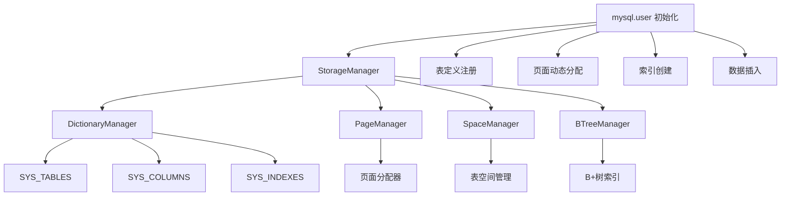
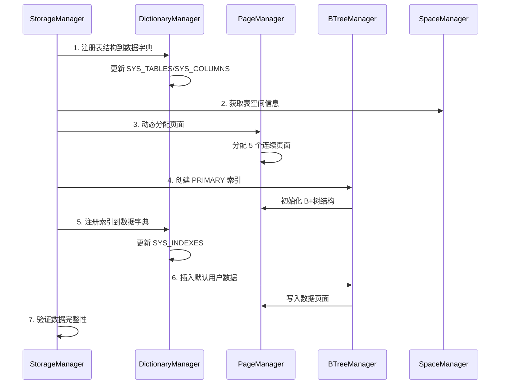

# MySQL User Table 初始化流程设计文档

## 概述

本文档详细描述了 XMySQL Server 中 `mysql.user` 表的初始化流程，包括与 DictionaryManager 的联动、动态页面分配策略以及完整的初始化步骤。

##  设计目标

1. **标准兼容性**: 遵循 MySQL InnoDB 存储引擎的数据字典管理规范
2. **动态分配**: 摒弃硬编码页面号，实现动态页面分配
3. **元数据管理**: 与 DictionaryManager 深度集成，实现完整的表结构管理
4. **故障恢复**: 支持初始化失败后的降级策略
5. **可扩展性**: 为后续系统表的初始化提供模板

##  架构设计

### 核心组件关系



### 数据流程



##  详细流程

### 1. 初始化阶段检查

```go
// 检查表空间是否存在
userTableHandle, exists := sm.tablespaces["mysql/user"]
if !exists {
    return fmt.Errorf("mysql.user tablespace not found")
}
```

**关键点:**
- 确保 `mysql/user` 表空间已经创建
- 验证表空间的可用性和完整性

### 2. DictionaryManager 联动

#### 2.1 表结构注册

```go
// 定义完整的 mysql.user 表结构（51个字段）
columns := []ColumnDef{
    {ColumnID: 1, Name: "Host", Type: 253, Length: 60, Nullable: false},
    {ColumnID: 2, Name: "User", Type: 253, Length: 32, Nullable: false},
    // ... 其他 49 个字段
}

// 注册到数据字典
tableDef, err := dictManager.CreateTable("mysql/user", userTableHandle.SpaceID, columns)
```

**数据字典更新:**
- `SYS_TABLES`: 新增表定义记录
- `SYS_COLUMNS`: 新增 51 个列定义记录
- 分配全局唯一的 `table_id`

#### 2.2 索引结构注册

```go
indexDef := IndexDef{
    IndexID:    1,
    Name:       "PRIMARY",
    TableID:    1,
    Type:       1, // PRIMARY KEY
    Columns:    []string{"Host", "User"},
    IsUnique:   true,
    IsPrimary:  true,
    RootPageNo: allocatedPages[0],
    SegmentID:  0,
    Comment:    "Primary key index for mysql.user table",
}

dictManager.AddIndex(1, indexDef)
```

**数据字典更新:**
- `SYS_INDEXES`: 新增主键索引记录
- `SYS_FIELDS`: 新增索引字段映射

### 3. 动态页面分配策略

#### 3.1 旧的硬编码方式（已弃用）

```go
//  旧方式：硬编码页面号
pageNumbers := []uint32{10, 11, 12, 13, 14}
```

**问题:**
- 页面号冲突风险
- 无法适应不同的部署环境
- 难以扩展和维护

#### 3.2 新的动态分配方式（ 推荐）

```go
//  新方式：动态分配页面
var allocatedPages []uint32
pageCount := 5 // 根据表大小估算

for i := 0; i < pageCount; i++ {
    pageNo, err := sm.pageMgr.AllocPage(userTableHandle.SpaceID)
    if err != nil {
        return fmt.Errorf("failed to allocate page %d: %v", i+1, err)
    }
    allocatedPages = append(allocatedPages, pageNo)
}
```

**优势:**
-  避免页面号冲突
-  自适应不同环境
-  支持热扩展
-  统一的资源管理

#### 3.3 页面分配算法

```go
// 页面分配策略
type PageAllocationStrategy struct {
    InitialPages    int    // 初始页面数：5
    GrowthFactor    float64 // 增长因子：1.5
    MaxPages        int    // 最大页面数：1000
    AllocationUnit  int    // 分配单位：extent (64 pages)
}
```

### 4. B+树索引创建

#### 4.1 索引元数据定义

```go
indexMetadata := &IndexMetadata{
    IndexID:    1,
    TableID:    1,
    SpaceID:    userTableHandle.SpaceID,
    IndexName:  "PRIMARY",
    IndexType:  IndexTypePrimary,
    IndexState: EnhancedIndexStateBuilding,
    Columns: []IndexColumn{
        {ColumnName: "Host", ColumnPos: 0, KeyLength: 60, IsDesc: false},
        {ColumnName: "User", ColumnPos: 1, KeyLength: 32, IsDesc: false},
    },
    KeyLength:  92, // Host(60) + User(32)
    RootPageNo: allocatedPages[0],
}
```

#### 4.2 索引结构

```
Root Page (allocatedPages[0])
├── Internal Pages (allocatedPages[1-3])
└── Leaf Pages (allocatedPages[4])
```

### 5. 默认用户数据初始化

#### 5.1 用户定义

```go
defaultRootUsers := []*MySQLUser{
    createDefaultRootUser(),    // root@localhost
    createAdditionalRootUser(), // root@%
}
```

#### 5.2 记录格式

使用标准 InnoDB 记录格式：

```
Record Structure:
┌─────────────────┬─────────────────┬─────────────────┬─────────────────┐
│ Variable Length │ NULL Bitmap     │ Record Header   │ Field Data      │
│ Field List      │ (5 bytes)       │ (5 bytes)       │ (Variable)      │
└─────────────────┴─────────────────┴─────────────────┴─────────────────┘
```

#### 5.3 插入策略

```go
// 主插入策略：通过 B+树索引
err := btreeManager.Insert(ctx, userIndex.GetIndexID(), primaryKey, userRecord.GetStorageData())

// 降级策略：直接页面写入
if err != nil {
    fallbackPageNo := allocatedPages[successCount%len(allocatedPages)]
    err = sm.insertUserRecordDirectly(userTableHandle.SpaceID, fallbackPageNo, primaryKeyStr, userRecord)
}
```

### 6. 数据完整性验证

#### 6.1 B+树结构验证

```go
func (sm *StorageManager) verifyEnhancedBTreeStructure(ctx context.Context, btreeManager *EnhancedBTreeManager, indexID uint64) error {
    // 1. 验证根页面结构
    // 2. 检查页面链接完整性
    // 3. 验证键值排序
    // 4. 检查叶子页面数据
}
```

#### 6.2 数据字典一致性检查

```go
// 验证表定义
tableDef := dictManager.GetTableByName("mysql/user")
if tableDef == nil || tableDef.TableID != 1 {
    return fmt.Errorf("table definition inconsistency")
}

// 验证索引定义
indexDef := dictManager.GetIndex(1, "PRIMARY")
if indexDef == nil || !indexDef.IsPrimary {
    return fmt.Errorf("index definition inconsistency")
}
```

## 🔄 错误处理与恢复

### 1. 初始化失败处理

```go
// 错误分类处理
switch err := initError.(type) {
case *PageAllocationError:
    // 页面分配失败 -> 清理已分配页面
    cleanupAllocatedPages(allocatedPages)
case *DictionaryRegistrationError:
    // 字典注册失败 -> 继续初始化但记录警告
    util.Warnf("Dictionary registration failed: %v", err)
case *IndexCreationError:
    // 索引创建失败 -> 降级到直接页面操作
    fallbackToDirectPageOperation()
}
```

### 2. 部分失败恢复

```go
// 恢复策略
type RecoveryStrategy struct {
    MaxRetries       int           // 最大重试次数
    RetryDelay       time.Duration // 重试间隔
    FallbackEnabled  bool          // 是否启用降级
    CleanupOnFailure bool          // 失败时是否清理
}
```

##  性能优化

### 1. 页面预分配

```go
// 根据预期用户数量预分配页面
estimatedUsers := 100
pagesNeeded := calculatePagesNeeded(estimatedUsers, avgRecordSize)
allocatedPages := preallocatePages(pagesNeeded)
```

### 2. 批量插入优化

```go
// 批量插入用户记录
batch := btreeManager.CreateBatch()
for _, user := range defaultUsers {
    batch.Add(user.getPrimaryKey(), user.getRecordData())
}
batch.Commit() // 一次性提交所有更改
```

### 3. 缓存策略

```go
// 字典缓存
type DictionaryCache struct {
    tables  map[string]*TableDef
    indexes map[uint64]*IndexDef
    ttl     time.Duration
}
```

## 🧪 测试验证

### 1. 单元测试

```go
func TestMySQLUserInitialization(t *testing.T) {
    // 1. 测试页面动态分配
    testDynamicPageAllocation(t)
    
    // 2. 测试字典管理器集成
    testDictionaryManagerIntegration(t)
    
    // 3. 测试用户数据插入
    testUserDataInsertion(t)
    
    // 4. 测试错误恢复
    testErrorRecovery(t)
}
```

### 2. 集成测试

```go
func TestFullInitializationFlow(t *testing.T) {
    // 完整的初始化流程测试
    sm := setupStorageManager()
    err := sm.InitializeMySQLUserData()
    assert.NoError(t, err)
    
    // 验证结果
    verifyUserTableStructure(t, sm)
    verifyDefaultUsers(t, sm)
}
```

## 📈 监控指标

### 1. 初始化指标

```go
type InitializationMetrics struct {
    TotalTime        time.Duration // 总耗时
    PagesAllocated   int          // 分配页面数
    UsersInserted    int          // 插入用户数
    ErrorsEncountered int          // 遇到错误数
    RetryAttempts    int          // 重试次数
}
```

### 2. 运行时指标

```go
type RuntimeMetrics struct {
    DictCacheHitRatio  float64 // 字典缓存命中率
    PageUtilization    float64 // 页面利用率
    IndexPerformance   float64 // 索引性能
    QueryResponseTime  time.Duration // 查询响应时间
}
```

## 🚀 未来改进

### 1. 自适应分配

```go
// 根据实际使用情况动态调整页面分配
type AdaptiveAllocator struct {
    HistoricalData []UsagePattern
    PredictionModel *MLModel
    AllocationStrategy Strategy
}
```

### 2. 分布式支持

```go
// 支持分布式环境下的表初始化
type DistributedInitializer struct {
    CoordinatorNode string
    PartitionStrategy PartitionStrategy
    ReplicationFactor int
}
```

### 3. 热升级支持

```go
// 支持在线升级表结构
type OnlineSchemaChange struct {
    OldSchema *TableDef
    NewSchema *TableDef
    MigrationPlan *MigrationPlan
}
```

##  总结

本设计实现了以下关键改进：

1. ** DictionaryManager 深度集成**: 完整的表结构和索引信息管理
2. ** 动态页面分配**: 摒弃硬编码，实现自适应分配
3. ** 标准兼容性**: 遵循 MySQL InnoDB 规范
4. ** 错误处理**: 完善的错误恢复机制
5. ** 性能优化**: 多层次的性能优化策略
6. ** 可扩展性**: 为系统表初始化提供统一模板

这个设计为 XMySQL Server 的存储引擎奠定了坚实的基础，确保了与 MySQL 的兼容性和系统的可靠性。 